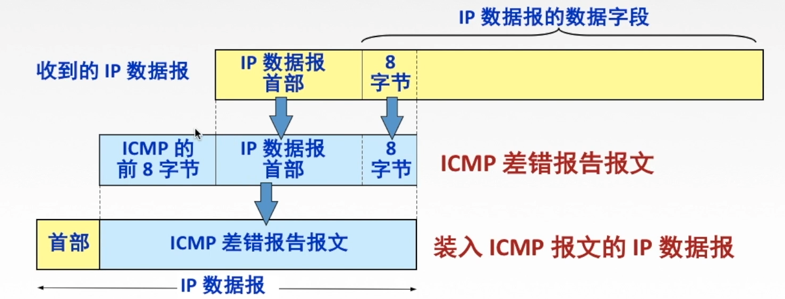

# Ch1. 计算机网络体系结构

## 1.1 计算机网络概述

### 1.1.1 概念

Def：

- 计网是一个将分散的、具有独立功能的计算机系统，通过通信设备与线路连接起来，由功能完善的软件实现**资源共享**和**信息传递**
- 计网是互连的、自治的计算机系统的集合
  互连：通过通信链路互联互通
  自治：无主从关系

### 1.1.2 组成

- 组成部分：硬件，软件，协议
- 工作方式：
  1. 边缘部分：用户直接使用
     - C/S方式(Client/Server)，B/S方式(Browser/Server)
     - P2P方式(peer-to-peer)：主机越多，数据传递越快
  2. 核心部分：为边缘部分服务
- 功能组成
  1. 通信子网：实现数据通信
  2. 资源子网：实现资源共享/数据处理

### 1.1.3 功能

1. 数据通信
2. 资源共享
3. 分布式处理：多台计算机各自承担同一工作任务多不同部分
4. 提高可靠性：各台计算机通过网络互为替代机
5. 负载均衡

### 1.1.4 分类

**1.按分布范围分类**

- 广域网(WAN) = 远程网：采用交换技术提供长距离通信
- 城域网(MAN)：采用以太网技术
- 局域网(LAN)：采用广播技术，覆盖范围小
- 个人局域网(PAN) = 无限个人局域网(WPAN)：将电子设备用无线技术连接起来的网络

⚠️：CPU之间的距离非常近，一般称为多处理器系统而非计算机网络

**2.按传输技术分类**

- 广播式网络：共享一个通信信道
- 点对点网络：分组存储转发和路由选择机制

**3.按拓扑结构分类**（主要指通信子网的拓扑）

- 总线性网络
- 星形网络
- 环形网络
- 网状网络

**4.按使用者分类**

- 公用网(Public Network) = 公众网：电信公司建造的大型网络
- 专用网(Private Network)：某个部门为满足业务需求建立的网络，不对外服务

**5.按交换技术分类**

- 电路交换网络：通过通信信道交换
- 报文交换网络：通过存储转发报文
- 分组交换网络（包交换网络）：通过存储转发分组

### 1.1.6 性能指标

- 带宽(bps)：表示网络的通信线路传送数据的能力 = 数字信道在发送端所能传送的最高数据传输速率 = 网络设备所支持的最高速度

- 时延(s)：数据从网络一端传送到另一端所需时间

  1. 发送(传输)时延：从发送分组的第一个bit算起，直到该分组的最后一个bit发送完毕所需时间
     *发送时延 = 分组长度 / 信道宽度*(发送速率)
  2. 传播时延：取决于电磁波传播速率和链路长度
     *传播时延 = 信道长度 / 电磁波在信道上传播的速率*
  3. 排队时延：分组进入路由器后先在输入队列中排队等待处理
  4. 处理时延：数据在交换点检错，找出口等

  *总时延 = 发送时延 + 传播时延 + 排队时延 + 处理时延*

  ⚠️：做题时，排队和处理时延一般忽略不计；高速链路是提高带宽来提高发送速率

- 时延带宽积 = 传播时延 * 带宽
  Def：指发送端发送端第一个bit到达终点时，发送端已经发出了多少个bit = 以bit为单位的链路长度

- 往返时延RTT：从发送方发送数据开始，到发送方收到接受方的确认总共经历的时延
  *RTT = 往返传播时延(2传播时延 ) + 末端处理时间*

- 吞吐量(bps)：单位时间内通过某个网络（or 信道、接口）的数据量，受带宽和网络额定速率限制

- 速率(bps)：连接到计算机网络上的主机在数字信道上的传送数据的速率
- 信道利用率：指出某一信道有百分之多少的时间是由数据通过的
  *信道利用率 = 有数据通过的时间 / (有 + 无)数据通过的时间*
  网络利用率：信道利用率加权平均值

## 1.2 计算机网络体系结构与参考模型

⚠️：计算机网络体系结构是计算机网络各层及其协议的集合

### 1.2.1 分层结构

分层的基本原则

1. 层间相互独立
2. 每层之间界面自然清晰
3. 每层采用最适合的技术实现
4. 保持下层对上层的独立性，上层单向使用下层提供的服务
5. 整个分层结构应该能促进标准版结构

**1.协议**：为进行网络中的对等实体数据交换而建立的规则、标准或约定（水平）

- 语法：规定传输数据的格式
- 语义：规定所要完成的功能
- 同步：规定各种操作顺序

**2.接口（访问服务点SAP）**：上层使用下层服务的入口

**3.服务**：下层为相邻上层提供功能调用（垂直）
第n层在向n+1层提供服务时，此服务包含第n层本身的功能和1～n-1层的功能 

报文数据单元：

1. 服务数据单元（SDU）：为完成用户所要求的功能而应传送的数据

2. 协议控制信息（PCI）：控制协议操作的信息

3. 协议数据单元（PDU）：对等层之间传送的数据单位

   各层之间传输数据：*n-SDU + n-PCI = n-PDU = (n-1)SDU*

### 1.2.3 ISO/OSI & TCP/IP

**1.OSI**
*物联网淑惠试用*

1. 应用层：所有能和用户交互产生网络流量的程序

2. 表示层：用于处理两个通信系统中交换信息的表示方式（语法和语义）

   - 数据格式变换
   - 数据的加密解密
   - 数据的压缩和恢复

3. 会话层（建立同步SYN）：向表示层实体/用户进程提供建立连接并在连接上有序地传输数据

   - 建立、管理、终止会话
   - 使用校验点可使会话在通信失效时从校验点/同步点恢复继续通信，实现数据同步
     （适用于传输大文件）

   ⬆️*上面三层为资源子网*

4. 传输层（进程 - 进程）：负责主机中的两个进程的通信，即端到端的通信。传输单位是报文段TCP或用户数据报UDP — TCP/IP 
   提供建立、维护和拆除端到端的连接

   - 可靠传输：有确认机制
     不可靠传输：数据很小时选用
   - 差错控制
   - 流量控制
   - 复用：多个应用进程可同时使用下面运输层的服务
     分用：运输层把收到的信息分别交付给上面应用层中相应的进程

   ⬆️*上面四层为端到端通信*

   ⬇️*下面三层为通信子网*

5. 网络层：主要任务是把分组从源端传到目的端，为分组交换网上的不同主机提供通信服务。网络层的传输单位是数据报或分组

   - 路由选择：最佳路径
   - 流量控制
   - 差错控制
   - 拥塞控制

6. 数据链路层：主要任务是把网络层传下来的数据报组装成帧，保证数据正确的顺序和完整性。链路层的传输单位是帧
   在分组上增加源地址，目的地址和控制信息
   为网络层实体提供数据发送和接收功能及过程

   - 成帧：定义帧的开始和结束
   - 差错控制：帧错 + 位错
   - 流量控制
   - 访问（接入）控制：控制对信道的访问，即物理寻址

7. 物理层：在物理媒体上实现bit流的透明传输。物理层的传输单位上bit
   透明传输：指不管所传送的数据是什么样的bit组合，都应当能够在链路上传送

   - 定义接口特性
   - 定义传输模式：单工、半双工、双工
   - 定义传输速率
   - 比特同步
   - 比特编码

**2.TCP/IP**

1. 应用层（用户 - 用户）：包含所有的高层协议 —— Telnet、FTP、DNS、SMTP和HTTP
2. 传输层（App - App/进程 - 进程）：使发送端和目的端的对等实体进行会话
   - TCP传输控制协议：面向连接，数据传输单位是报文段，可靠传输
   - UDP用户数据报协议：无连接，数据传输单位是数据报，不可靠传输
3. 网际层（主机 - 主机）：为分组选择合适的路由发往网络（不保证有序到达）。还定义了分组的格式和协议——IP
   提供无连接不可靠数据报服务
4. 网络接口层：类似于物理层和数据链路层。TCP/IP对此没有真正描述，只是指出主机必须使用某种协议与网络连接，以便在其上传送IP分组

**3.OSI & TCP/IP**

相同：

1. 都分层
2. 基于独立的协议栈的概念
3. 都可以实现异构互联

不同点：

1. OSI定义三点：服务、协议、接口

2. OSI先于协议发明，不偏向任何特定协议

3. TCP/IP设计之初就考虑到异构网互联问题，将IP作为重要层次

4. 面向连接：3个阶段，建立连接，数据传输，释放连接
   无连接：直接进行数据传输 

   |        | OSI               | TCP/IP            |
   | ------ | ----------------- | ----------------- |
   | 网络层 | 无连接 + 面向连接 | 无连接            |
   | 传输层 | 面向连接          | 无连接 + 面向连接 |

**4.五层参考模型**

数据封装与解封装

# Ch2. 物理层

物理层解决如何在连接各种计算机的传输媒体上传输数据比特流，而不是指具体的传输媒体

主要任务：确定与传输媒体接口有关的一些特性 => 定义标准

1. 机械特性：定义物理连接的特性
2. 电气特性：规定传输二进制位时，线路上信号的电压范围、阻抗匹配、传输速率和距离限制等
3. 功能特性：指明某条线上出现等某一电平表示何种意义，接口部件等信号线的用途
4. 规程（过程）特性：定义各条物理线路的工作过程和时序关系

## 2.1 通信基础

通信的目的是传送消息

**典型的数据通信模型**

**基本概念**

1. 数据data：传送信息的实体，通常是有意义的符号序列
   	数据传输方式：
   - 串行传输：一次1bit按照时间顺序传输（远距离通信采用较多）
   - 并行传输：若干bits通过多条通信信道同时传输

2. 信号：数据的电气/电磁的表现，是数据在传输过程中的存在形式

   - 数字/离散信号（或数据）：代表消息的参数的取值是离散的
   - 模拟/连续信号（或数据）：代表消息的参数的取值是连续的

3. 码元：用一个固定长度的信号波形（数字脉冲）表示一位k进制数，代表不同离散数值的基本波形。是数字通信中数字信号的计量单位，这个时长内的信号称为k进制码元，该时长称为码元宽度。

4. 信源：产生和发送数据的源头

5. 信宿：接受数据的终点

6. 信道：信号的传输媒介。一般用来表示某一个方向传送信息的介质，因此一条通信线路包含一条发送信道和一条接受信道

   - 按传输信号分：模拟信道（传送模拟信号）和数字信道（传送数字信道）
   - 按传输介质分：无线信道和有线信道

   信道上的信号：

   - 基带信号：将数字信号0，1直接用两种不同的电压表示，送到数字信道上传输——基带传输
   - 宽带信号：将基带信号进行调制后形成频分复用模拟信号，送到模拟信道上传输——宽带传输

   信道的极限容量：信道最高码元传输速率或信道的极限信息传输速率

7. 噪声源：信道上的噪声（即对信号的干扰）及分散在通信系统其他各处的噪声的集中表现

8. 速率：数据传输速率
   ⚠️信噪比，频率带宽和调制速率都会影响信道数据传输速率（信道发送速率）

   - 码元传输速率/波特率（Baud）：单位时间内数字通信系统所传输的码元个数（单位时间内脉冲个数或信号变化的次数）
   - 信息传输速率/信息速率/比特率（bit/s）：单位时间内数字通信系统传输的二进制码元个数(bit数)
   - 波特率 * n(一个码元含几bits) = 比特率

9. 带宽（bit/s）：单位时间内从网络中某一点到另一点所能通过最高数据率

 **通信方式**

1. 单向通信：只有一个方向的通信而没有反方向的交互
2. 半双工通信：通信双方都可以发送或接收信息，但是不能同时发送和接收消息，此时需要两条信道
3. 全双工通信：通信双方可以同时发送和接收消息，也需要两条信道

###  2.1.2 奈氏准则与香农定理

影响失真程度的因素：

1. 码元传输速率
2. 信号传输距离
3. 噪声干扰
4. 传输媒体质量（负相关）

失真的一种现象——码间串扰：接收端收到的信号波形失去了码元之间清晰界限的现象（频率过高引起）

信道带宽：能通过最高频率和最低频率之差

**1.奈氏(Nice)准则**

[^Def]: 在理想低通（无噪声、带宽有限）等信道中，为了避免码间串扰，极限码元传输速率为2W Baud，W是信道带宽（Hz）

$$
极限码元传输速率\space(b/s)=2Wlog_2V \\
V:几种码元;W:带宽(Hz)
$$

- 在任何信道中，码元传输速率有上限
- 信道的频带越宽，就可用更高的速率进行码元的有效传输
- 奈氏准则对码元传输速率限制，未对信息传输速率限制（不限制一个码元可以对应多少个二进制位）
- 若要提高数据传输速率，必须设法使每个码元携带更多bit的信息量，需采用多元制的调制方法（即多个bits来对应一个码元）

**2.香农定理**

[^Def]: 在带宽受限且有噪声的信道中，为了不产生误差，信息的数据传输速率有上限值

$$
信噪比(S/N) = \frac{信号的平均功率S}{噪声的平均功率N}= 10lg\frac{S}{N}\space (dB)\\
极限信息传输速率\space(b/s)=Wlog_2(1+S/N)
$$

- 信道中的带宽或信噪比越大，则信息的极限传输速率越高
- 对一定对传输带宽和信噪比，信息传输速率上限就确定了
- 只要信息的传输速率低于信道的极限传输速率，就一定能找到某种方法实现无差错传输
- 实际信道的传输速率比极限速率低不少

⚠️**区别**：Nice准则只考虑了带宽和极限码元传输速率的关系；香农不仅考虑到了带宽，也考虑了信噪比，侧面说明了一个码元对应的二进制位是有限的

### 2.1.3 编码与调制

信道上传送的信号：

1. 基带信号：将数字信号1和0直接用两种不同的电压表示，再送到数字信道上去传输（基带传输）
   传输距离较近时采用基带传输（近距离衰减小，信号内容不易发生变化）
2. 宽带信号：将基带信号进行调制后形成的频分复用模拟信号，再送到模拟信道上去传输（宽带传输）
   传输距离远时采用宽带传输（远距离衰减大，即使信号变化大也能最后过滤出基带信号）

数字数据通过数字发送器转换为数字信号；通过调制器转换为模拟信号
模拟数据通过PCM编码器转换为数字信号；通过放大器调制器转换为模拟信号

**1.数字数据编码为数字信号**

1. 归零编码RZ：高1低0且每个周期中间均跳变到低电平（归零）
   归零需要占用一部分带宽，所以传输效率受到影响
2. 非归零编码NRZ：高1低0
   NRZ无法传输时钟信号，双方难以同步，需建立时间线
3. 反向不归零编码NRZI：信号电平翻转表示0，不变表示1。such as USB2.0
   缺点同NRZ
4. 曼彻斯特编码：将一个码元分为两个等间隔，高跳低表示1，低跳高表示0（也可以相反），中间的跳变可以当作时钟信号，也作为数据信号，但它所占频带宽度时原始基带宽度的2倍
   每一个码元都被调成两个电平，所以数据传输速率 = 1/2调制速率
   such as 以太网
5. 差分曼彻斯特编码：同1异0。若码元=1，则前半个码元的电平与上一码元的后半个码元电平相同；若码元=0反之。 
   在每个码元中间都有电平跳转，可以实现自同步，且抗干扰性强于曼彻斯特编码
   such as 局域网
6. 4B/5B编码：将数据流划分4bit一组，对应一个5bit编码传输，其中16种对应16种的4bit组合，另外16种作为控制码
   编码效率 = 80%

**2.数字数据调制为模拟信号**

1. 调幅ASK
2. 调频FSK
3. 调相PSK
4. 调幅+调相QAM = ASK +PSK：设波特率B，采用m个相位，每个相位有n种振幅，则QAM的数据传输速率R为

$$
R=Blog_2(mn)
$$

**3.模拟数据编码为数字信号**

PCM脉码调制

1. 抽样：对模拟信号进行周期性扫描，把时间上连续的信号变成时间上离散的信号，用来带入求得正弦表达式
   f_采样频率 >= 2f\_信号最高频率
2. 量化：把采样去得的电平幅值按照一定的分级标度转化为对应的数字值，并取整数，这就把连续的电平幅值转换为离散的数字量
3. 编码：把量化结果转换为与之对应的二进制编码

**4.模拟数据调制为模拟信号**

为了实现传输的有效性，可能需要较高的频率

### 2.1.4 数据交换方式

**1.电路交换**

原理：在数据传输期间，源结点与目的结点之间有一条由中间结点构成的专用物理连按线路，在数据传输结束
之前，这条线路一直保持

阶段：1.连接建立 -> 2.数据传输 -> 3.连接释放

**2.报文交换**（存储转发）

通常适用在早期的电报通信网

报文：是网络中交换与传输的数据单元，即站点一次性要发送的数据块。包含了要发送的完整数据信息，目标地址和源地址等

原理：无需在两个站点之间建立一条专用通路，其数据传输单位是报文，传送过程采用存储转发的方式

**3.分组交换**（存储转发）

分组交换根据其通信子网向端点系统提供的服务

原理：分组交换限制了每次传送数据块的大小上限，把大的数据块划分为合理的小数据块，再加上一些必要的控制信息（源地址、目的地址和编号信息等）构成分组

过程：类似于报文交换

**4.三种方式等比较**

1. 传送数据量很大且传送时间远大于呼叫时间时，采用电路交换
2. 端到端的通路由多段链路组成时，采用分组交换
3. 从提高整个网络的信道利用率上看，报文和分组交换优于电路交换，分组交换的时延较报文交换小，所以采用分组交换

### 2.1.5 分组交换的数据报与虚电路

这两种服务均由网络层提供

**1.数据报**（无连接）

无连接服务：不同的分组可以走不同的路径，也可以按照不同的顺序到达目的结点

特点：

1. 数据报方式为网络层提供无连接服务。发送方可随时发送分组，网络中的结点可随时接收分组
2. 同一报文的不同分组达到目的结点时可能发生乱序、重复与丢失
3. 每个分组在传输过程中都必须携带源地址和目的地址，以及分组号
4. 分组在交换结点存储转发时，需要排队等候处理，这会带来一定的时延。当通过交换结点的通信量较大或网
   络发生拥塞时，这种时延会大大增加，交换结点还可根据情况丢弃部分分组
5. 网络具有元余路径，当某一交换结点或一段链路出现故障时，可相应地更新转发表，寻找另一条路径转发分
   组，对故障的适应能力强，适用于突发性通信，不适于长报文、会话式通信

**2.虚电路**（面向连接）

- 永久型虚电路PVC：提前定义好的虚电路、基本不需要任何建立时间的端点之间的连接
- 交换型虚电路SVC：端点之间的一种临时性连接，这些连接只持续所需时间，并且在会话结束时就取消这种连接

面向连接服务：源节点与目的结点之间建立一条逻辑连接，而非实际物理连接。

特点：

1. 一次通信的所有分组都通过虛电路顺序传送，分组不需携带源地址、目的地址等信息：包含虚电路号，相对数据报方式开销小，同一报文的不同分组到达目的结点时不会乱序、重复或丢失
2. 分组通过虛电路上的每个节点时，节点只进行差错检测，不需进行路由选择。
3. 每个节点可能与多个节点之间建立多条虚电路，每条虚电路支持特定的两个端系统之间的数据传输，可以对
   两个数据端点的流量进行控制，两个端系统之间也可以有多条康电路为不同的进程服务
4. 致命弱点：当网络中的菜个结点或某条链路出故障而彻底失效时，则所有经过该结点或该链路的虚电路将遭
   到破坏

**3.对比**

## 2.2 传输介质

传输介质也叫做传输媒体，它是数据传输系统中发送设备和接收设备之间的物理通路

### 2.2.1 各种传输介质

- 导向性传输介质

  1. 双绞线：屏蔽双绞线STP和非屏蔽双绞线UTP
     当距离太远时，对于模拟传输，要用放大器放大衰减的信号；对于数字传输，要用中继器将失真的信号整形
     多应用于局域网和传统电话网
     带宽取决于铜线的粗细和传输的距离

  2. 同轴电缆：基带同轴电缆（传送基带数字信号，如局域网）和宽带同轴电缆（传送宽带信号，如有线电视系统）
     具有良好的抗干扰特性，传输距离更远

  3. 光纤：主要由纤芯（实心的）和包层构成，传递光脉冲来进行通信，带宽范围极大

     - 多模光纤（光的全反射）：有多种传输光信号模式的光纤，易失真，适合近距离传输

     - 单模光纤：一种在横向模式直接传输光信号的光纤，衰耗小，适合远距离传输

       特点：
       1.传输损耗小，中继距离长，对远距离传输特别经济。
       2.抗雷电和电磁千扰性能好。
       3.无串音干扰，保密性好，也不易被窃听或截取数据。
       4.体积小，重量轻。

- 非导向性传输介质
  1. 无线电波（所有方向）：有较强的穿透能力，可远距离传输，广泛应用于通信领域
  2. 微波（固定方向）：通信频率较高、频段范围宽，所以数据率很高
     - 地面微波接力通信
     - 卫星通信
       优点：通信容量大，距离远，覆盖广
       缺点：保密性差，端到端传播时延长
  3. 红外线、激光（固定方向）：把要传输的信号分别转换为各自的信号格式，即红外光信号和激光信号

### 2.2.2 物理层接口特性

1. 机械特性：指明接口处设置
2. 电气特性：指明接口处电压范围
3. 功能特性：指明某条线上的某电平的电压表示何种意义
4. 过程特性（规程特性）：指明不同功能的可能事件的出现顺序

## 2.3 物理层设备

⚠️转发器：不能识别数据链路层的帧，也没有寻址功能，只有放大信号的功能

### 2.3.1 中继器

功能：对信号进行再生和还原，对衰减的信号进行放大，保持与原数据相同，以增加信号传输的距离，延长网络的长度

中继器的两端：

- 两端的网络部分是网段不是子网，属于同一局域网，所有两网段速率要相同
- 中继器只把一电缆上的数据发送到另一端电缆上，仅作用于信号的电气部分，不管数据中是否有错误数据或不适用于网段的数据
- 两端可以连不同媒体
- 两端网段必须是同一协议（中继器不会存储转发）

5-4-3规则：互相串联的中继器个数不能超过4个，其串联的5段通信介质中只有3段可以挂接计算机

⚠️放大器放大的是模拟信号，原理是将衰减的信号放大；
	 中继器放大的是数字信号，原理是将衰减的信号整形再生

### 2.3.2 集线器Hub

集线器实质是一个多端口的中继器

功能：对衰减的信号进行再生放大，接着转发到其他所有（除输入端口外）处于工作状态的端口上。

Hub不能划分冲突域，Hub所有的端口属于同一个冲突域。如果有多个端口输入，输出时会发生冲突，导致这些数据都无效
Hub组成的是共享式网络，但逻辑上仍是一个总线网
每个端口连接的都是同一网络的不同网段
Hub只能在半双工下工作，所以网络的吞吐率受到限制

# Ch3. 数据链路层

数据链路层负责通过一条链路从一个结点向另一个物理链路直接相连的相邻结点传送数据报

## 3.1 数据链路层功能

###  3.1.1 为网络层提供服务

1. 无确认无连接服务：适用于通信质量好，有线传输链路，实时通信
2. 有确认无连接服务：通信质量差的无线传输链路
3. 有确认面向连接服务：通信质量差的无线传输链路

### 3.1.2 链路管理

数据链路层连接的建立、维持和释放过程称为链路管理

### 3.1.3 封装成帧与透明传输

封装成帧：是在一段数据的前后部分添加首部和尾部，这样就构成了一个帧。接收端在收到物理层上交的比特流后，就能根据首部和尾部的标记，从收到的比特流中识别帧的开始和结束。

首部和尾部包含许多的控制信息，他们的一个重要作用:帧定界(确定帧的界限)

帧同步:接收方应当能从接收到的二进制比特流中区分出帧的起始和终止。

透明传输：不管所传输数据是什么样的比特组合，都应当能在链路上传送

### 3.1.4 流量控制

限制发送方的数据流量，使其发送速率不超过接收方的接收能力

⚠️OSI体系中数据链路层由流量控制的功能；而TCP/IP体系中，流量控制被移到了传输层

### 3.1.5 差错控制

用以使发送方确定接收方是否正确收到由其发送数据的方法叫差错控制

一般差错分为：位错 + 帧错

## 3.2 组帧

### 3.2.1 字符计数法

帧首部是有一个计数字段（第一个字节，8位）来标明帧内字符数

最大的问题：如果计数字段出错，将带来灾难性后果

### 3.2.2 字符填充的首尾定界符法

 使用SOH（Start of Header）控制字符放到帧的首部表示开始，EOT（End of transmission）控制字符在帧的尾部表示结束。若数据信息部分中出现控制字符，则在其前面加上ESC转义字符来沉默控制字符的作用

该方法实现起来较复杂且有一定的不兼容性

### 3.2.3 零比特填充的首尾标志法

“5-1-1-0”

用01111110来标志帧的开始和结束  

操作：

1. 在发送端，扫描整个信息字段，只要出现连续的5个1，就在其后立即填入1个0
2. 在接收端先找到标志字段确定边界，再用硬件对比特流进行扫描，发现连续的5个1时，就把后面的0删除

保证了透明传输：在传送的比特流中可以传送任意比特组合，而不会引起对帧边界的判断错误 

### 3.2.4 违规编码法——IEEE 802

借用违规编码（即不会出现的电平）序列来定界帧的起始和终止

违规编码法不需要采用任何的填充技术，便能实现数据传输的透明性

⚠️只适用于采用冗余编码的编码的特殊编码环境

## 3.3 差错控制

通信信道噪声：

1. 热噪声：信道固有的，会引起随机差错，可以通过提高信噪比减弱影响
2. 冲击噪声：由外界电磁干扰引起，会引起突发差错，也是引起传输差错的主要原因，无法提高信噪比来避免

### 3.3.1 检错编码

**1.奇偶校验码**

由n-1个信息元和1位校验元组成

⚠️只能检查出奇数个比特错误，检错能力为50%

**2.循环冗余码CRC**

给定一个m bit的帧或者报文，发送器生成一个r bit的序列，叫做帧检验序列（FCS）

计算冗余码的Steps：

1. 加0：假设G(x)的阶为r，在帧的低位端加上r个0
2. 模2除：异或除法，得到的余数即为冗余码

⚠️CRC本身具有纠错功能，只是数据链路层仅使用了它的检错功能，检测到帧出错直接丢弃。
	 CRC实现了无bit差错的传输，没有实现可靠传输（数据链路层发送端发送什么，接收端就收到什么）

### 3.3.2 纠错编码——海明码

海明距离（码距）：两个合法编码（码字）的对应bit取值不通的bit数
一个有效编码集中，任意两个合法编码的海明距离的最小值称为该编码集的海明距离	 

⚠️海明码要想能够检验出n位错误，需要码距>=n+1；要想能够纠正n位错误，需要码距>=2n+1

**海明码编码过程**：

1. 确定海明码的位数
   设n为有效信息的位数，k为校验码的位数，应满足
   $$
   海明不等式：n+k+1<=2^k
   $$
   上式的意义为：校验码加上信息一共n+k位，只发生一位差错即由n+k种可能，再加上一种没有发生错误的情况，共n+k+1种情况。而k位校验码最多有2^k种取值，应大于可能的情况
   ⚠️如果要想检验出两位差错，应++k

2. 确定校验码的分布：规定校验位Pi在海明位号（自低向高排列）为2^i-1的位置上，然后数据信息按序插入即可
3. 分组以形成校验关系：每个数据位用多个校验位校验，且满足——被校验的数据位的海明位号 = 校验该数据位的各校验位的海明位号之和。
   校验位不需要被校验 
4. 校验位取值 
   从上图可以看出校验位为1、2、4。*1\*为通配符，表示该校验位用于校验二进制为*1*的数据位，即x2用于校验2、3号位。
   然后（通常）采用偶校验的方法，校验位和其负责的数据位应满足偶校验法，从而可以得出校验位上的值
5. 海明码的校验原理：通过k个校验码可以构成k个校验方程，进行奇偶校验检查

**纠错方法：**

- 画圈法：找到不满足奇偶校验的分组取交集，并与复合校验的分组取差集
- 偶校验/异或=0法：

## 3.4 流量控制与可靠传输机制

链路层流量控制是点到点的（接收方收不下就不回复确认），而传输层是端到端的（接收端给发送端一个窗口公告）

### 3.4.1 流量控制、可靠传输与滑动窗口机制

 **1.停止-等待协议**

每发送完一个帧就停止发送，等待对方的确认，在收到确认后再发送下一帧

可以看成一种特殊的滑动窗口协议：发送窗口大小 = 接收窗口大小 = 1

**2.滑动窗口协议**

发送方和接收方都维持一组允许发送帧的序号，分别称为发送窗口和接收窗口

**3.可靠传输**

发送端发啥，接收端收啥

### 3.4.2 停止等待协议

发送帧分别交替使用01来标识，确认帧分别对应使用ACK0和ACK1来标识

**1.接收方未正确接收数据帧**

超时重传：发送端在发送数据帧后就开启了一个计时器（t>RTT），等计时器时间到时，再次发送相同的帧

**2.ACK丢失或迟到**

接收端成功接收到了数据帧，并返回ACK，但是ACK丢失，发送端超时重传，接收方收到重复数据帧后丢失该数据帧，再次返回ACK

**信道利用率**：发送方在一个发送周期内，有效地发送数据所需要的时间占整个发送周期的比率 = (L/C)/T（L是T内发送L bit数据，C是发送方数据传输率，T是发送周期）

**信道吞吐率** = 信道利用率 * 发送方的发送速率

### 3.4.2 后退N帧协议（GBN）

发送窗口：发送方维持一组连续的允许发送的帧的序号
接收窗口：接收方维持一组连续的允许接收帧的序号，GBN接收窗口为1 
⚠️若采用n bit对帧编号，则发送窗口的尺寸WT应满足1<=WT<=2^n-1，否则会造成接收方无法分辨是新帧旧帧

累计确认（偶尔捎带确认）：对某一数据帧的ACK就表明该数据帧之前所有的数据帧均已正确无误的收到

超时重传：超时后发送方重新发送已发送但是未确认的数据帧

 性能分析：

1. 缺点：当信道的传输质量很差导致误码率很高的时候，GBN未必优于停-等协议
2. 优点：提高了信道利用率

### 3.4.4 选择重传协议（SR）

- 发送方
  1. 上层的调用：从上层收到数据后，SR发送方检查下一个可用于该帧的序号，如果序号位于发送窗口内，则发送数据帧；否则就像GBN一样，要么将数据缓存，要么返回给上层之后再传输。
  2. 收到了一个ACK：如果收到ACK，加入该帧序号在窗口内，则SR发送方将那个被确认的帧标记为已接收。如果该帧序号是窗口的下界（最左边第一个窗口对应的序号〕，则窗口向前移动到具有最小序号的未确认帧处。如果窗口移动了并且有序号在窗口内的未发送帧，则发送这些帧。
  3. 超时事件：每个帧都有白己的定时器，一个超时事件发生后只重传一个帧。

- 接收方
  1. SR接收方将确认一个正确接收的帧而不管其是否按序。失序的帧将被缓存，并返回给发送方一个该帧的确认帧【收谁确认谁】，直到所有帧（即序号更小的帧）皆被收到为止，这时才可以将一批帧按序交付给上层，然后向前移动滑动窗口。
     如果收到了窗口序号外 （小于窗口下界）的帧，就返回一个ACK。其他情况，就忽略该帧。

差错处理策略：如果接收方怀疑帧出错，就会发一个否定帧NAK给发送方，要求发送方对NAK中指定的帧进行重传

滑动窗口大小：接收窗口 = 发送窗口，接收方需要暂存未按序到达的数据帧，所以缓冲区大小应该 = 接收窗口大小
$$
W_{Tmax} = W_{Rmax} =2^{n-1}
$$
信道利用率（从时间角度）：发送方在一个发送周期内有效地发送数据所需要的时间占整个发送周期的比率
信道吞吐率 = 信道利用率 * 发送方的发送速率

## 3.5 介质访问控制MAC

Def：采取一定的措施，使得两对结点之间的通信不会发生互相干扰的情况

### 3.5.1 信道划分介质访问控制（静态）

Def：将使用介质的每个设备与来自同一信道上的其他设备的通信隔开，把时域和频域资源合理地分配给网络上的设备（预先分配信道）

基于多路复用技术划分资源

- 网络负载重：共享信道效率高，且公平
- 网络负载轻：共亨信道效率低

**1.频分多路复用FDM**

——共享时间，不共享空间

FDM的所有用户在同样的时间占用不同的带宽（频率带宽）资源

优点：充分利用传输介质带宽，系统效率较高；技术比较成熟，实现较容易

⚠️TDM可用于数字传输而FDM不行，这就是计算机网络更多使用TDM的原因

**2.时分多路复用TDM**

——共享空间，不共享时间

将时间划分为一段段等长的时分复用帧（TDM帧）。每一个时分复用的用户在每一个TDM帧中占用固定序号的时隙，所有用户轮流占用信

⚠️TDM帧是物理层传输bit流所划分的帧，标志一个周期

- 改进的TDM——统计时分复用STDM：

  每一个STDM帧中的时隙数小于连接在集中器上的用户数。各用户有了数据就随时发往集中器的输入缓存，然后集中器按顺序依次扫描输入缓存，把缓存中的输入数据放入STDM帧中，一个STDM帧满了就发出。
  STDM帧不是固定分配时隙，而是按需动态分配时隙

**3.波分多路复用WDM**

——共享时间，不共享空间

在一根光纤中传输多种不同波长（频率）的光信号，由于波长不同，所以各路光信号互不干扰，最后再用波长分解复用器将各路波长分解出来

**4.码分多路复用CDM**

——共享时间、空间

码分多址 （CDMA） 是码分复用的一种方式。1个比特分为多个码片/芯片 (chip)，每一个站点被指定一个唯一的m位的芯片序列，发送1时发送芯片序列（通常把0写成-1）
发送1时站点发送芯片序列，发送0时发送芯片序列反码。

1. 多个站点同时发送数据的时候，要求各个站点芯片序列相互正交，规格化内积为0
   $$
   ST=\frac{1}{m}\sum S_iT_i=0
   $$

2. 两个向量到了公共信道上，线性相加：S+T
3. 数据分离：合并的数据和源站规格化内积
   S(S+T)=1——说明S发送的是bit1
   T(S+T)=-1——说明T发送的是bit0 

### 3.5.2 随机访问介质访问控制（动态）

所有用户可随机发送信息，发送信息时占全部带宽

- 网络负载重：产生冲突开销
- 网络负载轻：共享信道效率高，单个结点可利用信道全部带宽

**1.ALOHA协议**——不听就说！

1. 纯ALOHA协议

​	思想：不监听信道，不按时间槽发送，随机发送。——想发就发

- 冲突如何检测？：
  	如果发生冲突，接收方在就会检测出差错，然后不予确认，发送方在一定时间内收不到就判断发生冲突。
- 冲突如何解决？：
      超时后等一随机时间再重传。

2. 时隙ALOHA协议

思想：把时间分成若干个相同的时间片，所有用户在时间片开始时刻同步接入网络信道，若发生冲突，则必须等到下一个时间片开始时刻再发送——控制想发就发的随意性

3. 两个ALOHA对比
   - 纯ALOHA比时隙ALOHA吞吐量更低，效率更低。
   - 纯ALOHA想发就发，时隙ALOHA只有在时间片段开始时才能发。

**2.CSMA**——先听再说！

CS：载波监听，每一个站在发送数据之前要检测一下总线上是否有其他计算机在发送数据

MA：多点接入，表示许多计算机以多点接入的方式连接在一根总线上——总线型网络

思想：发送帧之前监听信道

1. 1-坚持CSMA：

   如果一个主机要发送信息，那么它先监听信道

   - 空闲则直接传输，不必等待
   - 忙则一直监听，直到空闲马上传输
   - 如果有冲突（一段时间内未收到ACK），则等待一个随机长的时间再监听，重复上述过程

   优点：只要媒体空闲，站点就马上发送，避免了媒体利用率低损失
   缺点：假如有两个或两个以上的站点有数据要发送，冲突就不可避免

2. 非坚持CSMA：

   如果一个主机要发送信息，那么它先监听信道

   - 空闲则直接传输，不必等待
   - 忙则等待一个随机的时间后再进行监听

   优点：采用随机重发延迟时间可以减少冲突发生的可能性
   缺点：可能存在大家都在延迟等待过程中，使得媒体处于空闲，媒体利用率降低

3. p-坚持CSMA：（应用于时隙信道）

   p-坚持指的是对于监听信道空闲的处理

   如果一个主机要发送信息，那么它先监听信道

   - 空闲则以p概率直接输出，不必等待；概率1-p等待到下一个时间槽再传输
   - 忙则持续监听直到信道空闲再以p概率发送。
   - 若冲突则等到下一个时间槽开始再监听并重复上述过程。

   优点：既能像非坚持算法那样减少冲突，又能像1-坚持算法那样减少媒体空闲时间

**3.CSMA/CD（载波监听多点接入/碰撞检测）**——先听再说，边听边说！

CD：碰撞检测，“边发送边监听”，适配器边发送数据边检测信道上信号电压的变化情况，以便判断自己在发送数据时其他站是否也在发送数据——半双工网络

- 截断二进制指数规避算法：
  1. 确定基本退避时间为争用期2τ（τ为单向传播时延）
  2. 定义参数k，它等于重传次数，但k不超过10，即k=min[重传次数，10]。当重传次数不超过10时，k等于重传次数：当重传次数大于10时，k就不再增大而一直等于10
  3. 从离散的整数集合[0,1,...,2^k-1]中随机取出一个数r，重传所需要退避的时间就是r倍的基本退避时间，即2rt。
  4. 当重传达16次仍不能成功时，说明网络太拥挤，认为此帧永远无法正确发出，抛弃此帧并向高层报告出错。

- 最小帧长：帧的传输时延至少要两倍于信号在总线中的传播时延

$$
\frac{帧长(bit)}{数据传输速率}\ge2\tau \\
最小帧长=总线传播时延\times数据传输速率\times2=2\tau\times数据传输速率
$$

⚠️以太网规定的最短帧长是64B

**4.CSMA/CA（碰撞避免）**——应用于无线局域网

 工作原理：——1.预约信道；2.ACK帧；3.RTS/CTS帧（可选，主要解决隐蔽站问题）

1. 发送数据前，先检测信道是否空闲。
2. 空闲则发出RTS (request to send），RTS包括发射端的地址、接收端的地址、下一份数据将持续发送的时间等信息；信道忙则等待。
3. 接收端收到RTS后，将响应CTS (clear to send)
4. 发送端收到CTS后，开始发送数据帧（同时预约信道：发送方告知其他站点自己要传多久数据）。
5. 按收端收到数据帧后，将用CRC来检验数据是否正确，正确则响应ACK帧。
6. 发送方收到ACK就可以进行下一个数据帧的发送，若没有则一直重传至规定重发次数为止（采用二进制指数退避算法来确定随机的推迟时间)

IEEE 802.11使用3种帧间间隔IFS：

- SIFS（ 短IFS）：最短的IFS，优先级最高，用于需要立即响应的操作

- PIFS（点协调IFS）：中等长度的IFS，优先级居中，在PCF操作中使用。

- DIFS（ 分布式协调IFS）：最长的IFS，优先级最低，用于异步帧竞争访问的时延。

**CSMA/CD与CSMA/CA**

相同点：CSMA/CD与CSMAVCA机制都从属于 CSMA的思路，其核心是先听再说。换言之，两个在接入信道之前都须要进行监听。当发现信道空闲后，才能进行接入

不同点：

1. 传输介质不同：CSMAVCD 用于总线式以太网【有线】，而CSMA/CA用于无线局域网【无线】。
2. 载波检测方式不同：因传输介质不同，CSMA/CD与CSMA/CA的检测方式也同。CSMA/CD通过电缆中电压的变化来检测，当数据发生碰撞时，电缆中的电压就会随着发生变化：而CSMA/ CA采用能量检测 (ED）载波检测（cs）和能量载波混合检测三种检测信道空闲的方式。
3. CSMA/CD检测冲突，CSMA/CA避免冲突，二者出现冲突后都会进行有上限的重传

### 3.5.3 轮流协议/轮询访问：令牌传递协议

既要不产生冲突，又要发送时占全部带宽。

轮询协议：主结点轮流“邀请”（发送一个数据帧）从属结点发送数据
问题：轮询开销；等待延迟；单点故障

令牌传递协议：
令牌：一个特殊格式的MAC控制帧，不含任何信息。控制信道的使用，确保同一时刻只有一个结点独占信道。
问题：令牌开销；等待延迟；单点故障
⚠️每个结点都可以在一定的时间内（令牌持有时间）获得发送数据的权利，并不是无限制地持有令牌。
	 应用于令牌环网（物理星型拓扑，逻辑环形拓扑），采用令牌传送方式的网络常用于负载较重、通信量较大的网络中，

## 3.6 局域网LAN

Def：局域网 (Local Area Network)：简称LAN，是指在某一区域内由多台计算机互联成的计算机组，使用广播信道。

⚠️覆盖物理层和链路层（Main）

### 3.6.1 LAN的基本概念和体系结构

决定局域网的主要要素：网络拓扑、传输介质与介质访问控制（vital）

主要特点：

1. 覆盖的地理范围较小，只在一个相对独立的局部范围内联，如一座或集中的建筑群内。
2. 使用专门铺设的传输介质（双绞线、同轴电缆）进行联网，数据传输速率高 (10Mb/$~10Gb/s）
3. 通信延迟时间短，误码率低，可靠性较高。
4. 各站为平等关系，共享传输信道。
5. 多采用分布式控制和广播式通信，能进行广播和组播。

分类：

1. 以太网（以太网是应用最为广泛的局域网）包括标准以太网 （10Mbps）、快速以太网 (100Mbps)
   千兆以太网（1000 Mbps）和10G以太网，它们都符 合IEEE802.3系列标准规范。逻辑拓扑总线型，物理拓扑是星型或拓展星型。使用CSMA/ CD
2. 令牌环网（IEEE802.5）：物理上采用了星形拓扑结构，逻辑上是环形拓扑结构。己是“明日黄花”
3. FDDI网 (Fiber Distrlburted Daca Incerface，光纤IEEE802.8）：物理上采用了双环拓扑结构，逻辑上是环形拓扑结构。
4. ATM网（Asyncthromous Tramsfter Mode）：较新型的单元交换技术,使用53字节固定长度的单元进行交换。
5. 无线局域网 (Wireless Local Area Netwrorik ：WLAN) 采用IEEE 802.11标准。

MAC层 & LLC层：

LLC层实现给帧加序号

### 3.6.2 以太网 & IEEE 802.3

以太网（Ethernet）指的是由Xerox公司创建并由Xerox、Intel和DEC公司联合开发的基带总线局域网规范，是当今现有局域网采用的最通用的通信协议标准。以太网络使用CSMA/CD （载波监听多路访问及冲突检测）技术。

以太网的两个标准：

1. DIX Ethernet V2：第一个局域网产品（以太网）规约。
2. IEEE 802.3: IEEE 802委员会802.3工作组制定的第一个IEEE的以太网标准。（帧格式有一丢丢改动）

以太网提供无连接不可靠服务：

- 无连接：发送方和接收方之间无“握手过程”。
- 不可靠：不对发送方的数据帧编号.接收方不向发送方进行确认，差错帧直接丢弃，差错纠正由高层负责。

**1.以太网的传输介质与网卡**

⚠️逻辑上总线型，物理上星型，采用CSMA/CD

- 10BASE-T以太网：是传送基带倍号的双绞线以太网，T表示采用双绞线，现10BASE-T采用的是非屏蔽双绞线 （UTP），传输速率是10Mb/s
  每段双绞线最长100m，采用曼彻斯特编码，CSMA/CD

**2.以太网的MAC帧**

最常用的MAC帧——以太网V2格式：

 

为什么MAC帧不需要帧结束符：

1. 以太网在传送帧时，各帧之间必须有一定的间隙
2. 以太网采用曼彻斯特编码，在发送bit时会有电压变化，若一段时间无电压变化，则发送结束

46=最短帧长-6-6-2-4
MTU=1500

目的地址——单播、广播、多播
类型——IP数据包的协议类型
FCS——循环冗余校验码

**3.高速以太网**

Def：速率>=100Mb/s的以太网

1. 100BASE-T 以太网（快速以太网）：
   	在双绞线上传送100Mb/s基带信号的星型拓扑以太网，仍使用IEEE802.3的CSMA/CD协议。
   	支持全双工和半双工，可在全双工方式下工作而无冲突。
   ⚠️在全双工方式下不使用CSMA/CD协议
   提速方法：保持最短帧长不变，将一个网段的最大长度减少到100m
2. 吉比特以太网：
       在光纤或双绞线上传送1Gb/s信号。
       支持全双工和半双工，可在全双工方式下工作而无冲突（全双工不需要使用CSMA/CD）。
3. 10吉比特：
       10吉比特以太网在光纤上传送10Gb/s信号。 
       只支持全双工，无争用问题（不需要使用CSMA/CD）。

### 3.6.3 IEEE 802.11 WLAN

WLAN不使用CSMA/CD使用CSMA/CA到原因：不需要在发送过程中进行冲突检测

**1.WALN的分类**

- 有固定基础设施WLAN

其中心称为接入点AP，MAC层使用CSMA/CA协议，每一个AP被分配一个32位的服务集标识符SSID（WLAN名字）和一个信道

基本服务集BSS——WLAN最小的构件，一个BSS包含一个基站（AP）和若干个移动站。
基本服务区BSA——一个BSS覆盖的地理范围，一般d<=100m
分配系统DS——不同BSS之间通过AP连接DS来通信
扩展的服务集ESS——不同BSS通过DS连接起来叫做ESS
门户Portal～网桥——为无线用户提供到有线连接到以太网接入

- 无固定基础设施WLAN（自组网络）

**2. 802.11局域网的MAC帧**

帧头格式：

Example：A(AP1)  ->  B(AP2)
SA——MAC(A)；DA——MAC(B)；TA——MAC(AP1)；RA——MAC(AP2)

### 3.6.4 VLAN的基本概念与基本原理

虛拟局域网VLAN (Virtual Local Area Network) 是一种将局域网内的设备划分成与物理位置无关的逻辑组的技术，这些逻辑组有某些共同的需求。每个VLAN是一个单独的广播域/不同的子网。

VLAN建立在网络交换机之上，以软件方式来实现逻辑工作组的划分与管理

VLAN标记的前两个字节表明是IEEE 802.1Q帧，接下来4位没用，后面12位是VLAN标识符VID，唯一表示了该以太网帧属于哪个VLAN。

- VID的取值范围为0～4095，但0和4095都不用来表示VLAN，因此用于表示VLAN的有效VID取值范围为1~4094。
- IEEE 802.1Q帧是由交换机来处理的，而不是由用户主机来处理的。（即主机和交换机之间只交换普通的以太网帧）

交换机上生成的各VLAN互不相通，若想实现通信，需要借助路由器或三层交换机

**VLAN的优点**：

1. 有效共享网络资源
2. 简化网络管理
3. 提高网络安全性

## 3.7 广域网WAN

⚠️覆盖物理层、链路层和网络层（Main）
	 WAN != 互联网（连接不同类型的网络）

### 3.7.1 广域网的基本概念

广域网 (WAN, Wide Area Network)，通常跨接很大的物理范围，所覆盖的范围从几十公里到几千公里，它能连接多个城市或国家，或横跨几个洲并能提供远距离通信，形成国际性的远程网络。
WAN由结点交换机和其连接的链路组成（为了提供网络的可靠性，通常一个结点交换机连接多个结点交换机）
WAN首要考虑的问题就是通信容量必须足够大

广域网的通信子网主要使用分组交换技术。广域网的通信子网可以利用公用分组交换网、卫星通信网和无线分组交换网，它将分布在不同地区的局域网或计算机系统互连起来，达到资源共享的目的。如因特网(Internet)是世界范围内最大的广域网。

### 3.7.2 PPP协议

点对点协议PPP (Point-to-Point Protocol）是目前使用最广泛的数据链路层协议，用户使用拨号电话接入因特网时一般都使用PPP协议。
⚠️只支持全双工
	 PPP两端可以运行不同的网络层协议
	 PPP是面向字节的，当信息字段出现标志字段一样的字符时：

	 	1. 若异步线路（Default）——字节填充法
	 	1. 若在SONET/SDH同步线路——硬件完成bit填充（like HDLC）

**PPP协议满足的要求：**

- 简单：对于链路层的帧，无需纠错，无需序号，无需流量控制
- 封装成帧：帧定界符
- 透明传输：与帧定界符一样比特组合的数据应该如何处理——异步线路用字节填充。同步线路用比特填充
- 多种网络层协议：封装的IP数据报可以采用多种协议
- 多种类型链路：串行/并行，同步/异步，电/光 ......
- 差错检测：错就丢弃
- 检测连接状态：链路是否正常工作
- 最大传送单元：数据部分最大长度MTU<=1500B
- 网络层地址协商：知道通信双方的网络层地址
- 数据压缩协商

**PPP协议的三个组成部分：**

1. 一个将P数据报封装到串行链路（同步串行/异步串行）的方法。
2. 链路控制协议LCP：建立并维护数据链路连接。身份验证
3. 网络控制协议NCP：pPP可支持多种网络层协议，每个不同的网络层协议都要一个相应的NCP来配置，为网络层协议建立和配置逻辑连接。

**PPP协议状态图**

**PPP协议帧格式**

### *3.7.3 HDLC协议（略）

## 3.8 数据链路层设备

链路层设备通过链路层扩展以太网

### 3.8.1 网桥

网桥根据MAC帧的目的地址对帧进行转发和过滤。当网桥收到一个帧时，并不向所有接口转发此帧，而是先检查此帧的目的MAC地址，然后再确定将该帧转发到哪一个接口，或者是把它丢弃（即过滤）

网段：一般指一个计算机网络中使用同一物理层设备（传输介质，中继器，集线器等）能够直接通讯的那一部分

网桥优点：

1. 过滤通信量，增大吞吐量。
2. 扩大了物理范围。
3. 提高了可靠性。
4. 可互连不同物理层、不同MAC子层和不同速率的以太网。

**透明网桥**

Def：透明指以太网上的站点并不知道所发送的帧将经过哪几个网桥，是一种即插即用的设备——自学习

**源路由网桥**

Def：在发送帧时，把详细的最佳路由信息放在帧的首部

方法：源站以广播方式向欲通信的目的站发送一个发现帧

### 3.8.2 局域网交换机

⚠️实现的主要功能在物理层和链路层

Def：一个多端口网桥

最大优点：一个用户在通信时独占传输媒体的带宽，所有N对端口的交换机总容量=N*带宽

**交换机特点**

1. 每个端口都直接与单台主机相连（网桥端口往往连接到一个网段），一般全双工
2. 能同时连接多对端口，使通信主机独占带宽，无碰撞的传输数据
3. 是一种即插即用设备，通过自学习算法建立交换表
4. 交换机独占传输媒体带宽

**交换方式**

- 直通式交换机：查完目的地址（6B）就立刻转发。
  	延迟小，可靠性低，无法支持具有不同速率的端口的交换
- 存储转发式交换机：将帧放入高速缓存，并检查是否正确，正确则转发，错误则丢弃。
      延迟大，可靠性高，可以支持具有不同速率的端口的交换

**自学习**

每一个交换机会维护一个交换表——其中每一表项包含一个MAC地址和连通该MAC地址的交换机接口

若交换表中没有目的地址的端口，则对除自己以外的端口进行广播

**冲突域和广播域**

冲突域：在同一个冲突域中的每一个节点都能收到所有被发送的帧。简单的说就是同一时间内只能有一台设备发送信息的范围

广播域：网络中能接收任一设备发出的广播帧的所有设备的集合简单的说如果站点发出一个广播信号，所有能接收收到这个信号的设备范围称为一个广播域。

⚠️利用交换机可以实现VLAN，VLAN即可以隔离冲突域，也可以隔离广播域

# Ch4. 网络层

网络层设计思路：向上提供简单灵活的、无连接的、尽最大努力交付的数据报服务

TCP/IP协议栈：

## 4.1 网络层功能概述

主要任务是把分组从源端传到目的端，为分组交换网上的不同主机提供通信服务
网络层的传输单位是数据报

### 4.1.1 异构网络互联

网络异构：指传输介质、数据编码方式、链路控制协议及不同的数据单元格式和转发机制不同

在路由器互联的多个局域网中，要求网络层以上的高层协议必须相同，网络层以下可以不同
因为路由器是网络层设备，它向上层隐藏下层的具体实现

### 4.1.2 路由与转发

转发：达到路由器输入链路之一的数据报如何转发到该路由器到输出链路之一（时间短用硬件解决）
路由选择：控制数据报沿着从源主机到目的主机到端到端路径中路由器之间的路由方式（时间长用软件解决）

### 4.1.3 SDN

数据平面（转发平面）：数据平面对于数据处理过程中各种具体处理转发过程——对应转发

- 主要功能是根据转发表进行转发，是路由器本地动作

控制平面：控制平面用于控制和管理网络协议的运行，such as OSPF、RIP、BGP——对应路由选择

- 传统方法/每路由器法：路由选择算法运行在每台路由器中，并且每台路由器中都包含转发和路由选择两功能
  - 具体过程：在一台路由器中的路由选择算法与其他路由器中的路由选择算法通信（通过交换路由选择报文），计算出路由表和转发表
  - 路由选择处理器执行平面功能
- SDN（Soft-Defined Networking）：控制平面从路由器物理上分离。路由器仅实现转发，远程控制器和分发转发表以供每台路由器使用
  - 具体过程：路由器通过交换包含转发表和其他路由选择信息的报文与远程控制器通信。因为计算转发并与路由器交互的控制器是用软件实现的，所以网络是“软件定义的”
  - 在SDN路由器中，路由选择处理器负责与远程控制器通信，目的是接收远程控制器计算的转发表项

**SDN控制平面**

1. SDN控制器：维护准确的网络状态信息（远程链路、路由器和主机的状态）；为运行在控制平面中的网络控制应用程序提供这些信息 （逻辑集中，在多台服务器上实现）。
   SDN控制器的三个层次：
   
   - 对于网络控制应用程序的接口：SDN控制器通过“北向接口”与网络控制应用程序交互。该API充许网络控制应用程序在状态管理层之间读写网络状态
   - 网络范围状态管理层：由SDN控制平面作出的最终控制决定将要求控制器具有有关网络的主机、链路等最新状态信息
   - 通信层：SDN控制器与受控网络设备之间的通信(OpenFlow协议），包含“南向接口”
2. 网络控制应用程序：根据SDN控制器提供的方法，这些应用程序通过这些方法能够监视、编程和控制下面的网
   络设备

**SDN的优点**

1. 全局集中式控制和分布式高速转发，既利于控制层面的全局优化，又利于高性能的网络转发
2. 灵活可编程与性能的平衡
3. 降低成本，because of将控制转发分离

**SDN的问题**

1. 安全风险，集中管理容易受攻击，会影响整个网络
2. 瓶颈问题，随着网络功能的扩大，控制器可能成为网络性能的瓶颈

### 4.1.4 拥塞控制

拥塞：在通信子网中，因出现过量的分组而引起的网络性能下降的现象

拥塞控制的方法：

- 开环控制——静

- 闭环控制——动

## 4.2 路由算法

最佳路由：“最佳”只能是相对于某一种特定要求下的较为合理的选择而已

### 4.2.1 静态 & 动态路由算法

静态路由算法（非自适应路由算法）：管理员手工配置路由信息

- 优点：简便可靠，在拓扑变化不大的网络中运行效果很好，广泛用于高度安全性的军事网络和较小的商业网络
- 缺点：路由更新慢，不适用于大型网络

动态路由算法（自适应路由算法）：路由器之间彼此交换信息，按照路由算法优化算出路由表项

- 优点：路由更新快，适用大型网络，及时响应链路费用或网络拓扑变化
- 缺点：算法复杂，增加网络负担
- 分类：
  - 全局性——链路状态路由算法OSPF：所有路由器掌握完整的网络拓扑和链路费用信息
  - 分散性——距离-向量路由算法RIP：路由器只掌握物理相连的邻居及链路费用

### 4.2.2 距离-向量路由算法

距离：通常为“跳数”，即从源端口到目的端口所经过的路由器个数，经过一个路由器跳数+1。特别的，从一路由器到直接连接的网络距离为1。

### 4.2.3 链路状态路由算法

### 4.2.4 层次路由

产生原因：当网络规模扩大时，路由器的路由表成比例增大，消耗路由器缓冲区。

自治系统AS：在单一的技术管理下的一组路由器，而这些路由器使用一种AS内部的路由选择协议和共同的度量以确定分组在该AS内的路由，同时还使用一种AS之间的路由协议以确定在AS之间的路由个AS内的所有网络都属于一个行政单位来管辖，
⚠️一个自治系统的所有路由器在本自治系统内都必须连通。

路由选择协议
⚠️网关 = 路由器

- 内部网关协议IGP（域内路由选择）——一个AS内部所使用的路由选择协议，such as RIP、OSPF
  OSPF把AS在划分为若干区域Area，每个路由器都知道在本区域内如何把分组路由到目的地的细节，但不知道其他区域的内部结构
- 外部网关协议EGP（域间路由选择）——AS之间所使用的路由选择协议，such as BGP

## 4.3 IPv4

### 4.3.1 IPv4分组（数据报）

⚠️分组与数据报的区别：当一个IP数据报过长时，就需要对其进行分片，每一片则是一个分组，就是网络层的传输单元

**1.IP数据报的格式**

- 版本：IPV4/ IPV6?
- 首部长度：单位是4B，最小为5。
- 区分服务：指示期望获得哪种类型的服务
- 总长度：首部＋数据，单位是1B
- 生存时间（TTL)：1P分组的保质期。经过一个路由器-1，变成0则丢弃。
- 协议：数据部分的协议。
- 首部检验和：只检验首部。
- 源p地址和目的P地址：32位 。
- 可选字段：0~40B,用来支持排错、测量以及安全等措施
- 填充：全0，把首部补成4B的整数倍。

**2.IP数据报分片**

- 标识：同一数据报的分片使用同一标识
- 标志：只有2位有意义x _ _
  - 中间位DF (Don't Fragment)
    	DF=1，禁止分片
    	DF=0，允许分片
  - 最低位MF (More Fragment )
        MF=1，后面“还有分片”
        MF=0，代表最后一片/没分片
- 片偏移：指出较长分组分片后，某片在原分组中的相对位置，以8B为单位。
  ⚠️除了最后一个分片，每个分片长度一定是8B的整数倍。

### 4.3.2 IPv4地址与NAT 

**1.IPv4-Addr**

IP地址::={<网络号>,<主机号>}

⚠️一般第一个可用的网络号不能是除了固定部分全0，但是引入CIDR后就可以了，如192.0.0/128.0

 特殊的IP地址：

⚠️一个主机可以有多个IP地址，但是必须属于多个逻辑网络 

**2.网络地址转换（NAT）**

NAT：是指通过将专用网络地址转换为公用地址，从而对外隐藏内部管理的IP地址
NAT路由器：实现NAT的转换，至少有一个全球IP地址
⚠️普通路由器仅工作在网络层，NAT路由器还要查看传输层的端口号，并对IP地址和端口号进行转换

专用（本地）互联网——采用私有IP地址的互联网，私有IP地址又叫作可重用地址

NAT转换表：NAT路由器中维护的转换表，用来实现本地IP地址到全球IP地址到映射；其表项为{本地IP地址，端口}{全球IP地址，端口}
⚠️当源IP地址和源端口号有一项与NAT转换表不匹配时，就丢弃该分组

根据NAT协议，以下内部网络不不能出现在公共网络中

### 4.3.3 子网划分与子网掩码、CIDR

**1.子网划分**

特点：

- 单位内部子网划分，对外仍表现为未划分子网
- 三级IP结构：IP地址={<网络号><子网号><主机号>}
- 发送数据报时仍根据数据报的目的网络地址找到单位的路由器，路由器再按照目的网络号和子网号找到目的主机
- 子网中全0为子网网络号，全1为子网广播地址

**2.子网掩码**

⚠️ABC类地址默认的子网掩码分别是：255.0.0.0、255.255.0.0、255.255.255.0

子网掩码是一个与IP地址对应的长32bit的二进制串，1对应网络号和子网号，0对应主机号

子网网络地址：通过将子网掩码和IP地址进行逐位“与”

**3.无分类编址CIDR**

Def：CIDR是在变长子网掩码的基础上提出的一种消除传统ABC类网络划分，并且可以在软件的支持下实现超网构造的一种IP地址划分方法

1. 消除了传统的A类，B类和C类地址以及划分子网的概念，IP::={<网络前缀>，<主机号>}
2. 融合子网地址与子网掩码，方便子网划分。
3. CIDR把网络前缀都相同的连续的IP地址组成一个“CIDR地址块”
   CIDR记法：IP地址后加上"1"然后写上网络前缀（可以任意长度）的位数。e.g. 128.14.32.0/20

超网：将多个子网聚合成一个较大的子网，叫做构成超网，或路由聚合。

- 方法——将网络前缀缩短（所有网络地址交集）。
- 优点——可以减少路由之间的信息交换，从而提高网络性能

最长前缀匹配（最佳匹配）：使用CIDR时，查找路由表可能得到几个匹配结果，应选择具有最长网络前级的路由。前缀越长，地址块越小，路由越具体

- 匹配方法：将目的地址和路由表中有的目的网络的子网掩码相“与”，若结果与路由表目的网络相同，则匹配成功，择优（匹配最长者）转发
- 优化——可以将路由表中按前缀长短降序排列，那么第一次匹配成功就无需再继续匹配下去了

**4.网络层转发分组的过程**

路由表中有：

- 主机路由：目的网络地址，目的网络子网掩码，下一跳地址
- 默认路由：0.0.0.0/0

路由器转发分组的算法（step-by-step）：

1. 提取目的p地址
2. 是否直接交付
3. 特定主机路由
4. 检测路由表中有无路径
5. 默认路由 0.0.0.0
6. 丢弃，报告转发分组出错

⚠️在不同网络中转发时，MAC帧中的源地址和目的地址会发生改变；但在网桥中转发时，不改变帧的源地址和目的地址
在不考虑NAT的情况下，源/目的IP地址永远不会改变

### 4.3.4 ARP、DHCP、ICMP

**1.地址解析协议ARP**

ARP协议：完成主机或路由器1P地址到MAC地址的映射。（解决下一跳走哪的问题）

ARP协议使用过程：检查ARP高速缓存，有对应表项则写入MAC帧，没有则用目的MAC地址为FF-FF-FF-FF-FF-FF（全1）的帧封装并广播ARP请求分组，同一局域网中所有主机都能收到该请求。目的主机收到请求后就会向源主机单播一个ARP响应分组，源主机收到后将此映射写入ARP缓存（10-20min更新一次）

ARP协议4种典型情况：

1. 主机A发给本网络上的主机B：用ARP找到主机B的硬件地址
2. 主机A发给另一网络上的主机B：用ARP找到本网络上一个路由器（网关）的硬件地址；
3. 路由器发给本网络的主机A：用ARP找到主机A的硬件地址：
4. 路由器发给另一网络的主机B：用ARP找到本网络上的一个路由器的硬件地址，

**2.动态主机配置协议DHCP**

DHCP是应用层协议，使用客户/服务器方式，客户端和服务端通过广播方式进行交互，基于UDP

DHCP提供即插即用联网的机制，主机可以从服务器动态获取IP地址、子网掩码、默认网关、DNS服务器名称与IP地址，允许地址重用，支持移动用户加入网络，支持在用地址续租

DHCP服务器和DHCP客户端的交换过程：

1. 主机广播DHCP发现报文
   ——试图找到网络中的服务器，服务器获得一个IP地址。
2. DHCP服务器广播DHCP提供报文
   ——服务器拟分配给主机一个P地址及相关配置，先到先得。
3. 主机广播DHCP请求报文
   ——主机向服务器请求提供IP地址
4. DHCP服务器广播DHCP确认报文
   ——正式将IP地址分配给主机

为什么交换过程中一直用广播的方式 / 为什么采用UDP而非TCP？

- DHCP执行初期，客户端不知道DHCP服务器端端IP地址
- DHCP执行中间，客户端未被分配IP地址
- 双方不知道彼此的IP地址，无法建立连接

租用期：DHCP客户只能在一段有限的时间内使用DHCP服务器提供的IP地址，这段时间就是租用期

⚠️一个网络上可以有多个DHCP服务器，DHCP客户机一般只会挑选其中“DHCP提供消息”最先到达的服务器

**4.网际控制报文协议ICMP**

ICMP报文来让主机或路由器报告差错和异常情况。ICMP报文作为IP层数据报的数据，加上数据报的首部，组成IP数据报发送出去，ICMP是IP层协议。

ICMP报文结构：

ICMP报文分类：

- ICMP差错报告报文：用于目标主机或到到目标主机路径上的路由器向源主机报告差错和异常情况

  1. 终点不可达：当路由器或主机不能交付数据报时就向源点发送终点不可达报文。——无法交付
  2. 源点抑制：当路由器或主机由于拥塞而丢弃数据报时，就向源点发送源点抑制报文，使源点知道应当把数据报的发送速率放慢。——拥塞丢数据
  3. 时间超过：当路由器收到生存时间TTL=0的数据报时，除丟弃该数据报外，还要向源点发送时间超过报文。当终点在预先规定的时间内不能收到一个数据报的全部数据报片时，就把己收到的数据报片都丟弃，并向源点发送时间超过报文。——TTL = 0
  4. 参数问题：当路由器或目的主机收到的数据报的首部中有的字段的值不正确时，就丢弃该数据报，并向源点发送参数问题报文。——首部字段有问题
  5. 改变路由(重定向)：路由器把改变路由报文发送给主机，让主机知道下次应将数据报发送给另外的路由器 (可通过更好的路由）。——值得更好路由

  - 数据字段：
  - 不发送ICMP差错报告报文的情况：
    1. 对ICMP差错报告报文不再发送ICMP差错报告报文。
    2. 对第一个分片的数据报片的所有后续数据报片都不发送ICMP差错报告报文。
    3. 对具有组播地址的数据报都不发送ICMP差错报告报文。
    4. 对具有特殊地址（如127.0.0.0或0.0.0.0）的数据报不发送ICMP差错报告报文。

- ICMP询问报文：

  1. 回送请求和回答报文：主机或路由器向特定目的主机发出的询问，收到此报文的主机必须给源主机或路由
     器发送ICMP回送回答报文。——测试目的站是否可达以及了解其相关状态。
  2. 时间戳请求和回答报文：请某个主机或路由器回答当前的日期和时间。——用来进行时钟同步和测量时间。
  3. 掩码地址请求和回答报文：❌
  4. 路由器询问和通告报文：❌

ICMP的应用：

- 分组网间探测PING：用来测试两台主机间的连通性——ICMP回送请求和回答报文
- Traceroute(UNIX)/Tracert(Windows)：跟踪一个分组从源点到终点的路径——ICMP时间超过报文

⚠️PING工作在应用层，直接使用网络层的ICMP，而未使用传输层的UDP/TCP
	 Traceroute工作在网络层

## 4.4 IPv6

### 4.4.1 IPv6的主要特点

1. IPV6将地址从32位 （4B） 扩大到128位（16B），更大的地址空间。
2. IPv6将1Pv4的校验和字段彻底移除，以减少每跳的处理时间。
3. IPV6将1Pv4的可选字段移出首部，变成了扩展首部，成为灵活的首部格式，路由器通常不对扩展首部进行检查，大大提高了路由器的处理效率
4. IPV6支持即插即用（即自动配置），不需要DHCP协议。
5. IPv6首部长度必须是8B的整数倍，IPV4首部是4B的整数倍。
6. IPV6只能在主机处分片，IPv4可以在路由器和主机处分片。
7. ICMPv6：附加报文类型 “分组过大”
8. IPV6支持资源的预分配，支持实时视像等要求，保证一定的带宽和时延的应用
9. IPv6取消了协议字段，改成下一个首部字段
10. IPV6取消了总长度字段，改用有效载荷长度字段。
11. IPv6取消了服务类型字段。

### 4.4.2 IPv6地址

三种基本类型：

1. 单播：一对一通信，可做源地址+目的地址
2. 多播：一对多通信，可做目的地址
3. 任播：一对多中的一个通信，可做目的地址

地址表示方法：

- 一般形式——冒号十六进制记法：4BF5:AA12:0216:FEBC:BA5F:039A: BE9A:2170

- 压缩形式——4BF5:0000:0000:0000:BA 5F:039A:000A:2176
  =>4BF5:0:0:0:BA5F:39A:A:2176
  =>4BF5::BA5F:39A:A:2176（零压缩——一连串的0可以用一对冒号代替，但一个地址中只能出现一个双冒号）

IPv6向IPv4过渡的策略：

- 双栈协议：双协议栈技术就是指在一台设备上同时启用IPv4议找和IPv6协议栈。这样的话，这台设备既能和IPV4网络通信，又能和IPV6网络通信。如果这台设备是一个路由器，那么这台路由器的不同接口上，分别配置了IPV4地址和IPv6地址，并很可能分别连接了IPV4网络和IPV6。如果这台设各是网络。如果这台设备是一个计算机，那么它将同时拥有1Pv4地址和1PV6地址，并具备同时处理这两个协议地址的功能。
- 隧道技术：通过使用互联网络的基础设施在网络之间传递数据的方式。使用隧道传递的数据（或负载）可以是不同协议的数据帧或包。隧道协议将其它协议的数据帧或包重新封装然后通过隧道发送。

## 4.5 路由协议

### 4.5.1 自治系统

自治系统AS：单一技术管理下的一组路由器，这些路由器使用一种AS内部的路由选择协议和共同的度量来确定分组在AS内的路由，同时还使用一种AS间的路由选择协议来确定分组在AS间的路由

### 4.5.2 域内路由和域间路由

**1.内部网关协议IGP**

Def：在一个AS内使用的路由选择协议——RIP、OSPF

**2.外部网关协议EGP**

Def：AS间的路由选择协议，将路由选择信息在AS间传递——BGP-4

### 4.5.3 路由信息协议（RIP）

⚠️好消息传得快，坏消息传得慢

RIP是一种分布式的基于距离向量的路由选择协议，是因特网的协议标准，最大优点是简单。
RIP是应用层协议，使用UDP传送数据
一个RIP报文最多包含25个路由

**1.RIP规定**

- RIP协议要求网络中每一个路由器都维护从它自己到其他每一个目的网络的唯一最佳距离记录（即一组距离）。

- RIP允许一条路由最多只能包含15个路由器，因此距离为16表示网络不可达，所以RIP只适用于小型网络 
- RIP中每个网络的子网掩码必须相同（RIP2中可以不同）

**2.RIP特点**

1. 仅和相邻路由器交换信息。
2. 路由器交换的信息是自己的路由表。
3. 每30秒交换一次路由信息，然后路由器根据新信息更新路由表。若超过180s没收到邻居路由器的通告，则判定邻居没了，并更新自己路由表。

### 4.5.4 开放最短路径优先（OSPF）协议 

OSPF最主要的特征就是使用分布式的链路状态协议。OSPF是网络层协议，直接用IP数据报传送

**OSPF特点：**

- 和谁交换？——使用洪泛法向白治系统内所有路由器发送信息，即路由器通过输出端口向所有相邻的路由器发送信息，而一个相邻路由器又再次将此信息发往其所有的相邻路由器。（广播）
- 交换什么？——发送的信息就是与本路由器相邻的所有路由器的链路状态（本路由器和哪些路由器相邻，以及该链路的度量/代价一一费用、距离、时延、带宽等
- 多久交换？——只有当链路状态发生变化时，路由器才向所有路由器洪泛发送此信息

最后，所有路由器都能建立一个链路状态数据库，即全网拓扑图
其他特点：

- 每隔30min，要刷新一次数据库中的链路状态。
- 由于一个路由器的链路状态只涉及到与相邻路由器的连通状态，因而与整个互联网的规模并无直接关系。因此当互联网规模很大时，OSPF 协议要比距离向量协议 RIP好得多
- OSPF不存在坏消息传的慢的问题，它的收敛速度很快。
- 多路径间的负载均衡：若到一个目的网络有多条代价相同的路径，那么可以将通信量分配给这几条路径
- OSPF路由器间交换的分组都有鉴别功能，保证仅在可信赖路由器间交换信息
- OSPF支持可变长度的子网划分和无分类编址CIDR

**链路状态路由算法：**

1. 每个路由器发现它的邻居结点【HELLO问候分组】，并了解邻居节点的网络地址。
2. 设置到它的每个邻居的成本度量metric。
3. 构造【DD数据库描述分组】，向邻站给出自己的链路状态数据库中的所有链路状态项目的摘要信息。
4. 如果DD分组中的摘要自己都有，则邻站不做处理；如果有没有的或者是更新的，则发送【LSR链路状态请求分组】请求自己没有的和比自己更新的信息。
5. 收到邻站的LSR分组后，发送【LSU链路状态更新分组】进行更新。
6. 更新完毕后，邻站返回一个【LSAck链路状态确认分组】进行确认

- 只要一个路由器的链路状态发生变化：

5. 泛洪发送【LSU链路状态更新分组】进行更新。
6. 更新完毕后，其他站返回一个【LSAck链路状态确认分组】进行确认。
7. 使用Dijkstra根据自己的链路状态数据库构造到其他节点间的最短路径

OSPF区域：为了使 OSPF 能够用于规模很大的网络，OSPF 将一个自治系统再划分为若干个更小的范围，叫做区域。每一个区域都有一个32位的区域标识符 (用点分十进制表示）。区域也不能太大，在一个区域内的路由器最好不超过200个。

### 4.5.5 边界网关协议（BGP）

BGP是应用层协议，使用TCP传送，基于路径-向量算法

 **BGP特点：**

- 和谁交换？——与其他AS的邻站BGP发言人交换信息。
- 交换什么？——交换的网络可达性的信息，即要到达某个网络所要经过的一系列AS。
- 多久交换？——发生变化时更新有变化的部分。

其他特点：

- BGP 支持 CIDR，因此BGP 的路由表也就应当包括目的网络前级、下一跳路由器，以及到达该目的网络所要经过的各个自治系统序列。
- 在BGP刚刚运行时，BGP 的邻站是交换整个的 BGP路由表。但以后只需要在发生变化时更新有变化的部分。这样 做对节省网络带宽和减少路由器的处理开销都有好处．

**交换信息过程：**一个BGP发言人要跟另一个BGP发言人交换路由信息（路径向量）时，先建立TCP连接，通过TCP传送，然后在此连接上交换BGP报文以建立BGP会话（session），利用session交换路由信息

**BGP-4的四种报文：**

1. OPEN（打开）报文：用来与相邻的另一个BGP发言人建立关系，并认证发送方。
2. UPDATE（更新）报文：通告新路径或撤销原路径。
3. KEEPALIVE（保活）报文：在无UPDATE时，周期性证实邻站的连通性：也作为OPEN的确认
4. NOTIFICATION（通知）报文：报告先前报文的差错；也被用于关闭连接

### 三种路由协议对比

- RIP是一种分布式的基于距离向量的内部网关路由选择协议，通过广播UDP报文来交换路由信息。——RU
- OSPF是一个内部网关协议，要交换的信息量较大，应使报文的长度尽量短，所以不使用传输层协议（如UDP
  或TCP），而是直接采用IP。——OI
- BGP是一个外部网关协议，在不同的自治系统之间交换路由信息，由于网络环境复杂，需要保证可拿传输，所以采用TCP。——BT

## 4.6 IP组播

### 4.6.1 组播的概念

Def：当网络中的某些用户需要特定数据时， 组播教据发送者仅发送一次数据，借助组播路由协议为组播数据包建立组播分发树，被传递的数据到达距离用户端尽可能近的节点后才开始复制和分发，是 一种点对多点传输方式。

作用：组播提高了数据传送效率。减少了主干网出现拥塞的可能性。组播组中的主机可以是在同一个物理网络，也可以来自不同的物理网络（如果有组播路由器的支持）。

### 4.6.2 IP组播地址

Def：IP组播地址让源设备能够将分组发送给一组设备。属于多播组的设备将被分配一个组播组IP地址（一群共同需求主机的相同标识）
组播地址范围为224.0.0.0~-239.255.255.255（D类地址），一个口类地址表示一个组播组。只能用作分组的目标地址。源地址总是为单播地址。

1. 组播数据报也是“尽最大努力交付”，不提供可靠交付，应用于UDP。
2. 对组播数据报不产生ICMP差错报文。
3. 并非所有D类地址都可以作为组播地址。

**硬件组播**

同单播地址一样，组播1P地址也需要相应的组播MAC地址在本地网络中实际传送帧。组播MAC地址以十六进制值01-00-5E打头，余下的6个十六进制位是根据IP组播组地址的最后23位转换得到的。

TCP/IP协议使用的以太网多播地址的范围是：从01-00-5E-00-00-00到01-00-5E-7F-FF-FF 

组播地址到MAC地址的转换：

### 4.6.3 IGMP与组播路由算法

因特网组管理协议IGMP：让路由器知道本局域网上是否有主机（的进程）参加或退出了某个组播组 

IGMP工作的两个阶段：

1. 某主机要加入组播组时，该主机向组播组的组播地址发送一个IGMP报文，声明自己要称为该组的成员。
   本地组播路由器收到IGMP报文后，要利用组播路由选择协议把这组成员关系发给因特网上的其他组播路由器。
2. 本地组播路由器周期性探询本地局域网上的主机，以便知道这些主机是否还是组播组的成员。
   - 只要有一个主机对某个组响应，那么组播路由器就认为这个组是活跃的（⚠️只要有一个主机响应后，其他组播组内主机无需响应该询问）
   - 如果经过几次探询后没有一个主机响应，组播路由器就认为本网络上的没有此组播组的主机，因此就不再把这组的成员关系发给其他的组播路由器。

⚠️组播路由器知道的成员关系只是所连接的局域网中有无组播组的成员。

组播路由选择：找出以源主机为根结点的组播转发树（构造树可以避免在路由器之间兜圈子）
		对不同的多播组对应于不同的多播转发树；同一个多播组，对不同的源点也会有不同的多播转发树。

三种路由算法：

1. 基于链路状态的路由选择
2. 基于距离-向量的路由选择
3. 协议无关的组播PIM（稀疏/密集）——建立在如何路由协议之上

## 4.7 移动IP

移动IP技术是移动结点(计算机/服务器等)以固定的网络IP地址，实现跨越不同网段的漫游功能，并保证了
基于网络IP的网络权限在漫游过程中不发生任何改变。

### 4.7.1 移动IP的概念

- 移动结点——具有永久IP地址的移动设备。
- 归属代理（本地代理）——一个移动结点的永久“居所”称为归属网络，在归属网络中代表移动节点执行移动管理功能的实体叫做归属代理。
- 永久地址（归属地址/主地址）——移动站点在归属网络中的原始地址。
- 外部代理（外地代理）——在外部网络中帮助移动节点完成移动管理功能的实体称为外部代理。
- 转交地址（辅地址）——可以是外部代理的地址或动态配置的一个地址。

### 4.7.2 通信过程

- A刚进入外部网络：
  1. 获得外部代理的转交地址（外部代理广播报文)。
  2. 移动节点通过外部代理发送注册报文给归属代理（包含永久地址&转交地址）
  3. 归属代理接收请求，并将移动节点的永久地址和转交地址绑定（以后到达该归属代理的数据报且要发往移动节点的数据报将被封装并以隧道方式发给转交地址），并返回一注册响应报文
  4. 外部代理接收注册响应，并转发给移动节点。

- A移动到了下一个网络：
  1. 在新外部代理登记注册一个转交地址。
  2. 新外部代理给本地代理发送新的转交地址（覆盖旧的）
  3. 通信

- A回到了归属网络：
  1. A向本地代理注销转交地址。
  2. 按原始方式通信。

## 4.8 网络层设备

### 4.8.1 冲突域和广播域

**三层设备的区别**

- 路由器——可以互联两个不同网络层协议的网段。
- 网桥——可以互联两个物理层和链路层不同的网段。
- 集线器——不能互联两个物理层不同的网段

**冲突域**——指连接到同一物理介质上的所有结点的集合，这些结点之间存在介质征用现象

**广播域**——指接收同样广播消息的结点集合
	通常LAN特指使用路由器分割的网络，也就是广播域

### 4.8.2 路由器的组成和功能

路由器是一种具有多个输入/输出端口的专用计算机，其任务是连接不同的网络（异构网络）并完成路由转发，主要实现物理层、数据链路层和网络层的功能

⚠️路由器和网桥的区别：网桥与高层协议无关，而路由器是面向协议的，它依据网络地址进行操作，并进行路径选择、分段、帧格式转换、控制TTL和流量等

内部结构：

- 输入端口的查表和转发功能在路由器中是最重要的
- 若路由器处理分组的速率赶不上分组进入队列的速率，则队列的存储空间最终必定减少到零，这就使后面再进入队列的分组由于没有存储空间而只能被丢弃，
- 路由器中的输入或输出队列产生溢出是造成分组丢失的重要原因

### 4.8.3 路由表和路由转发

路由表——根据路由选择算法得出的，主要用途是路由选择，总用软件来实现。
	表项：【目的网络IP地址、子网掩码、下一跳IP地址、接口】

转发表——由路由表得来，可以用软件实现，也可以用特殊的硬件来实现。转发表必须包含完成转发功能所必需的信息，在转发表的每一行必须包含从要到达的目的网络到输出端口和某些MAC地址信息的映射。
	表项：【目的地址、下一跳】

转发和路由选择的区别：

- 转发：是路由器根据转发表把收到的IP数据报从合适的端口转发出去，仅涉及一个路由器
- 路由选择：涉及很多路由器，路由表是许多路由器协同工作的结果

# Ch5. 传输层

只有主机才有的层次

## 5.1 传输层提供的服务

### 5.1.1 传输层的功能

1. 传输层提供进程和进程之间的逻辑通信（端到端通信）
   ⚠️网络层提供主机之间的逻辑通信

2. 复用和分用

   - 复用：发送方不同的应用进程都可使用同一个传输层协议传送数据
   - 分用：接收方的传输层从网络层收到数据后交付给指明的应用进程
   - ⚠️区别网络层的复用分用
     - 复用：发送方不同协议的数据都可以封装成IP数据报发送出去
     - 分用：接收方的 网络层在剥去首部后把数据交给相应的协议

3. 传输层对收到的报文进行差错检测 

   ⚠️网络层只检查IP数据报的首部，不检查数据部分

4. 提供两种传输协议
   ⚠️网络层同一时间只能提供一种协议

   - 面向连接TCP
   - 无连接UDP

### 5.1.2 传输层的寻址与端口

**端口**——逻辑/软件端口

Def：是传输层的服务访问点（SAP），标识主机中的应用进程

端口号：只有本地意义，不同主机中端口无联系，长度16bit（65536个端口号）

- 服务端使用的端口号
  - 熟知端口号：给TCP/IP最重要的一些应用程序，让所有用户都知道（0～1023）
  - 登记端口号：为没有熟知端口号的应用程序使用的（1024～49151）
- 客户端使用的端口号：仅在客户进程运行时，操作系统才动态分配的端口号（49152～65536）

常见熟知端口号与应用程序：

**套接字Socket**

Def：在网络中采用发送法和接收方的套接字组合来识别端点，Socket唯一标识了网络中的一个主机 和它上面的一个进程
$$
套接字Socket=(主机IP地址,端口号)
$$

## 5.2 UDP

应用层给UDP多长的报文，UDP就照样发送，即一次发一个完整报文

UDP仅在IP数据报服务之上增加了复用分用和差错检测功能

### 5.2.1 UDP数据报

**UDP的主要特点**

1. UDP是无连接的，减少开销和发送数据之前的时延。
2. UDP使用最大努力交付，即不保证可靠交付。
3. UDP是面向报文的，适合一次性传输少量数据的网络应用。
4. UDP无拥塞控制，适合很多实时应用。
5. UDP首部开销小，8B，TCP20B。

**UDP数据报首部**

源端口号可以不填，即为全0
分用时找不到对应端口号，就丢弃报文，并给发送方发送“端口不可达”ICMP报文
UDP校验和功能不是必须的，不使用时校验和字段全填0

###  5.2.2 UDP校验

伪首部只有在计算检验和时才出现，不向下传送也不向上递交
17：封装UDP报文的IP数据报首部协议字段是17。
UDP长度：UDP首部8B+数据部分长度（不包括伪首部）

在发送端：

1. 填上伪首部
2. 全0填充检验和字段
3. 全0填充数据部分（UDP数据报要看成许多4B的字串接起来）
4. 伪首部+首部＋数据部分采用二进制反码求和
5. 把和求反码填入检验和字段
6. 去掉伪首部，发送

在接收端：

1. 填上伪首部
2. 伪首部＋首部+数据部分采用二进制反码求和
3. 结果全为1则无差错，否则丢弃数据报/交给应用层附上出差错的警告。

## 5.3 TCP协议

### 5.3.1 TCP特点

1. TCP是面向连接（虚连接）的传输层协议。打call
2. 每一条TCP连接只能有两个端点，每一条TCP连接只能是点对点的。
3. TCP提供可拿交付的服务，无差错、 不丢失、不重复、按序到达。可靠有序，不丢不重
4. TCP提供全双工通信。
   - 发送缓存——准备发送的数据&已发送但尚未收到确认的数据
   - 接收缓存——按序到达但尚未被接受应用程序读取的数据&不按序到达的数据

5. TCP面向字节流——TCP把应用程序交下来的数据看成仅仅是一连串的无结构的字节流。（流：流入到进程或从进程流出的字节序列。）

### 5.3.2 TCP报文段

1. 序号（4B）：其值指的是本报文段所发送数据的第一个字节的序号
2. 确认号（4B）：是期望收到对方下一个报文段的第一个数据字节的序号
3. 数据偏移（首部长度，4bit）：指出TCP报文段的数据部分起始处距离报文段起始处多远【以4B为单位，用4bit的数*4B就是数据偏移】
4. 6个控制位：
   1. 紧急位URG： URG=1时，标明此报文段中有紧急数据，是高优先级的数据，应尽快传送，不用在缓存里排队，配合紧急指针字段使用。
   2. 确认位ACK：ACK=1时确认号有效，在连接建立后所有传送的报文段都必须把ACK置为1。
   3. 推送位PSH： PSH=1时，接收方尽快交付接收应用进程，不再等到缓存填满再向上交付.
   4. 复位RST：RST=1时，表明TCP连接中出现严重差错，必须释放连接，然后再重新建立传输链接。
   5. 同步位SVN： SYN=1时，表明是一个连接请求/连接接受报文。
   6. 终止位FIN： FIN=1时，表明此报文段发送方数据已发完，要求释放连接。 
5. 窗口：指的是发送本报文段的一方的接收窗口，即现在允许对方发送的数据量
6. 检验和：检验首部＋数据，检验时要加上12B伪首部，第四个字段为6。
7. 紧急指针：URG=1时才有意义，指出本报文段中紧急数据的字节数。
8. 选项：最大报文段长度MSS、窗口扩大、时间戳、选择确认......

### 5.3.3 TCP连接管理

客户服务器方式：主动发起连接建立的应用进程叫做客户，而被动等待连接建立的应用进程叫做服务器

**1.TCP连接的建立**——三次握手

1. 客户端发送连接请求报文，无应用层数据（SYN=1，seq=x(随机)）
2. 服务器为该TCP连接分配缓存和变量，并向客户端返回确认报文段，允许连接，无应用层数据（SYN=1，ACK=1，seq=y(随机)，ack=x+1）
3. 客户端为该TCP连接分配缓存和变量，并向服务器端返回确认的确认，可携带数据（SYN=0，ACK=1，seq=x+1，ack=y+1）

洪泛攻击：利用服务器端资源是在第二次握手时分配而客户端资源是在第三次握手时分配，来对服务器资源进行攻击

**2.TCP连接的释放**——四次握手

参与一条TCP连接的两个进程中的任何一个都能终止该连接，连接结束后，主机中的“资源”（缓存和变量，将被
释放

1. 客户端发送连接释放报文段，停止发送数据，主动关闭TCP连接（FIN=1，seq=u）
2. 服务器端回送一个确认报文段，客户到服务器这个方向的连接就释放了——半关闭状态（ACK=1，seq=v，ack=u+1）
3. 服务器端发完数据，就发出连接释放报文段，主动关闭TCP连接（FIN=1，ACK=1，seq=w，ack=u+1）
4. 客户端回送一个确认报文段，再等到时间等待计时器设置的2MSL(最长报文段寿命）后，连接彻底关闭。（ACK=1，seq=u+1，ack=w+1）

### 5.3.4 TCP可靠传输

TCP采用了对报文段的确认机制

**1.序号**

TCP把数据视为一个无结构但有序的字节流，序号建立在字节流之上，而不建立在报文段之上

TCP连接传送的数据流中每个字节都编上一个序号，首部的序号字段是指本报文段所发送的数据的第一个字节序号

**2.确认**

TCP首部的确认号是期望收到对方的下一个报文段的数据的第一个字节的序号

TCP采用累计确认，只确认数据流中至第一个丢失字节为止的字节

**3.重传**

- 超时

  超时计时器设置一个RTTs（加权平均往返时间），在RTTs内没收到ACK就要重传已发送的报文段

- 冗余ACK

  快速重传：当发送方收到对于一个报文段的3个冗余ACK，就可以认为该报文段已丢失，对其进行重传

### 5.3.5 TCP流量控制

流量控制：让发送方慢点，要让接收方来得及接收。

TCP利用滑动窗口机制实现流量控制：
	在通信过程中，接收方根据自己接收缓存的大小，动态地调整发送方的发送窗口大小，即接收窗口rwnd （接收方设置确认报文段的窗口字段来将rwnd通知给发送方），发送方的发送窗口取接收窗口rwnd和拥塞窗口cwnd的最小值。

TCP为每一个连接设有一个持续计时器，只要TCP连接的一方收到对方的零窗口通知，就启动持续计时器。

- 若持续计时器设置的时间到期，就发送一个零窗口探测报文段接收方收到探测报文段时给出现在的窗口值。
- 若窗口仍然是0，那么发送方就重新设罝持续计时器

### 5.3.6 TCP拥塞控制

出现拥塞的条件：对资源的需求总和 > 可用资源

假定前提条件：

1. 数据单方向传送，而另一个方向只传送确认

2. 接收方总是有足够大的缓存空间，因而发送窗口大小取决于拥塞程度

   发送窗口=Min{接收窗口rwnd，拥塞窗口cwnd}

   - 接收窗口：接收方根据接受缓存设置的值，并告知给发送方，反映接收方容量。
   - 拥塞窗口：发送方根据自己估算的网络拥塞程度而设置的窗口值，反映网络当前容量。

**1. 慢开始和拥塞避免**

- 慢开始

  一开始将cwnd设置为1个窗口，每经过一个传输轮次（RTT），加倍cwnd，直到cwnd增大到一个规定的ssthresh门限（阈值），然后改用拥塞避免算法

- 拥塞避免

  每经过一个传输轮次（RTT）就把发送方的cwnd++

- 网络拥塞的处理

  只要出现网络拥塞，就把慢开始门限ssthresh/=2（>=2），然后重新将cwnd设置为1进行慢开始

**2. 快重传和快恢复**

- 快重传：发送方收到3个冗余ACK就执行快速重传该报文段
- 快恢复：收到3个冗余ACK后，将ssthresh/=2，然后将cwnd设置为新的ssthresh值，继续拥塞避免算法

# Ch6. 应用层

应用层对应用程序的通信提供服务。

应用层协议定义：

1. 应用进程交换的报文类型，请求还是响应？
2. 各种报文类型的语法，如报文中的各个字段及其详细描述，
3. 字段的语义，即包含在字段中的信息的含义。
4. 进程何时、如何发送报文，以及对报文进行响应的规则。

应用层功能：

1. 文件传输、访问和管理
2. 电子邮件
3. 虚拟终端
4. 查询服务和远程作业登陆

应用层的重要协议：FTP、SMTP、POP3、HTTP、DNS

## 6.1 网络应用模型

### 6.1.1 客户/服务器模型（Client/Server）

服务器：提供计算服务的设备。

1. 永久提供服务
2. 永久性访问地址/域名

客户机：请求计算服务的主机。

1. 与服务器通信，使用服务器提供的服务
2. 间歇性接入网络
3. 可能使用动态IP地址
4. 不与其他客戶机直接通信

应用：web，文件传输FTP，远程登录，电子邮件

### 6.1.2 P2P模型（peer-to-peer）

特点：

- 不存在永远在线的服务器
- 每个主机既可以提供服务，也可以请求服务
- 任意端系统/节点之间可以直接通讯
- 节点间歇性接入网络
- 节点可能改变IP地址
- 可扩展性好
- 网络健壮性强

## 6.2 域名系统（DNS）

⚠️Internet上提供访问的主机一定要有IP地址，不一定要有域名

DNS在传输层采用无连接的UDP服务

### 6.2.1 层次域名空间

### 6.2.2 域名服务器

1. 根域名服务器：是最高层次的域名服务器，所有的根域名服务器都知道所有的顶级域名服务器的IP地址
2. 顶级域名服务器：管理在该顶级域名服务器注册的所有二级域名
3. 权限域名服务器：每台主机都必须在权限域名服务器处登记
4. 本地域名服务器：当一个主机发出DNS查询请求时，这个查询请求报文就发给本地域名服务器

### 6.2.3 域名解析过程

- 递归查询（靠别人）
- 迭代+递归查询（靠自己）

高速缓存：为减少因特网上DNS查询报文的数量，在域名服务器中广泛应用高速缓存以缓存近期查询过的主机名和IP地址之间的映射（DNS服务器定期丢弃高速缓存的信息，因为主机和IP地址间的映射不是永久的）

## 6.3 文件传输协议（FTP）

FTP——是一种基于C/S使用TCP的可靠协议，提供交互式访问，允许客户指明文件的类型与格式，并允许文件具有存取权限

### 6.3.1 FTP工作原理

FTP服务器进程：1*主进程（负责接收新请求） + n\*从属进程（负责处理单个请求）

FTP提供的功能：

1. 提供不同种类的主机系统（软、硬件体系都可不同）之间的文件传输能力
2. 以用户权限管理的方式提供用户对远程FTP服务器上的文件管理能力
3. 以匿名FTP的方式提供公用文件共享的能力

FTP工作步骤：

1. 打开熟知端口21（控制端口），连接客户进程
2. 等待客户进程发送连接请求
3. 启动从属进程处理客户请求。（主进程和从属进程并发执行，从属进程处理完单个客户请求后就终止）
4. 回到等待状态继续接受其他客户进程的请求

### 6.3.2 控制连接和数据连接

控制连接：建立在21号端口上的连接，并且控制信息均以7位ASCII格式传送，且控制连接在整个会话期间一直保持打开装态

数据连接：

- 主动PORT：使用TCP 20端口
- 被动PASV：由服务器和客户端自行协商决定（端口>1024）

## 6.4 电子邮件

### 6.4.1 电子邮件系统组成结构

用户代理：用户与电子邮件系统的接口

邮件服务器：用来发送和接受邮件，同时还要向发信人报告邮件传送情况（已交付、被拒绝、丢失等）

### 6.4.2 电子邮件格式与MIME

**邮件格式**

**通用因特网邮件扩充MIME**

MIME使电子邮件系统可以支持声音、图像、、视频多种国家语言等等。

### 6.4.3 SMTP和POP3

**1.简单邮件传送协议SMTP**——TCP-25，C/S

SMTP规定了在两个相互通信的SMTP进程之间应如何交换信息。

负责发送邮件的SMTP进程就是SMMTP客户，负责接收邮件的进程就是SMTP服务器。

SMTP规定了14条命令（几个字母）和21种应答信息（三位数字代码＋简单文字说明）

 SMTP通信的3个阶段：

SMTP的缺点：

1. SMTP不能传送可执行文件或者其他二进制对象。
2. SMTP仅限于传送7位ASCI码，不能传送其他非英语国家的文字。
3. SMTP服务器会拒绝超过一定长度的邮件。

**2.邮局协议POP3**——TCP-110，C/S

POP3工作方式：

1. 下载并保留（在服务器）
2. 下载并删除

**3.网际报文存取协议IMAP**

当用户PC上的IMAP客户程序打开IMAP服务器的邮箱时，用户可以看到邮箱的首部，若用户需要打开某个邮件，该邮件才上传到用户的计算机上。

IMAP可以让用户在不同的地方使用不同的计算机随时上网阅读处理邮件，还允许只读取邮件中的某一个部分（先看正文，有WiFi的时候再下载附件）

**4.基于万维网的电子邮件**

## 6.5 万维网（WWW）

### 6.5.1 WWW的概念和组成结构

万维网WWW (World wide web）是一个大规模的、联机式的信息储藏所/资料空间，是无数个网络站点和网页的集合。

统一资源定位符URL一般形式：<协议>://<主机>:<端口>/<路径>

万维网以客户/服务器方式工作，用户使用的浏览器就是万维网客户程序，万维网文档所驻留的主机运行服务器程序。

万维网使用超文本标记语言HTML，使得万维网页面设计者可以很方便地从一个界面的链接转到另一个界面，并能
够在自己的屏幕上显示出来。

工作流程：

1. Web用户使用浏览器（指定URL）与Web服务器建立连接，并发送浏览请求
2. Web服务器吧URL转换为文件路径，并返回信息给Web浏览器
3. 通信完成，关闭连接

### 6.5.2 超文本传输协议（HTTP）

HTTP协议定义了浏览器（万维网客户进程）怎样向万维网服务器请求万维网文档，以及服务器怎样把文档传送给
浏览器

**1. HTTP的操作过程**

1. 浏览器分析URL
2. 浏览器向DNS请求解析IP地址
3. DNS解析出IP地址
4. 浏览器与服务器建立TCP连接
5. 浏览器发出取文件命令
6. 服务器响应
7. 释放TCP连接
8. 浏览器显示

**2. HTTP的特点**

1. HTTP是无状态的，使服务器更容易支持大量并发的HTTP请求
   Cookie是存储在用户主机中的文本文件，记录一段时间内某用户（使用识别码识别，如“123456”）的访问记录。
2. HTTP采用TCP作为运输层协议，但HTTP协议本身是无连接的 (通信双方在交换HTTP报文之前不需要先建立HTTP连接）
3. HTTP连接方式
   - 持久连接【HTTP/1.1支持】：万维网服务器在发送响应后仍然保持这条连接，使同一个客户（浏览器）和该服务器可以继续在这条连接上传送后续的HTTP请求和响应报文
     - 流水线：客户可以逐个地连续发出对各个引用对象的请求
     - 非流水线：客户在收到前一个响应后才能发出下一个请求
   - 非持久连接：每个网页元素对象的传输都需要单独建立一个TCP连接

**3. HTTP报文结构**

HTTP报文分为请求报文和响应报文，是面向文本的，因此在报文中的每一个字段都是一些ASCII码串。

状态码：

- 1xx表示通知信息的，如请求收到了或正在处理。
- 2xx表示成功，如接受或知道了。——202 Accepted
- 3xx表示重定向，如要完成请求还必须采取进一步的行动。——301 Moved Permanently
- 4xx表示客户的差错，如请求中有错误的语法或不能完成。——404Not Found
- 5xx表示服务器的差错，如服务器失效无法完成请求。
