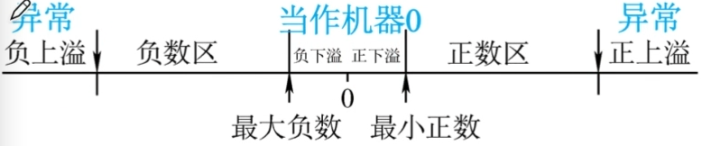
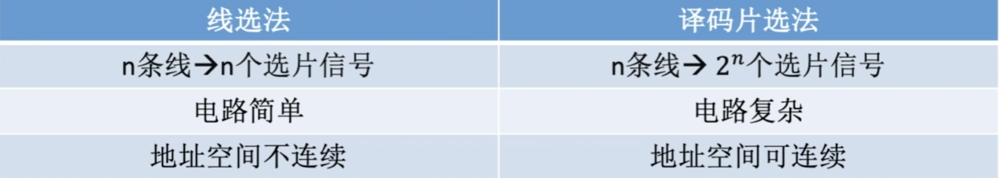
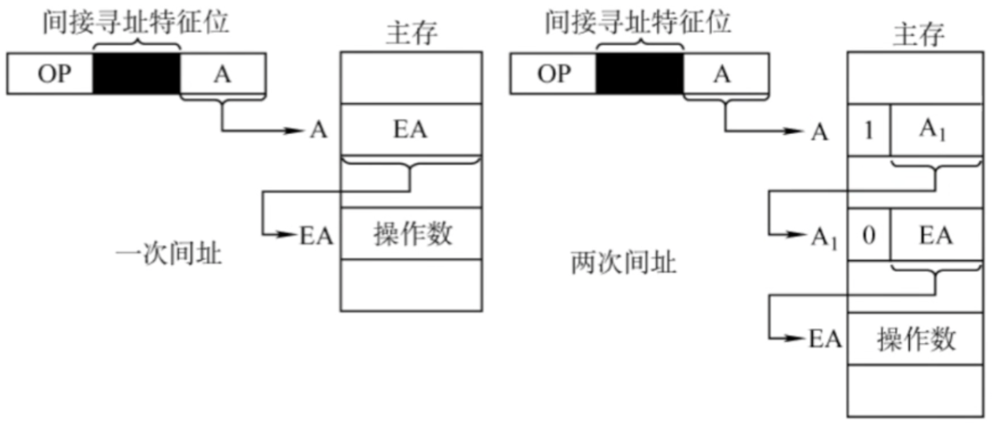
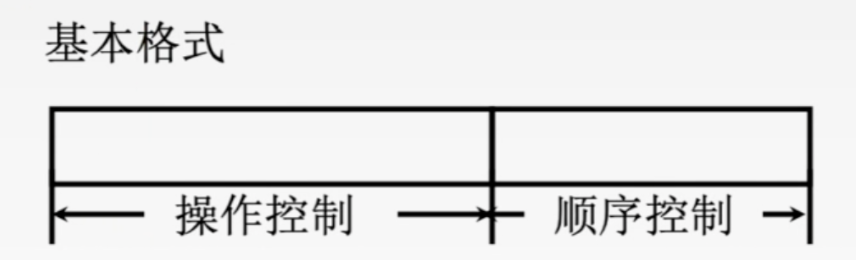
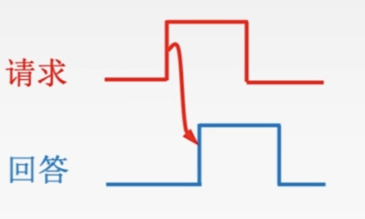
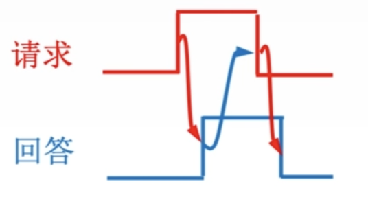

# Ch1. 计算机系统概述

##  1.2 计算机系统层次结构

### 1.2.1 计算机系统组成 = 软件 + 硬件

CPU=运算器+控制器

主机=主存储器+CPU

### 1.2.2 计算机硬件

 **1. 冯诺依曼机基本思想**

冯诺依曼机的基本工作方式——控制流驱动方式


冯诺依曼计算机特点：

1. 计算机由五大部件组成
2. 指令和数据以同等地位存于存储器，可按地址寻访
3. 指令和数据用二进制表示
4. 指令由操作码和地址码组成
5. 存储程序
6. 以运算器为中心：IO设备与存储器之间的数据传输通过运算器完成
   ⚠️现代计算机以存储器为中心

存储程序的基本思想：将事先编制好的程序和原始数据送入主存后才能执行，一旦程序被执行，就无需操作人员干预，计算机逐条执行指令，直至程序结束

**2.计算机的功能部件**

- 输入设备
- 输出设备

- 存储器

  1. 主存储器（内存储器）

     - 存储体

       ​	存储单元：每个存储单元存放一串二进制代码
       ​	存储字（word）：存储单元中二进制代码的组合（1word = 2n*1B）
       ​	存储字长：存储单元中二进制代码的位数，可以说1B或1B的偶数倍
       ​	存储元：存储二进制的电子元件（电容），每个存储元可存1bit

     - 存储地址寄存器MAR：用于寻址，位数对应着存储单元的个数

     - 存储数据寄存器MDR：位数 = 存储字长 = 每个存储单元的大小，一般为字节的二次幂的整数倍

  2. 辅助存储器（外存储器）

  - ⚠️相联存储器（内容存储器）：既可以按地址寻址又可以按内容（通常是某些字段）寻址

- 运算器——用于实现算术运算、逻辑运算
  1. 累加器ACC：用于存放操作数或运算结果
  2. 乘商寄存器MQ：在乘、除运算时，用于存放操作数或运算结果。
  3. 操作数寄存器X：用于存放操作数
  4. （*）算术逻辑单元ALU：通过内部复杂的电路实现算数运算、逻辑运算

- 控制器

  1. （*）控制单元CU：分析指令，给出控制信号

  2. 指令寄存器IR：存放当前执行的指令

  3. 程序计数器PC：存放下一条指令地址，有自动加1功能

     完成一条指令的过程：取指令（PC）->分析指令（IR）->执行指令（CU）

### 1.2.3 计算机软件

**三个级别的语言**

1. 机器语言：二进制代码
2. 汇编语言：助记符
3. 高级语言：C/Cpp ...

**翻译程序**——把更高级的语言翻译成较低级的语言

1. 汇编程序（汇编器）：将汇编语言翻译成机器语言程序
2. 解释程序（解释器）：将源程序的语句按执行顺序逐条翻译成机器指令并立即执行（每次执行都要翻译）
3. 编译程序（编译器）：将高级语言程序翻译成汇编语言或机器语言程序（只需翻译一次）

### 1.2.4 计算机系统的多级层次结构

1. 微程序机器M0（微指令系统）：由硬件直接执行微指令
2. 传统机器M1（用机器语言的机器）：执行二进制机器指令

--------------------------------------------------------------⚠️以上是硬件层次，以下是软件层次

1. 虚拟机器M2（操作系统机器）： 向上提供“广义指令”
2. 虚拟机器M3（汇编语言机器）：用汇编程序翻译成机器语言程序
3. 虚拟机器M4（高级语言机器）：用编译程序翻译成汇编语言程序

## 1.3 计算机的性能指标

### 1.3.1 计算机主要的性能指标

**数据通路带宽**

数据总线一次所能并行传输信息的位数（各硬件通过数据总线传输数据）

**主存容量**

MAR的位数反应存储单元的个数，MAR的位数反映可寻址范围的最大值（而不一定是实际存储器的存储容量）

**运算速度**

1. 吞吐量：指系统在单位时间内处理请求的数量
2. 响应时间：指从用户向计算机发送一个请求，到系统对该请求作出响应并获得所需结果的等待时间
3. 主频和CPU时钟周期
   - 主频：机器内部主时钟的频率，主频越高，执行指令越快
   - CPU时钟周期：CPU中最小的时间单元，=主频的倒数
4. CPI：执行一条指令所需的时钟周期数
   影响因子：系统结构、指令集、计算机组织
5. CPU执行时间 = CPU时钟周期数/主频 = （指令条数 * CPI）/主频
6. IPS：每秒执行多少条指令，IPS = 主频/平均CPI
7. FLOPS：每秒执行多少次浮点运算

**基准程序**

是用来测量计算机处理速度的一种实用程序，以便于被测量的计算机性能可以与运行相同程序的其他计算机性能进行比较

### 思考

1. 主频高的CPU一定比主频低的CPU快吗？

   不一定，如两个CPU，A的主频为2GHz，平均CP1=10；B的主频1GHz，平均CP1=1.

2. 若A、B两个CPU的平均CPI相同，那么A一定更快吗？

   也不一定，还要看指令系统，如A不支持乘法指令，只能用多次加法实现乘法；而B支持乘法指令。

3. 基准程序执行得越快说明机器性能越好吗？

   基淮程序中的语句存在频度差异，运行结果也不能完全说明问题

- 常用数量单位
  - 描述存储容量、文件大小时：K=2^10, M=2^20, G=2^30, T=2^40
  - 描述频率、速率时：K=10^3, M=10^6, G=10^9, T=10^12

# Ch2. 数据的表示和运算

## 2.1 数制与编码

### 2.1.1 进位计数制及其相互转换

基数：每个数码位所用到的不同符号的个数，r进制基数为r


真值：符合人类习惯的数字

机器数：数字世纪存到机器里的形式，正负号需要被“数字化”

### 2.1.3 定点数的编码表示

**机器数的定点表示**

定点数：

- 定点整数——带符号整数
- 定点小数——纯小数，约定小数点在符号位之后、有效数值部分最高位之前
  【注】：定点小数的加减法运算同定点整数，即先转换成补码在进行加法运算

定点小数 vs 定点整数：

- 
- 扩展位数时，拓展位置不一样


**原码**

1. 符号位“0/1〞对应“正/负”，剩余的数值位表示真值的绝对值
2. 若机器字长n+1位，带符号整数的原码表示范围：-(2^n - 1)<=x<=2^n - 1
3. 真值 0 有两种表示方式，+0/-0

缺点：符号位不能参与运算，需要设计更复杂的硬件电路来实现加减法运算

**补码**

原码补码快速转换（手算）：

- 正数：原码 = 补码
- 负数：在原码中从左往右找到第一个1，这个1左边所有的”数值位“按位取反
  【注】：逆向转换同样可以

计算机硬件如何做补码的加法：从最低位开始，按位相加（符号位参与运算），并往更高位进位

求相反数的补码：在x的补码中从左往右找到第一个1，这个1左边的”全部位“按位取反

计算机硬件如何做带符号整数的减法：

1. 在补码的基础上，“被减数"不变，"减数〞全部位按位取反、末位＋1，减法变加法
2. 从最低位开始，按位相加，并往更高位进位

**移码 **——补码的基础上将符号位取反

**原码、反码、补码、移码对比**


原码和反码的合法表示范围完全相同，都有两种方法表示真值0
补码的合法表示范围比原码多一个负数，只有一种方法表示真值0
移码的合法表示范围比原码多一个负数，只有一种方法表示真值0

### 2.1.4 整数的表示

**1. 无符号整数**

- 全部二进制位都是数值位，没有符号位，第i位的位权是 2^i-1
- n bit 无符号整数表示范国(0~2^n-1)，超出则溢出，意味着该计算机无法一次处理这么多
- 可以表示的最小的数——全0，可以表示的最大的数——全1

计算机硬件如何做无符号整数的加法：从最低位开始，按位相加，并往更高位进位

计算机硬件如何做无符号整数的减法：

1. “被减数”不变，“减数”全部位按位取反、末位＋1，减法变加法
2. 从最低位开始，按位相加，并往更高位进位

## 2.2 运算方法和运算电路

### 2.2.1 基本运算部件

**一位全加器**


**串行进位加法器**

- 串行加法器：只有一个全加器，数据逐位串行送入加法器中进行运算。进位触发器用来寄存进位信号，以便参与下一次运算。
  如果操作数长n位，加法就要分n次进行，每次产生一位和，并且串行逐位地送回寄存器。
  影响串行加法器的运算时间因素：主要是由进位信号的传递时间决定的，位数越多延迟时间就越长
- 串行进位的并行加法器：把n个全加器串接起来，就可进行两个n位数的相加。串行进位又称为行波进位，每一级进位直接依赖于前一级的进位，即进位信号是逐级形成的。
  

**并行加法器**——并行进位

Def：各级信号同时形成，又称作先行进位、同时进位
$$
C_i=A_iB_i+(A_i\oplus B_i)C_{i-1}\\
G_i==A_iB_i，P_i=A_i\oplus B_i \\
C_1=G_1+P_1C_0\\
C_2=G_2+P_2C_1=G_2+P_2G_1+P_2P_1C_0\\
......\\
C_4=...
$$
实现上述逻辑表达式的电路称为先行进位（或超前进位）部件——CLA部件

**算术逻辑单元ALU**

ALU的核心是带标志的加法器，同时也能执行”与或非“等逻辑运算和“移位”操作

### 2.2.2 定点数的移位运算

移位：通过改变各个数码位和小数点的相对位置，从而改变各数码位的位权。可用移位运算实现乘法、除法

**1. 算术移位**

1. 原码的算数移位——符号位保持不变，仅对数值位进行移位．
   - 右移：高位补0，低位舍弃。若舍弃的位=0，则相当于/2；若舍弃的位!=0，则会丢失精度
   - 左移：低位补0，高位舍弃。若舍弃的位=0，则相当于x2；若舍弃的位!=0，则会出现严重误差
2. 反码的算数移位
   - 正数的反码移位 = 其原码移位
   - 负数的反码数值位与原码相反
     - 右移：高位补1，低位舍弃。
     - 左移：低位补1，高位舍弃。
3. 补码的算数移位
   - 正数的补码移位 = 其原码移位
   - 负数补码=反码末位+1，导致反码最右边几个连续的1都因进位而变为0，直到进位碰到第一个为止。
     【规律】——负数补码中，最右边的1及其右边同原码。最右边的1的左边同反码负数补码
     - 右移（同反码）：高位补1，低位舍弃。
     - 左移（同原码）：低位补0，高位舍弃。

规则：


**2. 逻辑移位**

可以把逻辑移位看作对无符号数的算术移位

- 逻辑左移：低位补0，高位舍弃。
- 逻辑右移：高位补0，低位舍弃。

**3. 循环移位**

- 带进位标志位CF的循环移位（大循环）
- 不带进位标志位CF的循环移位（小循环）
  1. 左移：将最高位移入最低位和标志位CF
  2. 右移：将最低位移入最高位和标志位CF

循环移位适合将数据的低字节数据和高字节数据互换

### 2.2.3 定点数的加减运算

**补码加减法运算电路**


**标志位**

- OF（Overflow Flag）溢出标志
  - Def：有符号数的加减运算是否发生了溢出，OF=1时．说明发生了溢出
  - 硬件的计算方法：OF=最高位产生的进位 ⊕ 次高位产生的进位
- SF（Sign Flag）符号标志
  - Def：有符号数加减运算结果的正负性，SF=0表示运算结果为正数，SF=1表示运算结果为负数
  - 硬件的计算方法：SF = 最高位的本位和
- ZF（Zero Flag）零标志位
  - Def：表示运算结果是否为0。ZF = 1表示运算结果为0，ZF = 0表示运算结果非0
  - 硬件的计算方法：两个数的运算结果为n bit，只有n bit全为0时，ZF = 1
- CF（Carry Flag）进位/借位标志位
  - Def：表示无符号教的加减法是否发生了讲位或借位。当CF = 1时。说明无符号数的加减运算发生了进位或借位，也即发生了溢出
  - 硬件的计算方法：CF = 最高位产生的进位  ⊕ Sub（【注】：Sub=1 -> 减法，Sub=0 -> 加法）

⚠️OF、SF对无符号数的加减法无意义；CF对有符号数的加减法无意义

### 2.2.4 定点数的乘除运算

**1. 定点数的乘法**

***原码的一位乘法***


实现方法：——机器字长n+1位，数值部分占n位

- 符号位通过异或确定；

- 数值部分通过被乘数和乘数绝对值的n轮加法、移位完成
- 根据当前乘数中参与运算的位确定(ACC)加什么。
- 若当前运算位=1，则(ACC)+[|x|]原；若=0，则(ACC)+0。
- 每轮加法后ACC、MQ的内容统一逻辑右移

Tips：

1. 乘数的符号位不参与运算，可以省略原码
2. 位乘可以只用单符号位
3. 答题时最终结果最好写为原码机器数

***补码的一位乘法***


辅助位初始为0。每次右移会使MQ的最低位顶替原本的辅助位（事实上MQ共n+2位）
所有寄存器都统一用n+2位，因此采用双符位补码运算

实现方法：

- 进行n轮加法、算术右移位，最后再多来一次加法
- 每次加法可能+0、+[x]_补、+[-x]\_补
  【注】：根据当前MQ中的最低位、辅助位来确定加什么
  - 辅助位 - MQ中“最低位” = 1时，(ACC)+[x]_补
  - 辅助位 - MQ中”最低位“ = 0时，(ACC)+0
  - 辅助位  - MQ中“最低位” = -1时，(ACC)+[-x]_补
- 符号位参与运算

***原码一位乘法 vs 补码一位乘法***


**2. 定点数的除法**

原码的一位除法——恢复余数法


原码的一位除法——加减交替法（不恢复余数法）


恢复余数法：当余数为负时商0，并+|除数|，再左移，再|除数|

加减交替法：当余数为负时商0，并左移，再+|除数|

补码的一位除法——加减交替法

- 符号位参与运算
- 被除数/余数、除数采用双符号位
- 运算规则：
  - 被除数和除数同号，则被除数减去除数：
    异号则被除数加上除数。
  - 余数和除数同号，商1，余数左移一位减去除数；
    余数和除数异号，商0，余数左移一位加上除数
  - 重复n次

**两种加减交替法对比**


### 2.2.5 C语言中整数类型及类型转换

**1. 有符号数和无符号数的转换**

```c
short x=-4321;
unsigned short y=(unsigned short)x;
```

不改变数据内容，改变解析方式。即x的补码和y的补码一样，只是解析方式不同，y=61215

**2. 不同字长整数之间的转换**

- 长变短

```c
int a=165537, b=-34991; //int类型占4B
short c=(short)a; //short类型占2B
short d=(short)b;
```

长整数变短整数，高位直接截断丢弃，保留低位。

a：0x000286A1 => c：0x86A1；b：0xFFFF7751 => d：0x7751

- 短变长

```c
‘short x=-4321;
int y=x;
unsigned short u=(unsigned short)x;
unsigned int v=u;
```

短整数变长整数采用符号扩展——对高位部分用原数字符号位进行填充（无符号数补0）
【注】：char类型是8bit无符号数

### 2.2.6 数据的存储和排列

**1. 数据的“大小端”存储方式**

大端方式：按最高有效字节（MSB）到最低有效字节（LSB）的顺序存储——便于人类阅读

小端方式：按LSB到MSB的顺序存储——利于机器处理

**2. 数据按”边界对齐“方式存储**

现代计算机通常是按字节编址，即每个字节对应1个地址。通常也支持按字、按半字、按字节寻址。

假设存储字长为32位，则1个字=32bit，半字=16bit。每次访存只能读/写1个字


通过字或者半字地址转换到字节地址只需要逻辑左移1或2位

## 2.3 浮点数的表示与运算

### 2.3.1 浮点数的表示

**1. 浮点数的表示格式**


阶码E：常用补码或移码表示的定点整数，E反映浮点数的表示范围及小数点的实际位置
尾数M：常用原码或补码表示的定点小数，M数值部分的位数n反映浮点数的精度
浮点数的真值：N = r^E * M

【注】：尾数给出了一个小数，阶码指明了小数点要向前/后移动几位

**2. 浮点数尾数的规格化**

规格化浮点数：规定尾数的最高数值位必须是一个有效值。

- 左规：当浮点数运算的结果为非规格化时要进行规格化处理，将尾数算数左移一位，阶码减1。
- 右规：当浮点数运算的结果尾数出现溢出（双符号位为01或10）时，将尾数算数右移一位，阶码加1。

【注】：采用“双符号位”，当溢出发生时，可以挽救。更高的符号位是正确的符号位

**3. 规格化浮点数的特点**

1. 用原码表示的尾数进行规格化：

   - 正数为0.1××..x的形式，其最大值表示为0.11...1；最小值表示为0.10...0。
     尾数的表示范围为1/2≤M≤(1-2^-n)。
   - 负数为1.1××..× 的形式，其最大值表示为1.10...0；最小值表示为1.11...1。
     尾数的表示范围为-(1-2^-n)<M<-1/2。

   【注】：规格化的原码尾数，最高数值位一定是1

2. 用补码表示的尾数进行规格化：

   - 正数为0.1××..x的形式，其最大值表示为0.11...1；最小值表示为0.10...0。
     尾数的表示范围为1/2≤M<(1-2-1。
   - 负数为1.0××..×的形式，其最大值表示为1.01...1；最小值表示为1.00...0。
     尾数的表示范围为-1≤M<-(1/2+2^-n)。

   【注】：规格化的补码尾数，符号位与最高数值位一定相反
   

**4. IEEE 754标准** 


由浮点数确定真值（阶码不是全0、也不是全1）

1. 根据“某浮点数” 确定数符、阶码、尾数的分布

2. 确定尾数 1.M（注意补充最高的隐含位1）

3. 确定阶码的真值=移码-偏置值（可将移码看作无符号数，用无符号数的值减去偏置值）

4. 

5. 
    真值=(-1)^s * 1.M*2^{E-偏置值}

阶码E全0、全1的特殊用途：

- E全0（阶码真值-127）
  - 尾数M不全0时，表示非规格化小数，+/-（0.M）B*2^-126
    【注】：隐含位从1变0；虽然阶码真值为-127，但这里规定指数固定为-126
  - 尾数M全0时，表示真值+/-0
- E全1（阶码真值-128）
  - 尾数M全0时，表示+/-∞
  - 尾数M不全0时，表示非数值NAN（Not A Number，如a/0...等非法运算）

**5. 定点、浮点的表示区别**

1. 数值表示的范围
   字长相同的前提下，浮点数表示的范围远大于定点数
2. 精度
   浮点数虽然扩大了表示范围，但是降低了精度
3. 运算
   浮点数运算较定点数更为复杂
4. 溢出
   当定点数运算结果超出范围时会发生溢出；浮点数运算后只有规格化后的阶码超出表示的范围时才会发生溢出

### 2.3.2 浮点数的加减运算

**浮点数加减运算步骤**：

1. 对阶——小阶向大阶看齐

2. 尾数求和

3. 规格化

   - 左规一次相当于乘2，右规一次相当于除2
   - 需要右规时，只需要一次

4. 舍入
   ⚠️只有对阶和右规格化时才可能会发生舍入

   - “0”舍“1”入法——类似于十进制数运算中的“四舍五入” 法，即在尾数右移时，被移去的最高数值位为0，则舍去；被移去的最高数值位为1，则在尾数的末位加1。这样做可能会使尾数又溢出，此时需再做一次右规。

   - 恒置“1” 法——尾数右移时，不论丟掉的最高数值位是“1”还是“”都使右移后的尾数末位恒置“1”。这种方法同样有使尾数变大和变小的两种可能。

   - 截断法：直接丢弃后面的位

     【注】：有的计算机可能会把浮点数的尾数部分单独拆出去计算(24bit-≥ 32bit)，算完了经过舍入(32bit-≥24bit) 再拼回浮点数

5. 溢出判断

   - 指数上溢——一个正指数超过了最大允许值，产生异常

   - 指数下溢——一个负指数超过了最小允许值，机器一般按0处理，不产生异常

     【注】：是否溢出主要看是否发生了指数上溢

**C语言强制类型转换**


无损转换：

- Char -> int ->long -> double
- Float -> double

有损转换：

- Int -> float：可能损失精度
- float -> int：可能损失精度，也可能溢出

# Ch3. 存储系统

## 3.1 存储器概述

### 3.1.1存储器分类

**1. 按在计算机中的作用（层次）分类**

1. 高速缓冲（Cache）——可直接被CPU调用
2. 主存储器（主存、内存）——可直接被CPU调用
3. 辅助存储器（辅存、外存）——需调入主存后才可被CPU调用

**2. 按存取方式分类**

1. 随机存取存储器 (Random Access Memory, RAM)：读写任何一个存储单元所需时间都相同，与存储单元所在的物理位置无关
2. 只读存储器（ROM）：存储器的内容只能随机读出而不能写入
3. 串行访问存储器：读写某个存储单元所需时间与存储单元的物理位置有关
   - 顺序存取存储器 (Sequential Access Memory,SAM)：读写一个存储单元所需时间取决于存储单元所在的物理位置
   - 直接存取存储器 (Direct Access Memory,DAM)：既有随机存取特性，也有顺序存取特性。先直接选取信息所在区域，然后按顺序方式存取。

**3. 按信息的可保存性分类**

- 断电后，存储信息消失的存储器——易失性存储器（主存、Cache )
  断电后，存储信息依然保持的存储器一一非易失性存储器（磁盘、光盘）
- 信息读出后，原存储信息被破坏——破坏性读出 （如DRAM芯片，读出数据后要进行重写
  信息读出后，原存储信息不被破坏——非破坏性读出（如SRAM芯片、磁盘、光盘）

### 3.1.2 存储器的性能指标

1. 存储容量：存储字数×字长（如1M×8位）

   [^字长]: MDR位数反映存储字长
2. 单位成本：每位价格=总成本/总容量
3. 存储速度：数据传输率（主存带宽）=数据的宽度（存储字长）/存储周期
   

- 存取时间（Ta）：存取时间是指从启动一次存储器操作到完成该操作所经历的时间，分为读出时间和写入时间。
- 存取周期（Tm）：存取周期又称为读写周期或访问周期。它是指存储器进行一次完整的读写操作所需的全部时间，即连续两次独立地访问存储器操作（读或写操作）之间所需的最小时间间隔
- 主存带宽（Bm）：主存带宽又称数据传输率，表示每秒从主存进出信息的最大数量，单位为字/秒、字节/秒 （B/s）或位/秒(b/s)

### 3.1.3 多级层次的存储系统


主存和Cache之间的数据调动是由硬件自动完成的，对所有程序员是透明的

主存和辅村之间的数据调动是由硬件和操作系统共同完成的，对应用程序员是透明的

## 3.2 主存储器

### 3.2.1 SRAM芯片和DRAM芯片

**地址线复用技术**


分行列地址可使地址线更少，芯片引脚更少

- DRAM是分两次送行列地址，因为DRAM的存储元较多，行列地址较长
- SRAM是同时送行列地址，因为SRAM的存储元较少

**DRAM的刷新**

1. 多久需要刷新一次？
Ans：刷新周期：一般为2ms

1. 每次刷新多少存储单元？
Ans：以行为单位，每次刷新一行存储单元

1. 为什么要用行列地址？
Ans：减少选通线的数量

1. 如何刷新？
Ans：有硬件支持，读出一行的信息后重新写入，占用1个读/写周期

5. 在什么时刻刷新？
   （假设DRAM内部结构排列成128 ×128的形式，读/写周期0.5us，2ms共 2ms/0.5us=4000个周期）

   - 分散刷新：每次读写完都刷新一行 => 系统的存取周期变为1us
     

   - 集中刷新：2ms内集中安排时间全部刷新 => 系统的存取周期还是0.5us。有一段时间专门用于刷新，无法访问存储器，称为访存“死区”
     
   - 异步刷新：2ms内每行刷新1次即可 => 2ms内需要产生128次刷新请求。每隔2ms/128=15.6us一次，每15.6us内有0.5us的“死时间”
     

**SRAM vs DRAM**


### 3.2.2 只读存储器ROM*

**ROM分类**

1. MROM (Mask Read-Only Memory)——掩模式只读存储器
   厂家按照客户需求，在芯片生产过程中直接写入信息，之后【任何人不可重写（只能读出）】可靠性高、灵活性差、生产周期长、只适合批量定制
2. PROM (Programmable Read-Only Memory)——可编程只读存储器
   用户可用专门的PROM写入器写入信息，写【一次之后就不可更改】
3. EPROM (Erasable Programmable Read-Only Memory)——可擦除可编程只读存储器
   允许用户写入信息，之后用某种方法擦除数据，【可进行多次重写】
   - UVEPROM (ultraviolet rays)——用紫外线照射8~20分钟，擦除所有信息
   - EEPROM （第一个E是Electrically)——可用“电擦除”的方式，擦除特定的字
4. Flash Memory一一闪速存储器（如：U盘、SD卡就是闪存）
   在EEPROM 基础上发展而来，断电后也能保存信息，且可进行多次快速擦除重写
   【注】：由于闪存需要先擦除在写入，因此闪存的【“写” 速度要比“读” 速度更慢】。
5. SSD (Solid State Drives)——固态硬盘
   由控制单元+存储单元（Flash 芯片）构成，与闪速存储器的核心区别在于控制单元不一样，但存储介质都类似，【可进行多次快速擦除重写】。SSD速度快、功耗低、价格高。目前个人电脑上常用SSD取代传统的机械硬盘
6. 计算机中的重要ROM——BIOS芯片：存储了 “自举装入程序”，负责引导装入操作系统（开机）
   【注】：BIOS芯片一般被集成在CPU的RAM中，RAM划出一部分给BIOS

### 3.2.3 主存储器的基本组成


【注】：MOS管可理解为一种电控开关，输入电压达到某个阈值时，MOS管就可以接通


1. 读/写线

   - 两根读/写线
     - {WE}:允许写 
     - {OE}:允许读

      - 一根读/写线
        $$
        \bar {WE}:低电平写，高电平读
        $$


   【注】：头上划线表示该信号低电平有效

2. 片选线：一个内存条可能包含多块存储芯片，片选线帮助选择在哪块芯片上进行读写

3. n位地址 -> 2^n 个存储单元
4. 总容量=存储单元个数 x 存储字长

寻址：

- 按字节寻址（1B）
- 按字寻址（4B）：左移两位
- 按半字寻址（2B）：左移1位
- 按双字寻址（8B）：左移3位



### 3.2.4 多模块存储器

⚠️存取周期T = 存取时间r + 恢复时间

**1. 单体多字存储器**

Def：每个存储单元存储m个字，总线宽度也为m个字，一次并行读出m个字


缺点：

1. 每次只能同时取m个字，不能单独取其中某个字
2. 指令和数据在主存内必须是连续存放的

**2. 多体并行存储器**

Def：每个模块都有相同的容量和存取速度。各模块都有独立的读写控制电路、地址寄存器和数据寄存器它们既能并行工作，又能交叉工作。


假设每个存储体的存取周期为T，存取时间为r，T=4r（恢复时间=3r）


不难看出当需要存取连续内存时，低位交叉编址的效率要高得多！

低位交叉编址原理： 采用“流水线”的方式并行存取（宏观上并行，微观上串行）。宏观上，一个存储周期内，m体交叉存储器可以提供的数据量为单个模块的m倍。

- 存取周期为T，存取时间为r，为了使流水线不间断，应保证模块数m≥T/r
- 存取周期为T，总线传输周期为r，为了使流水线不间断，应保证模块数 m≥T/r

## 3.3 主存储器与CPU的连接

### 3.3.1 连接原理

1. 主存储器通过数据总线、地址总线和控制总线与CPU连接
2. 数据总线的位数与工作频率的乘积正比于数据传输率
3. 地址总线的位数决定了可寻址的最大内存空间
4. 控制总线（读/写）指出总线周期短类型和本次输入/输出操作的完成的时刻
   

### 3.3.2 主存容量的扩展

**1. 位扩展**


【注】：仅采用位扩展时，各芯片连接地址线的方式相同，但连接数据线的方式不同，在某一时刻选中所有的芯片，所以片选信号CS要连到所有芯片

**2. 字扩展**

字扩展是指增加存储器中字的数量，而位数不变。


- 线选法——高位地址线直接（或经反相器）分别连接至各个存储芯片的片选端。
  【注】：每次寻址只能由一位高位地址有效，不允许同时多位有效
  - 优点：不需要译码器，线路简单
  - 缺点：地址空间不连续，不能充分利用存储器空间，造成地址资源浪费
- 译码片选法——高位地址线通过译码器芯片产生片选信号

【注】：仅采用字扩展时，各芯片连接地址线和数据线方式相同，但在某一时刻只需选中部分芯片，所以通过片选信号CS或采用译码器设计连接到相应芯片

**3. 字位同时扩展**

字位同时扩展是指既增加存储字的数量，又增加存储字长


【注】：采用字位同时扩展时，各芯片连接地址线的方式相同，但连接数据线的方式不同，而且需要通过片选信号CS或采用译码器设计连接到相应芯片

### 3.3.3 存储芯片的地址分配和片选

见3.3.2中的字扩展部分

### 3.3.4 存储器与CPU的连接

## 3.4 外部存储器

### 3.4.1 磁盘存储器

**1. 磁盘存储器**

1. 磁盘设备的组成

   - 磁盘存储器的组成：硬盘存储器由磁盘驱动器，磁盘控制器和盘片组成。

     - 磁盘驱动器：核心部件是磁头组件和盘片组件，温彻斯特盘是一种可移动头固定盘片的硬盘存储器

     - 磁盘控制器：是硬盘存储器和主机的接口，主流的标准有1DE、SCSI、SATA等

   - 存储区域：一块硬盘含有若干个记录面，每个记录面划分为若干条磁道，而每条磁道又划分为若干个扇区，扇区（也称块）是磁盘读写的最小单位，也就是说磁盘按块存取

     - 磁头数（Heads）：即记录面数，表示硬盘总共有多少个磁头，磁头用于读取/写入盘片上记录面的信息，一个记录面对应一个磁头。
     - 柱面数（Cylinders）：表示硬盘每一面盘片上有多少条磁道。在一个盘组中，不同记录面的相同编号（位置）的诸磁道构成一个圆柱面
     - 扇区数（Sectors）：表示每一条磁道上有多少个扇区

2. 磁盘性能指标

   - 磁盘的容量：一个磁盘所能存储的字节总数称为磁盘容量。磁盘容量有非格式化容量和格式化容量之分。

     - 非格式化容量——是指磁记录表面可以利用的磁化单元总数。
     - 格式化容量——是指按照某种特定的记录格式所能存储信息的总量。

   - 记录密度：记录密度是指盘片单位面积上记录的二进制的信息量，通常以道密度、位密度和面密度表示。

     - 道密度——沿磁盘半径方向单位长度上的磁道数

     - 位密度——磁道单位长度上能记录的二进制代码位数

     - 面密度——位密度和道密度的乘积。

       【注】：磁盘所有磁道记录的信息量一定是相等的，并不是圆越大信息越多，故每个磁道的位密度都不同（越内侧位密度越大）

   - 平均存取时间 = 寻道时间 （磁头移动到目的磁道）+ 旋转延迟时间（磁头定位到所在扇区）+传输时间（传输数据所花费的时间）

   - 数据传输率：磁盘存储器在单位时间内向主机传送数据的字节数，称为数据传输率。
     【假设磁盘转数为r（转/秒），每条磁道容量为N个字节，则数据传输率为D=rN】

3. 磁盘地址


4. 硬盘的工作过程

   ​	硬盘的主要操作是寻址、读盘、写盘。每个操作都对应一个控制字，硬盘工作时，第一步是取控制
   字，第二步是执行控制字。
   ​	硬盘属于机械式部件，其读写操作是串行的，不可能在同一时刻既读又写，也不可能在同一时刻读
   两组数据或写两组数据。

**2. 磁盘阵列**

RAID ( Redundant Array of Inexpensive Disks， 廉价冗余磁盘阵列）是将多个独立的物理磁盘组成一个独
立的逻辑盘，数据在多个物理盘上分割交叉存储、 并行访问，具有更好的存储性能、可拿性和安全性。

- RAID0：把连续多个数据块交替地存放在不同物理磁盘的扇区中，几个磁盘交叉并行读写，不仅扩大了存储容量，而且提高了磁盘数据存取速度，但RAID0没有容错能力。——条带化，提高存取速度，没有容错能力
- RAID1:为了提高可拿性，使两个磁盘同时进行读写，互为备份，如果一个磁盘出现故障可从另一磁盘中读出数据。两个磁盘当一个磁盘使用，意味着容量减少一半。——镜像磁盘互为备份
- RAID2～RAID5:通过数据校验提高容错能力

优点：

1. RAID通过同时使用多个磁盘，提高了传输率
2. 通过在多个磁盘上并行存取来大幅提高存储系统的数据吞吐量
3. 通过镜像功能，可以提高安全可靠性
4. 通过数据校验，可以提供容错能力

### 3.4.2 固态硬盘SSD


1. 原理——基于闪存技术Flash Memory，属于电可擦除ROM，即EEPROM
2. 组成：
   - 闪存翻译层——负责翻译逻辑块号，找到对应页（Page）
   - 存储介质——多个闪存芯片（Flash Chip），每个芯片包含多个块（block），每块包含多个页（Page）
3. 读写性能特性：
   - 以页 (page）为单位读/写，相当于磁盘的"扇区”
   - 以块（block） 为单位"擦除”，擦干净的块，其中的每页都可以写一次，读无限次
   - 支持随机访问，系统给定一个逻辑地址，闪存翻译层可通过电路迅速定位到对应的物理地址
   - 读快、写慢。要写的页如果有数据，则不能写入，需要将块内其他页全部复制到一个新的 （擦除过的）块中，再写入新的页
4. 与机械硬盘相比的特点：
   - SSD读写速度快，随机访问性能高，用电路控制访问位置；机械硬盘通过移动磁臂旋转磁盘控制访问位置，有寻道时间和旋转延迟
   - SSD 安静无噪音、耐摔抗震、能耗低、造价更贵
   - SSD的一个“块"被擦除次数过多（重复写同一个块）可能会坏掉，而机械硬盘的扇区不会因为写的次数太多而坏掉
5. 磨损均衡技术——思想：将“擦除，平均分布在各个块上，以提升使用寿命
   - 动态磨损均衡——写入数据时，优先选择累计擦除次数少的新闪存块
   - 静态磨损均衡——SSD监测并自动进行数据分配、迁移，让老旧的闪存块承担以读为主的储存任务，让较新的闪存块承担更多的写任务

## 3.5 高速缓冲存储器Cache

### 3.5.1 程序访问的局部性原理

- 空间局部性：在最近的未来要用到的信息(指令和数据)，很可能与现在正在使用的信息在存储空间上是邻近的
- 时间局部性：在最近的未来要用到的信息，很可能是现在正在使用的信息

### 3.5.2 Cache的基本工作原理

工作原理：将某些主存块复制到 Cache 中，缓和CPU与主存之间的速度矛盾

1. 主存与Cache 之间以“块”为单位进行数据交换
2. 主存的“块”又叫“页/页框/页面”；Cache 的“块”又叫“行”
3. 主存地址可拆分为（主存块号，块内地址）的形式

**性能分析**

- 命中率H：CPU欲访问信息已在Cache中的比率称为Cache命中率
  $$
  H = N_c/(N_c+N_m)
  $$

- 缺失率M = 1 - 命中率H

- 平均访问时间Ta
  设tc为命中时Cache的访问时间，tm为未命中时主存的访问时间

  1. 先访问 Cache，发现未命中再访问主存

  $$
  T_a=Ht_c+(1-H)(t_m+t_c)
  $$

  2. 同时访问 Cache 和主存，若Cache 命中则停止访问主存

  $$
  T_a=Ht_c+(1-H)t_m
  $$

### 3.5.3 Cache和主存的映射方式

**1. 全相联映射**

Def：主存中的每一块可以装入Cache中的任何位置，每行的标记用于指出该行取自主存的哪一块

- 主存地址结构：标记（整个主存块号）+ 块内地址

- CPU访存过程
  1. 主存地址的前22位对比Cache中所有块的标记
  2. 若标记匹配且有效位=1，则Cache命中
  3. 若末命中或有效位=0，则正常访问主存
- 优点：Cache存储空间利用充分，命中率高
- 缺点：查找“标记”最慢，有可能需要对比所有行的标记

**2. 直接映射**

Def：主存中的每一块只能装入Cache中的唯一位置，主存块在Cache中的位置=主存块号%Cache总块数

- 主存地址结构：标记（主存块号前几位）+ Cache行号（主存块号后几位）+ 块内地址
- CPU访存过程
  1. 根据主存块号的后几位确定Cache行
  2. 若主存块号的前19位与Cache标记匹配且有效位=1，则Cache命中
  3. 若末命中或有效位=0，则正常访问主存
- 优点：对于任意一个地址，只需对比一个“标记”，速度最快
- 缺点：Cache 存储空间利用不充分，命中率低

**3. 组相联映射**

Def：主存块可以放到特定分组中的任意位置，所属组号=主存块号％总组数

- 主存地址结构：标记(主存块号前几位)＋组号 （主存块号末几位）+ 块内地址
- CPU访存过程
  1. 根据主存块号的后几位确定所属分组号
  2. 若主存块号的前几位与分组内的某个标记匹配且有效位=1，则Cache命中
  3. 若未命中或有效位=0，则正常访问主存

- 优点：另外两种方式的折中，综合效果较好

【注】：n路组相联映射——每n个Cache 行为一组

### 3.5.4 Cache中主存块的替换算法

1. 随机算法（RAND）——随机确定替换的Cache块【不考虑局部性原理】

2. 先进先出（FIFO）——选择最早调入的行进行替换【不考虑局部性原理】

3. 近期最少使用算法（LRU）——为每一个Cache块设置一个“计数器”，用于记录每个Cache块已经多久没访问过了。每次替换“计数器”最大的Cache块 【考虑局部性原理】

   ①命中时，所命中的行的计数器清零，比其低的计数器加1，其余不变：
   ②未命中且还有空闲行时，新装入的行的计数器置0，其余非空闲行全加1;
   ③末命中目无空闲行时，计数值最大的行的信息块被淘汰，新装行的块的计数器置0，其余全加1。

4. 最不经常使用算法（LFU）——为每一个Cache块设署一个“计数器”，用于记录每个Cache块被访问过几次。当Cache满后替换“计数器” 最小的【没有很好地考虑局部性原理】

### 3.5.5 Cache写策略

**命中**

1. 回写法（write-back）——当CPU对Cache命中时，只修改Cache对内容，而不立即写入主存；为每个块设置一个修改位（脏位），只有当此块被换出时（脏位 == 1）才写回主存。
   - 方法特点：减少了访存次数，但是存在不一致的隐患
2. 全写法（写直通法，write-through）——当CPU对Cache 写命中时，必须把数据同时写入Cache和主存，一般使用写缓冲(write buffer，一个SRAM的FIFO队列)；使用写缓冲，CPU写的速度很快，若写操作不频繁，则效果很好。若写操作很频繁，可能会因为写缓冲饱和而发生阻塞
   - 方法特点：方法实现简单，能随时保持主存数据的正确性。缺点是增加了访存次数，降低了Cache效率

**未命中**

1. 写分配法（write- allocate）——当CPU对Cache写不命中时，把主存中的块调入Cache，在Cache中修改，通常搭配回写法使用
   - 方法特点：试图利用空间的局部性，但是每次不命中都要从主存中读取一块
2. 非写分配法(not- write-allocate)——当CPU对Cache写不命中时只写入主存，不调入Cache。搭配全写法使用。【注】：只有“读”未命中时才调入Cache

**多级Cache**


现代计算机常采用多级Cache，离CPU越近的速度越快，容量越小；离CPU越远的速度越慢，容量越大

## 3.6 虚拟存储器。。。


# Ch4. 指令系统

指令系统是计算机硬件的指令系统

## 4.1 指令格式

指令字长：一条指令的总长度（可能会变）

半字长指令、单字长指令、双字长指令——指令长度是机器字长的多少倍

 **按指令长度分类**

1. 定长指令字结构：指令系统中所有指令的长度都相等
2. 变长指令字结构：指令系统中各种指令的长度不等

**按操作数地址码的数目不同**

1. 零地址指令——只给出操作码OP，没有显示地址
   - 不需要操作数，如空操作、停机、关中断等指令
   - 堆栈计算机，两个操作数隐含存放在栈顶和次栈顶，计算结果压回栈顶

2. 一地址指令

   - 只需要单操作数，如加1、减1、取反、求补等
     指令含义：OP(A1) -> A1，
     完成一条指令需要3次访存：取指之读A1 -＞写A1

   - 需要两个操作数，但其中一个操作数隐含在某个寄存器（如隐含在ACC)
     指令合义：(ACC)OP(A1) -> ACC
     完成一条指令需要2次访存：取指-＞读A1

     【注】：A1指某个主存地址，（A1)表示 A1所指向的地址中的内容

3. 二地址指令——要求使用两个操作数，需分别给出目的操作数和源操作数地址，运算结果保存至目的操作数地址
   指令含义：(A1)OP(A2) -> A1
   完成一条指令需要访存4次，取指 ->读A1 ->读A2 -> 写A1

4. 三地址指令——用一个新的地址A3来存两个操作数的运算结果
   指令含义：(A1)OP(A2)->A3
   完成一条指令需要访存4次，取指 ->读A1 -> 读A2 -> 写A3

5. 四地址指令——A4 = 下一条将要执行指令的地址
   指令含义：(A)OP(Az)>A3
   完成一条指令需要访存4次，取指 -> 读A1 -> 读A2 -> 写A3
   - 正常情况下：取指令之后 PC+1，指向下一条指令
     四地址指令：执行指令后，将PC的值修改位 A, 所指地址

### 4.1.2 定长操作码指令格式

在指令的最高位部分分配固定的若干位（定长）表示操作码。（n位操作码可以表示2^n条指令）

定长操作码对于简化计算机硬件，提高指令译码和识别速度有利

### 4.1.3 扩展操作码指令格式

定长指令字结构 + 可变长操作码 = 扩展操作码指令格式

在设计扩展操作码指令格式时，必须注意以下两点：

1. 不允许短码是长码的前缀，即短操作码不能与长操作码的前面部分的代码相同。
2. 各指令的操作码一定不能重复。

通常情况下，对使用频率较高的指令，分配较短的操作码；对使用频率较低的指令，分配较长的操作码，从而尽可能减少指令译码和分析的时间。


扩展操作码(不定长操作码）：全部指令的操作码字段的位数不固定，且分散地放在指令字的不同位置上。

- 最常见的变长操作码方法是扩展操作码，使操作码的长度随地址码的减少而增加，不同地址数的指令可以具有不同长度的操作码，从而在满足需要的前提下，有效地缩短指令字长
- 优：在指令字长有限的前提下仍保持比较丰富的指令种类；
  缺：增加了指令译码和分析的难度，使控制器的设计复杂化

### 4.1.4 指令的操作类型

1. 数据传送【进行CPU和主存之间的数据传送】
   - LOAD——把存储器中的数据放到寄存器中
   - STORE——把寄存器中的数据放到存储器中

2. 算术逻辑、移位操作【运算类】
3. 转移操作【程序控制类：改变程序的执行顺序】
   - 无条件转移 JMP
   - 条件转移 JZ：结果为0；JO：结果溢出；JC：结果有进位
   - 调用和返回 CALL和RETURN
   - 陷阱(Trap)与陷阱指令
4. 输入输出操作【输入输出类(I/O）：进行CPU和工/0设备之间的数据传送】
           CPU寄存器与10端口之间的数据传送(端口即10接口中的寄存器）

## 4.2 指令的寻址方式

### 4.2.1 指令寻址

1. 顺序寻址——通过程序计数器PC + “1”（一个指令字长），自动形成下一条指令地址
2. 跳跃寻址——通过转移类JMP/CAL L实现，通过JMP/CALL指令修改PC的值，下一条指令地址仍由PC给出

### 4.2.2 数据寻址及寻址方式


**1. 直接寻址**

直接寻址：指令字中的形式地址A就是操作数的真实地址EA，即EA=A。


一条指令的执行：取指令（访存1次）-> 执行指令（访存1次），暂不考虑存结果，共访存2次

- 优点：简单，指令执行阶段仅访问一次主存，不需专门计算操作数的地址。
- 缺点：A的位数决定了该指令操作数的寻址范围，操作数的地址不易修改。

**2. 间接寻址**

间接寻址：指令的地址字段给出的形式地址不是操作数的真正地址，而是操作数有效地址所在的存储单元的地址，也就是操作数地址的地址，即EA=(A)。


- 优点：可扩大寻址范围(有效地址EA的位数大于形式地址A的位数）。便于编制程序(用间接寻址可以方便地完成子程序返回)。
- 缺点：指令在执行阶段要多次访存(一次间址需两次访存，多次寻址需根据存储字的最高位确定几次访存）。

**3. 寄存器寻址**

寄存器寻址：在指令字中直接给出操作数所在的寄存器编号，即EA=Ri，其操作数在由尺所指的寄存器内。


一条指令的执行：取指令（访存1次）-> 执行指令（访存0次），暂不考虑存结果，共访存1次

- 优点：指令在执行阶段不访问主存，只访问寄存器，指令字短且执行速度快，支持向量/矩阵运算，
- 缺点：寄存器价格昂贵，计算机中寄存器个数有限。

**4. 寄存器间接寻址**

寄存器间接寻址：寄存器R中给出的不是一个操作数，而是操作数所在主存单元的地址，即EA=(Ri)。

一条指令的执行：取指令（访存1次）-> 执行指令（访存1次），暂不考虑存结果，共访存2次

- 特点：与一般间接寻址相比速度更快，但指令的执行阶段需要访问主存(因为操作数在主存中)。

**5. 隐含寻址**

隐含寻址：不是明显地给出操作数的地址，而是在指令中隐含着操作数的地址。


- 优点：有利于缩短指令字长
- 缺点：需增加存储操作数或隐含地址的硬件。

**6. 立即寻址**


立即寻址：形式地址A就是操作数本身，又称为立即数，一般采用补码形式。#表示立即寻址特征。

一条指令的执行：取指令（访存1次）-> 执行指令（访存0次），暂不考虑存结果，共访存1次

- 优点：指令执行阶段不访问主存，指令执行时间最短
- 缺点：A的位数限制了立即数的范围

**7. 基址寻址**

基址寻址：将CPU中基址寄存器BR（basic address register）的内容加上指令格式中的形式地址A，而形成操作数的有效地址，即EA=(BR)+A。


- 优点：可扩大寻址范围（基址寄存器的位数大于形式地址A的位数）；用户不必考虑自己的程序存于主存的哪一空间区域，故有利于多道程序设计，以及可用于编制浮动程序（整个程序在内存里边的浮动）

【注】：基址寄存器是面向操作系统的，其内容由操作系统或管理程序确定。在程序执行过程中，基址奇存器的内容不变（作为基地址），形式地址可变（作为偏移量）。
当采用通用寄存器作为基址寄存器时，可由用户决定哪个寄存器作为基址寄存器，但其内容仍由操作系统确定。

**8. 变址寻址**

变址寻址：有效地址EA等于指令字中的形式地址A与变址寄存器IX（index register）的内容相加之和，即EA= (IX)+A，其中以可为变址奇存器（专用）也可用通用寄存器作为变址寄存器。


【注】：变址寄存器是面向用户的，在程序执行过程中，变址奇存器的内容可由用户改变(以作为偏移量），形式地址A不变（作为基地址）。而在基址寻址中，BR保持不变作为基地址，A作为偏移量

- 基变复合寻址——先基址后变址寻址： EA=(IX)+((BR)+A)

**9. 相对寻址**

相对寻址：把程序计数器PC的内容加上指令格式中的形式地址A而形成操作数的有效地址，即EA=(PC)+A，其中A是相对于PC所指地址的位移量，可正可负，补码表示。


优点：操作数的地址不是固定的，它随着PC值的变化而变化，它随着PC值的变化而变化，口并且与指令地址之间总是相差一个固定值，因此便于程序浮动（一段代码在程序内部的浮动）。相对寻址广泛应用于转移指令。

**10. 堆栈寻址**

堆栈寻址：操作数存放在堆栈中，隐含使用堆栈指针(SP：stack pointer)作为操作数地址。

堆栈是存储器（或专用寄存器组）中一块特定的按“后进先出 (LIFO)原则管理的存储区，该存储区中被读/写单元的地址是用一个特定的寄存器给出的，该寄存器称为堆栈指针 (SP)

- 硬堆栈：寄存器堆栈
- 软堆栈：从主存中划出一段区域来做堆栈

**寻址方式对比**


## 4.3 程序的机器代码表示


### 4.3.1 常用汇编指令介绍

**2. 汇编指令格式**

 

- 常见的算术运算指令

  

- 常见的逻辑运算指令

  

- 用于实现分支结构、循环结构的指令：cmp、test、jmp、jxxx

  - 无条件转移指令jmp
    
  - 条件转移指令jxxx
    

- 用于实现两数调用的指令：push、pop、call、ret

- 用于实现数据转移的指令：mov

### 4.3.3 选择语句的机器级表示

### 4.3.4 循环语句的机器级表示

- 用条件转移指令实现循环


- 用loop指令实现循环


## 4.4 CISC和RISC

### 4.4.1 复杂指令系统计算机CISC

设计思路：一条指令完成一个复杂的基本功能

80-20规律：典型的程序中80%的语句仅仅使用处理机中20%的指令

代表：x86架构，主要用于笔记本、台式机

### 4.4.2 精简指令系统计算机RISC

设计思路：一条指令完成一个基本“动作”，多条指令组合完成一个复杂的基本功能

代表：ARM架构，主要用于手机、平板

### 4.4.3 CISC和RISC的比较


# Ch5. 中央处理器

## 5.1 CPU的功能和基本结构

### 5.1.1 CPU的功能

1. 指令控制——完成取指令、分析指令和执行指令的操作，即程序的顺序控制。
2. 操作控制——一条指令的功能往往是由若干操作信号的组合来实现的。CPU管理并产生由内存取出的每条指令的操作信号，把各种操作信号送往相应的部件，从而控制这些部件按指令的要求进行动作
3. 时间控制。对各种操作加以时间上的控制。时间控制要为每条指令按时间
   顺序提供应有的控制信号
4. 数据加工。对数据进行算术和逻辑运算。
5. 中断处理。对计算机运行过程中出现的异常情况和特殊请求进行处理。

运算器——对数据进行加工

控制器——协调并控制计算机各部件执行程序的指令序列，基本功能包括

- 取指令：自动形成指令地址；自动发出取指令的命令。
- 分析指令：操作码译码(分析本条指令要完成什么操作)：产生操作数的有效地址、
- 执行指令：根据分析指令得到的 “操作命令”和“操作数地址”形成操作信号控制序列，控制运算器、存储器以及I/O设备完成相应的操作。
- 中断处理：管理总线及输入输出；处理异常情况(如掉电)和特殊请求(如打印机请求打印一行字符）。

### 5.1.2 CPU的基本结构

**1. 运算器**

1）算术逻辑单元：主要功能是进行算术/逻辑运算。

2）通用寄存器组：如AX、BX、CX、DX、SP等，用于存放操作数（包括源操作数、目的操作数及中间结果）和各种地址信息等。SP是堆栈指针，用于指示栈顶的地址。

- 专用数据通路方式：根据指令执行过程中的数据和地址的流动方向安排连按线路
  如果直接用导线连接，相当于多个寄存器同时并且一直向ALU传输数据，两种解决方法如下：

  1. 使用多路选择器根据控制信号选择一路输出
  2. 使用三态门可以控制每一路是否输出（如：R0out为1时R0中的数据输出到A端，R0out为0时R0中的数据无法输出到B端）

  - 特点：性能较高，基本不存在数据冲突现象，但结构复杂，硬件量大，不易实现。

- CPU内部单总线方式：将所有寄存器的输入端和输出端都连接到一条公共的通路上。

  - 特点：结构简单，容易实现，但数据传输存在较多沖突的现象，性能较低。

3）暂存寄存器：用于暂存从主存读来的数据，这个数据不能存放在通用寄存器中，否则会破坏其原有内容

4）累加寄存器（ACC）：它是一个通用寄存器，用于暂时存放ALU运算的结果信息，用于实现加法运算

5）程序状态字寄存器（PSW）：保留由算术逻辑运算指令或测试指令的结果而建立的各种状态信息，如溢出标志(OF)、符号标志 (SF)、零标志 （ZF）、进位标志(CF）等。PSW中的这些位参与并决定微操作的形成

6）移位器：对运算结果进行移位运算

7）计数器：控制乘除运算的操作步数

**2. 控制器**

【注】：控制器取指令是自动进行的，不需要得到相应指令；所有指令的取指操作都是相同的

工作原理：根据指令操作码、指令的执行步骤（微命令序列）和条件信号来形成当前计算机各部件要用到的控制信号。

1）程序计数器（PC）：用于指出下一条指令在主存中的存放地址。CPU就是根据PC的内容去主存中取指令的。因程序中指令（通常）是顺序执行的，所以PC有自增功能

2）指令寄存器（IR）：用于保存当前正在执行的那条指令

3）指令译码器（ID）：仅对操作码字段进行译码。向控制器提供特定的操作信号

4）微操作信号发生器：根据IR的内容（指令）、PSW的内容 （状态信息〕及时序信号，产生控制整个计算机系统所需的各种控制信号，其结构有组合逻辑型和存储逻辑型两种。

5）时序系统：用于产生各种时序信号，它们都是由统一时钟 （CLOCK） 分频得到。

6）存储器地址寄存器（MIR）：用于存放所要访问的主存单元的地址。

7）存储器数据寄存器（MDR）：用于存放向主存写入的信息或从主存中读出的信息

【注】：CPU内部寄存器可分为两类

1. 用户可见寄存器：可对这类寄存器编程（如：通用寄存器组，PSW）
2. 用户不可见寄存器：对用户时透明的，不可对这类寄存器编程（如：MD，MIR，IR）


## 5.2 指令的执行过程

### 5.2.1 指令周期

指令周期：CPU从主存中每取出并执行一条指令所需的全部时间。
指令周期常常用若干机器周期来表示，机器周期又叫CPU周期。
一个机器周期又包含若干时钟周期（也称为节拍、丁周期或CPU时钟周期，它是CPU操作的最基本单位）。


每个指令周期内机器周期数可以不等，每个机器周期内的节拍数也可以不等。

### 5.2.2 指令周期的数据流

**1. 取址周期**

根据PC的内容从主存中取出指令代码并存放在IR中

1. 当前指令地址送至存储器地址寄存器，记做：(PC)  -> MAR
2. CU发出控制信号，经控制总线传到主存，这里是读信号，记做：1 -> R
3. 将MAR所指主存中的内容经数据总线送入MDR，记做：M(MAR) ->MDR
4. 将MDR中的内容(此时是指令)送入R，记做：(MDR) -> IR
5. CU发出控制信号，形成下一条指令地址，记做：(PC)+1 -> PC
    

**2. 间址周期**

取操作数有效地址

1. 将指令的地址码送入MAR，记做：Ad(IR) -> MAR或Ad(MDR) -> MAR
2. CU发出控制信号，启动主存做读操作，记做：1 -> R
3. 将MAR所指主存中的内容经数据总线送入MDR，记做：M(MAR) -> MDR
4. 将有效地址送至指令的地址码字段，记做：(MDR) -> Ad(IR)
    【注】：此步骤有时有，有时无
    

**3. 执行周期**

取操作数，根据IR的指令字的操作码通过ALU操作产生执行结果

**4. 中断周期**

暂停当前任务去完成其他任务。为了能够恢复当前任务，需要保存断点。一般使用堆栈来保存断点，这里用SP表示栈顶地址，假设SP指向栈顶元素，进栈操作是先修改指针，后存入数据

1. CU控制将SP减1，修改后的地址送入MAR记做：(SP)-1 -> SP，(SP) -> MAR
   本质上是将断点存入某个存储单元，假设其地址为a，故可记做：a -> MAR

   【注】：SP-=1，与传统进栈操作相反，因为计算机的堆栈式向低地址增加的

2. CU发出控制信号，启动主存做写操作，记做：1 -> W

3. 将断点(PC内容)送入MDR，记做：(PC) -> MDR

4. CU控制将中断服务程序的入口地址（由向量地址形成部件产生)送入PC，记做：向量地址 -> PC
   

### 5.2.3 指令执行方案

一个指令周期通常要包括几个时间段（执行步骤），每个步骤完成指令的一部分功能，几个依次执行的步骤完成这条指令的全部功能。

**1. 单指令周期**

对所有指令都选用相同的执行时间来完成。

指令之间串行执行

指令周期取决于执行时间最长的指令的执行时间对于那些本来可以在更短时间内完成的指令，要使用这个较长的周期来完成，会降低整个系统的运行速度

**2. 多指令周期**

对不同类型的指令选用不同的执行步骤来完成、指令之间串行执行；

可选用不同个数的时钟周期来完成不同指令的执行过程

需要更复杂的硬件设计

**3. 流水线方案**

在每一个时钟周期启动一条指令，尽量让多条指令同时运行，但各自处在不同的执行步骤中

指令之间并行执行

## 5.3 数据通路的功能和基本结构

### 5.3.1 数据通路的功能

数据通路：数据在功能部件之间传送的路径，功能是实现CPU内部运算器与寄存器及寄存器之间的数据交换

数据通路由控制部件CU控制，CU根据每条指令功能的不同生成对数据通路的看着信号。

### 5.3.2 数据通路的基本结构

1）CPU内部单总线方式：将所有寄存器的输入端和输出端连接到一条公共通路上，一个时钟周期内传输数据只能有一个out和in

2）CPU内部多总线方式：将所有寄存器的输入端和输出端连到多条公共通路上，可同时在多个总线上传输不同数据

3）专用数据通路方式：根据指令执行过程中的数据和地址的流动方向安排连接线路，避免使用共享总线，性能高，硬件成本大

内部总线：同一部件内的总线

系统总线：同一台计算机不同部件互相相连的总线

**1. 寄存器之间的数据传送**

比如把PC内容送至MAR，实现传送操作的流程及控制信号为：

(PC) -> Bus【：有效，PC内容送总线】
Bus -> MAR【MARin有效，总线内容送MAR】

**2. 主存与CPU之间的数据传送**

比如CPU从主存读取指令，实现传送操作的流程及控制信号为：

(PC) -> Bus -> MAR【PCout和MARin有效，现行指令地址>MAR】
1 -> R【CU发读命令(通过控制总线发出）】
MEM(MAR) -> MDR【MDRinE有效】
MDR -> Bus -> IR【MDRout和IRin有效，现行指令 -> IR】

**3. 执行算术或逻辑运算**

比如一条加法指令，微操作序列及控制信号为：

Ad(MDR)/Ad(IR) -> Bus -> MAR【MDRout/IRout和MARin有效】
1 -> R【CU发读命令】
MEM(MAR) -> 数据线 -> MDR【MDRin有效】
MDR -> Bus -> Y【MDRout和Yin有效，操作数 Y】
(ACC)+(Y) -> Z【Accout和ALUin有效，CU向ALU发送加命令】
Z -> ACC【Zout和ACCin有效，结果 -> ACC】

## 5.4 控制器的功能和工作原理

### 5.4.1 控制器的结构和功能

### 5.4.2 硬布线（组合逻辑）控制器

**1. 硬布线控制单元图**


【注】：控制单元还接受来自系统总线（控制总线）的控制信号，如中断请求、DMA请求

**2. 硬布线控制器的时序系统及微操作**

取址周期的微操作命令：

1. PC -> MAR
2. 1 -> R
3. M(MAR) -> MDR
4. MDR -> IR
5. OP(IR) -> CU
6. (PC)+1 ->PC

间址周期的微操作命令：

1. Ad(IR) -> MAR
2. 1 -> R
3. M(MAR) -> MDR

执行周期的微操作命令：

**3. CPU的控制方式**

**4. 硬布线控制单元设计步骤**

1. 分析每个阶段的微操作序列
2. 选择CPU的控制方式

3. 安排微操作时序
3. 电路设计
1. 列出操作时间表
2. 写出微操作命令的最简表达式
3. 画出逻辑图

*设计原则*：

- 微操作的先后顺序不得随意更改

- 被控对象不同的微操作尽量安排在一个节拍内完成

- 占用时间较短的微操作尽量，安排在一个节拍内完成并允许有先后顺序

*硬布线控制器的特点*：

1. 指令越多，设计和实现就越复杂，因此一般用于 RISC(精简指令集系统）
2. 如果扩充一条新的指令，则控制器的设计就需要大改，因此扩充指令较困难。
3. 由于使用纯硬件实现控制，因此执行速度很快。微操作控制信号由组合逻辑电路即时产生

### 5.4.3 微程序控制器

**1. 基本概念**

设计思想：将每条机器指令编写成一个微程序，每个微程序包含若干微指令，每条微指令对应一个或几个微操作命令

1）微命令与微操作：微命令和微操作是一一对应的。微命令是微操作的控制信号，微操作是微命令的执行过程。

2）微指令与微周期

微指令是若干微命令的集合。

微指令基本格式：

1. 操作控制（微操作码）字段：用于产生某一步操作所需的各种操作控制信号
2. 顺序控制（微地址码）字段：用于控制产生下一条要执行的微指令地址

微周期是指从控制存储器中读取一条微指令并执行相应的微操作所需的时间

【注】：指令是对程序执行步骤的描述，微指令是对指令执行步骤的描述，指令是对微指令功能的“封装”

3）主存储器与控制存储器CM

主存储器：用于存放程序和数据，在CPU外部，用RAM实现

控制存储器CM：用于存放微程序，在CPU内部，用ROM实现

4）程序与微程序

程序：由指令序列组成

微程序：应由微指令序列组成，每一种指令对一个微程序

**2. 微程序控制器的组成和工作过程**

（1）微程序控制器的基本组成


1. 控制存储器（CM）：用于存放各指令对应的微程序，控制存储器可用只读存储器ROM构成。
2. 微指令寄存器（CMDR）：用于存放从CM中取出的微指令，它的位数同微指令字长相等
3. 微地址形成部件：产生初始微地址和后继微地址，以保证微指令的连续执行
4. 微地址寄存器（CMAR）：接收微地址形成部件送来的微地址，为在CM中读取微指令作准备。

（2）微程序控制器的工作过程

1. 执行取微指令公共操作

   当取指微程序执行完后，从主存中取出的机器指令就已存入指令寄存器IR中

2. 由机器指令的操作码字段通过微地址形成部件产生该机器指令所对应的微程序入口地址，并送入CMAR

   OP(IR) -> 微地址形成部件 -> CMAR

3. 从CM中逐条取出对应的微指令并执行
4. 执行完对应于一条机器指令的一个微程序后，回到取指微程序的入口地址，继续1.

（3）微程序和机器指令

通常一条机器指令对应一个微程序

CM中的微程序个数 = 机器指令数 + 取指、间址、中断周期等公用微程序数

【注】：如果某指令系统中有n条机器指令，则CM中微程序的个数至少是n+1（取指微程序）个

**3. 微指令的编码方式**

（1）直接编码（直接控制）方式

在微指令的操不控制字段中，每一位代表一个微操作命令，某位为 “1”表示该控制信号有效


- 优点：简单、直观，执行速度快，操作并行性好
- 缺点：微指令字长过长，n个微命令就要求微指令的操作字段有n位，造成控存容量极大。

（2）字段直接编码方式

将微指令的控制字段分成若干 “段”，每段经译码后发出控制信号


微命令字段分段的原则：

1. 互斥性微命令分在同一段内，相容性微命令分在不同段内。
2. 每个小段中包含的信息位不能太多，否则将增加译码线路的复杂性和译码时间。
3. 一般每个小段还要留出一个状态，表示本字段不发出任何微命令。因此，当某字段的长度为3位时，最多只能表示7个互斥的微命令，通常用000表示不操作。

- 优点：可以缩短微指令字长。
- 缺点：要通过译码电路后再发出微命令，因此光直接编码方式慢

（3）字段间接编码方式

一个字段的某些微命令需由另一个字段中的某些微命令来解释，由于不是靠字段直接译码发出的微命令，故称为字段间接编码，又称隐式编码。

- 优点：可进一步缩短微指令字长
- 缺点：削弱了微指令的并行控制能力，故通常作为字段直接编码方式的一种辅助手段

**4. 微指令的地址形成方式**

1. 直接由微指令的下地址字段指出（断定法）——微指令格式中设置一个下地址字段，由微指令的下地址字段直接指出后继微指令的地址
2. 根据机器的操作吗形成——当机器指令取至指令寄存器后，微指令的地址由操作码经微地址形成部件形成
3. 增量计数器法——（CMAR）+1 -> CMAR

**5. 微指令的格式**

1）水平型微指令：一条微指令能定义多个可并行的微命令。


- 优点：微程序短，执行速度快
- 缺点：微指令长，编写微程序较麻烦

2）垂直型微指令：一条微指令只能定义一个微命令，由微操作码字段规定具体功能


- 优点：微指令短、简单、规整，便于编写微程序
- 缺点：微程序长，执行速度慢，工作效率低

3）混合型微指令：在垂直型的基础上增加一些不太复杂的并行操作。

微指令较短，仍便于编写；微程序也不长，执行速度加快

**6. 微程序控制单元的设计步骤**

设计步骤：

1. 分析每个阶段的微操作序列

2. 写出对应机器指令的微操作命令及节拍安排

   1. 写出每个周期所需要的微操作(参照硬布线）

   2. 补充微程序控制器特有的微操作：

      - 取指周期：
        Ad (CMDR) -> CMAR【每条微指令结束之后都需要进行】

        OP(IR) -> 微地址形成部件 -> CMAR【取指周期的最后一条微指令完成后，要根据指令操作码确定其执行周期的微程序首地址】

      - 执行周期：
        Ad(CMDR) -> CMAR【每条微指令结束之后都需要进行】

3. 确定微指令格式

   根据微操作个数决定采用何种编码方式，以确定微指令的操作控制字段的位数。

   根据CM中存储的微指令总数，确定微指令的顺序控制字段的位数

   最后按操作控制字段位数和顺序控制字段位数就可确定微指令字长。

4. 编写微指令码点

   根据操作控制字段每一位代表的微操作命令，编写每一条微指令的码点。

**7. 静/动态微程序设计和毫微程序设计（套娃）**

1. 静态微程序设计和动态微程序设计

   - 静态——微程序无需改变，采用 ROM
   - 动态——通过改变微指令和微程序改变机器指令，有利于仿真，采用 EPROM

2. 毫微程序设计

   基本概念：微程序设计用微程序解释机器指令；毫微程序设计用毫微程序解释微程序

**8. 硬布线和微程序控制器的特点**


## 5.6 指令流水线

### 5.6.1 指令流水线的基本概念

**1. 指令流水的定义**

5个阶段：

- 取指IF：从指令存储器或Cache中取出指令
- 译码/读寄存器ID：CU对指令译码，并从寄存器中取出操作数
- 执行/计算地址EX：执行运算操作或计算地址
- 访存MEM：读写存储器
- 写会WB：将指令结果写会寄存器

流水线方式不能缩短单条指令的执行时间，但对于整个程序来说，执行效率得到了大幅提升

### 5.6.2 流水线的基本实现


### 5.6.3 流水线的冒险与处理

**1. 结构冒险**——互斥

Def：多条指令在同一时刻争用同一资源而形成的冲突

解决方法：

1. 前一指令访存时，后一指令停1周期
2. 分离数据Cache和指令Cache

**2. 数据冒险**——同步

Def：下一条指令会用到上一条指令计算出的结果，也就是上一条指令写入前下一条指令已经读出数据

解决办法：

1. 将冲突的相关指令通过硬件阻塞（stall）或软件插入NOP的方法暂停若干个周期
2. 数据旁路技术：设置相关专用通路，将上一条指令的计算结果从ALU直接传入下一条指令（Eg.改变PC值）
3. 通过编译器进行编译优化，调整指令顺序

**3. 控制冒险**

Def：遇到改变指令顺序的情况，会改变PC值，会造成断流，引起控制冒险

解决办法：

1. 对指令进行分支预测
   - 静态预测：每次都预测条件不满足
   - 动态预测：根据程序执行历史情况预测
2. 预取转移成功和不成功两个控制流方向上的指令
3. 加快和提前形成条件码

**常见指令的执行周期**

|      | 运算类                                | 无条件转移                            | 条件转移                                    | LOAD                                       | STORE                                                        |
| ---- | ------------------------------------- | ------------------------------------- | ------------------------------------------- | ------------------------------------------ | ------------------------------------------------------------ |
| IF   | 根据PC从指令Cache取指令到IF段的锁存器 | 根据PC从指令Cache取指令到IF段的锁存器 | 根据PC从指令Cache取指令到IF段的锁存器       | 根据PC从指令Cache取指令到IF段的锁存器      | 根据PC从指令Cache取指令到IF段的锁存器                        |
| ID   | 取出操作数至ID锁存器                  | 偏移量放至Imm                         | 将进行比较的两数放入锁存器AB，偏移量放入Imm | 将基址寄存器的值放入锁存器A，偏移量放入Imm | 将基址寄存器的值放至锁存器A，偏移量放至Imm，要存的数放至锁存器B |
| EX   | 运算，将结果存入EX段锁存器            | 目标PC写回PC                          | ALU运算比较两数                             | 运算得到有效地址                           | 运算得到有效地址，并将锁存器B的数放至锁存器Store             |
| MEM  | -                                     | -                                     | 目标PC写回PC                                | 从数据Cache中取数并放入锁存器              | 写入数据Cache                                                |
| WB   | 运算结果写回寄存器                    | -                                     | -                                           | 将取出的数写回寄存器                       | -                                                            |

### 5.6.4 流水线的性能指标

**1. 吞吐率**

Def：单位时间内流水线完成的任务总数量

理想情况下，一条k段流水线在k+n-1个时钟周期内完成n个任务，∆t为时钟周期，吞吐量为：
$$
TP=\frac{n}{T_k}=\frac{n}{(k+n-1)∆t}
$$
n->无穷时，TPmax=1/∆t

**2. 加速比**

Def：不使用流水线和使用流水线之比

继续使用上述条件，则加速比为：
$$
S=\frac{T_0}{T_k}=\frac{kn∆t}{(k+n-1)∆t}=\frac{kn}{k+n-1}
$$
n->无穷时，最大加速比Smax=k

# Ch.6 总线

## 6.1 总线概述

### 6.1.1 总线基本概念

**1. 总线的定义**

Def：总线是一组能为多个部件分时共享的公共信息传送线路。


- 共享：指总线上可以挂接多个部件，各个部件之间互相交换的信息都可以通过这组线路分时共享。
- 分时：指同一时刻只允许有一个部件向总线发送信息，如果系统中有多个部件，则它们只能分时地向总线发送信息、

**2. 总线设备**

主设备：指获得总线控制权的设备

从设备：指被主设备访问的设备，它只能响应从主设备发来的各种总线命令

**3. 总线特性**

1. 机械特性：尺寸、形状、管脚数、排列顺序
2. 电气特性：传输方向和有效的电平范围
3. 功能特性：每根传输线的功能(地址、数据、控制
4. 时间特性：信号的时序关系

### 6.1.2 总线的分类

- 按数据传输格式分类

  - 串行总线
    - 优点：只需要一条传输线，成本低廉，广泛应用于长距离传输；应用于计算机内部时，可以节省布线空间。
    - 缺点：在数据发送和接收的时候要进行拆卸和装配，要考虑串行•并行转换的问题。
  - 并行总线
    - 优点：总线的逻辑时序比较简单，电路实现起来比较容易
    - 缺点：信号线数量多，占用更多的布线空间；远距离传输成本高昂；由于工作频率较高时，并行的信号线之间会产生严重干扰，对每条线等长的要求也越高，所以无法持续提升工作频率
  - 速度？（总线带宽=总线工作频率 x 总线宽度 (bit/s)）
    1. 工作频率相同时，串行总线传输速度比并行总线慢。
    2. 并行总线的工作频率无法持续提高，而串行总线可以通过不断提高工作频率来提高传输速度，最终超过并行总线。

- 按功能分类

  - 片内总线：CPU内部部件之间的公共连接线

  - 系统总线：是计算机系统内各功能部件 （CPU、主存、1/0接口）之间相互连接的总线。按传输信息内容不同可分为

    - 数据总线：用来传输各功能部件之间的数据信息，它是双向传输总线，其位数与机器字长、存储字长有关
    - 地址总线：用来指出数据总线上的源数据或目的数据所在的主存单元或I/O端口的地址，它是单向传输总线，地址总线的位数与主存地址空间的大小有关
    - 控制总线：传输的是控制信息，包括CPU送出的控制命令/时序信号和主存（或外设）返回CPU的反馈信号

    【注】：区分数据通路和数据总线：数据通路表示的是数据流经的路径；数据总线是承载的媒介

  - I/O总线：主要用于连接中低速的I/O设备，目的是将低速设备与高速总线分离
  - 通信总线：通信总线是用于计算机系统之问或计算机系统与其他系统（如远程通信设备、测试设备）之间信息传送的总线，通信总线也称为外部总线

### 6.1.3 系统总线的结构

**1. 单总线结构**


- 结构：CPU、主存、VO设备(通过VO接口）都连接在一组总线上，允许I/O设备之间、I/O设备和CPU之间或IO设备与主存之间直接交换信息
- 优点：结构简单，成本低，易于接入新的设备
- 缺点：带宽低、负载重，多个部件只能争用唯一的总线，且不支持并发传送操作。

【注】：单总线并不是指只有一根信号线，系统总线按传送信息的不同可以细分为地址总线、数据总线和控制总线。

**2. 双总线结构**


- 结构：双总线结构有两条总线，一条是主存总线，用于CPU、主存和通道之间进行数据传送；另一条是!口总线，用于多个外部设备与通道之问进行数据传送
- 优点：将较低速的I/O设备从单总线上分离出来，实现存储器总线和I/O总线分离。
- 缺点：需要增加通道等硬件设备

主存总线支持突发(猝发）传送：送出一个地址，收到多个地址连续的数据

通道（可视为小CPU）是具有特殊功能的处理器，能对I/O设备进行统一管理，通道程序放在主存中

**3. 三总线结构**


- 结构：三总线结构是在计算机系统各部件之间采用3条各自独立的总线来构成信息通路。这3条总线分别为主存总线、I/O总线和直接内存访问DMA总线。
- 优点：提高了V0设备的性能，使其更快地响应命令，提高系统吞吐量。
- 缺点：系统工作效率较低。（因为3个总线同时最多只能有一个在工作）

### 6.1.5 总线的性能指标

1）总线的传输周期(总线周期）：一次总线操作所需的时间（包括申请阶段、寻址阶段、传输阶段和结束阶段），通常由若干个总线时钟周期构成。

2）总线时钟周期：即机器的时钟周期。计算机有一个统一的时钟，以控制整个计算机的各个部件，总线也要受此时钟的控制。
【注】：现在的计算机中，总线时钟周期也有可能由桥接器提供

3）总线的工作频率：总线上各种操作的频率，为总线周期的倒数。若总线周期=N个时钟周期，则总线的工作频率=时钟频率/N。实际上指一秒内传送几次数据。

4）总线的时钟频率：即机器的时钟频率，为时钟周期的倒数。若时钟周期为T，则时钟频率为1/T。实际上指一秒内有多少个时钟周期

5）总线宽度（总线位宽）：是总线上同时能够传输的数据位数，通常是指数据总线的根数，如32根称为32位 （bit）总线。

6）总线带宽（总线数据传输率）：单位时间内总线上可传输数据的位数，通常用每秒钟传送信息的字节数来衡量
$$
总线带宽=总线工作频率\times总线宽度(bit/s)=总线工作频率\times(总线宽度/8)(B/s)\\
=\frac{总线宽度}{总线周期}(bit/s)=\frac{总线宽度/8}{总线周期}(B/s)
$$
【注】：总线带宽是指总线本身所能达到的最高传输速率。在计算实际的有效数据传输率时，要用实际传输的数据量除以耗时。

7）总线复用：指一种信号线在不同的时间传输不同的信息，因此可以使用较少的线传输更多的信息，从而节省空间和成本

8）信号线数 = 地址总线 + 数据总线 + 控制总线

## 6.2 总线事务和定时

总线定时是指总线在双方交换数据的过程中需要时问上配合关系的控制，这种控制称为总线定时，它的实质是一种协议或规则
### 6.2.1 总线事务

**总线周期的四个阶段**

1）申请分配阶段：由需要使用总线的主模块（或主设备）提出申请，经总线仲裁机构决定将下一传输周期的，总线使用权授予某一申请者。
	1.1 请求阶段
	1.2 总线仲裁阶段

2）寻址阶段：获得使用权的主模块通过总线发出本次要访问的从模块的地址及有关命令，启动参与本次传输的从模块。

3）传输阶段：主模块和从模块进行数据交换，可单向或双向进行数据传送。

4）结束阶段：主模块的有关信息均从系统总线上撤除，让出总线使用权。

### 6.2.2 同步定时方式（同步通信）

同步定时方式是指系统采用一个统一的时钟信号来协调发送和接收双方的传送定时关系。

若干个时钟产生相等的时间间隔，每个间隔构成一个总线周期。
在一个总线周期中，发送方和接收方可进行一次数据传送。
因为采用统一的时钟，每个部件或设备发送或接收信息都在固定的总线传送周期中，一个总线的传送周期结束，下一个总线传送周期开始。

- 优点：传送速度快，具有较高的传输速率；总线控制逻辑简单。
- 缺点：主从设备属于强制性同步；不能及时进行数据通信的有效性检验，可靠性较差

- 适用于：总线长度较短及总线所接部件的存取时间比较接近的系统。

### 6.2.3 异步定时方式（异步通信）

异步定时方式中，没有统一的时钟，也没有固定的时间间隔，完全依靠传送双方相互制约的 “握手” 信号来实现定时控制。
主设备提出交换信息的 “请求”信号，经接口传送到从设备；从设备接到主设备的请求后，通过接口向主设备发出 “回答”信号。

根据“请求”和“回答”信号的撤销是否互锁，可以分为以下3种类型：

1）不互锁方式（速度最快，可靠性最差）

主设备发出 “请求”信号后，不必等到接到从设备的“回答”信号，而是经过一段时间，便撤销“请求”信号。
而从设备在接到“请求”信号后，发出“回答” 信号，并经过一段时间，自动撤销 “回答”信号。双方不存在互锁关系。

2）半互锁方式

主设备发出 “请求”信号后，必须待接到从设备的“回答” 信号后，才撤销“请求”信号，有互锁的关系。
而从设备在接到“请求”信号后，发出“回答” 信号，但不必等待获知主设备的“请求”信号已经撤销，而是隔一段时间后自动撤销“回答”信号，不存在互锁关系。

3）全互锁方式（最可靠，速度最慢）

主设备发出“请求”信号后，必须待从设备“回答，后，才撒销“请求”信号；
从设备发出 “回答” 信号，必须待获知主设备“请求”信号已经撤销后，再撤销其“回答”信号。双方存在互锁关系。

- 优点：总线周期长度可变，能保证两个工作速度相差很大的部件或设备之间可靠地进行信息交换，自动适应时间的配合。
- 缺点：比同步控制方式稍复杂一些，速度比同步定时方式慢。

### 半同步通信*

统一时钟的基础上，增加一个“等待” 响应信号 WAIT


【注】：“握手”信号的采样由同步时钟控制

### 分离式通信*

上述三种通信的共同点，在一个总线传输周期内（以输入数据为例）

1. 主模块发地址、命令——使用总线
2. 从模块准备数据——不使用总线（总线空闲）
3. 从模块向主模块发数据——使用总线

分离式通信的一个总线传输周期：

- 子周期1——主模块申请吉用总线，使用完后放弃总线的使用权
- 子周期2——从模块申请占用总线，将各种信息送至总线上
  【注】：分离式通信需满足从设备也可以主动申请总线，而其他方式只有主设备可以主动申请总线

特点：

1. 各模块均有权申请占用总线
2. 采用同步方式通信，不等对方回答
3. 各模块准备数据时，不占用总线
4. 总线利用率提高

# Ch7. 输入/输出系统

## 7.2 I/O接口


### 7.2.1 功能

1. 地址译码和设备选择：接口对CPU送来选择外设的地址码进行译码来产生设备选择信息，以指定外设交换信息
2. 与主机和设备通信：实现主机—I/O接口一I/O设备之间的通信
3. 数据缓冲：通过数据缓冲寄存器（DBR）达到主机和外设工作速度的匹配
4. 信号格式的转换：接口提供计算机与外设的信号格式的转换功能（串/并、并/串转换）
5. 传送控制命令和状态信息：接口中的控制寄存器向外设发送启动命令；接口中的状态寄存器接收外设发给接口的状态信息
6. 控制和定时：接收从控制总线发来的控制信号、时钟信号

### 7.2.2 基本结构与工作原理 


1. 发命令：发送命令字（控制字）到I/O控制寄存器，向设备发送命令（需要驱动程序的协助）
2. 读状态：从状态寄存器读取状态字，获得设备或I/O控制器的状态信息
3. 读/写数据：从数据缓冲寄存器发送或读取数据，完成主机与外设的数据交换

【注】① 控制寄存器、状态寄存器在使用时间上是错开的，方向上是相反的，因此有的I/O接口中可将二者合二为一；② IO控制器中的各种寄存器称为IO端口；③ 接口 = 若干端口 + 控制逻辑

Ques：I/O接口如何确定要操作的设备？

Ans：每个设备对应一组寄存器，操作不同的寄存器就是在操作不同的设备

### 7.2.3 类型

1）按数据传送方式——接口完成数据格式的转换：

- 并行接口（1B或1word的所有位同时传送）
- 串行接口（以1b为单位传送）

2）按主机访问IO设备的控制方式

- 程序查询接口
- 中断接口
- DMA接口

3）按功能选择的灵活性

- 可编程接口
- 不可编程接口

### 7.2.4 I/O端口及其编址

 IO端口是指接口电路中可以被CPU直接访问的寄存器，如数据端口（读&写）、状态端口（读）、控制端口（写）

1. 统一编址（存储器映射方式；RISC常用）：把IO端口当做存储器的单元进行地址分配，用统一的访存指令就可以访问IO端口。靠不同的地址码区分内存和IO设备，IO地址要求相对固定在地址的某部分。

   - 优点：
     1. 不需要专门的输入/输出指令，所有访存指令都可直接
     2. 访问端口，程序设计灵活性高
     3. 端口有较大的编址空间
     4. 读写控制逻辑电路简单

   - 缺点：
     1. 端口占用了主存地址空间，使主存地址空间变小
     2. 外设寻址时间长（地址位数多，地址译码速度慢）

2. 独立编址（IO映射方式）：IO端口地址与存储器地址无关，独立编址CPU需要设置专门的输入/输出指令访问端口。靠不同的指令区分内存和IO设备。

   - 优点：
     1. 使用专用IO指令，程序编制清晰
     2. IO端口地址位数少，
     3. 地址译码速度快
     4. IO端口的地址不占用主存地址空间

   - 缺点：
     1. IO指令类型少，一般只能对端口进行传送操作，程序设计灵活性差
     2. 需要CPU提供存储器读/写、IO设备读/写两组控制信号，增加了控制逻辑电路的复杂性

## 7.3 I/O方式

### 7.3.1 程序查询方式

CPU一旦启动IO，必须停止现行程序的运行，并在现行程序中插入一段程序。


流程图：


- 独占查询：CPU 100%的时间都在查询IO状态，完全串行
- 定时查询：在保证数据不丢失的情况下，每隔一段时间CPU就查询一次IO状态。查询的间隔内CPU可以执行其他程序

### 7.3.2 程序中断方式

**1. 基本概念**

  Def：程序中断是指在计算机执行现行程序的过程中，出现某些急需处理的异常情况或特殊请求，CPU暂时中止现行程序，而转去对这些异常情况或特殊请求进行处理，在处理完毕后CPU又自动返回到现行程序的断点处，继续执行原程序。

**2. 中断的工作流程**

（1）*中断请求*

每个中断源向CPU发出中断请求的时间是随机的。为了记录中断事件并区分不同的中断源，中断系统需对每个中断源设置中断请求标记触发器INTR，当其状态为 “1“时，表示中断源有请求。这些触发器可组成中断请求标记寄存器，该寄存器可集中在CPU中，也可分散在各个中断源中。


- 可屏蔽中断：优先级最低，在关中断的情况下不会被响应
- 不可屏蔽中断 ：用于处理紧急和重要的事件，优先级最高，在关中断的情况下也可以被响应
  【注】：外部设备的中断一般是可屏蔽中断

（2）*中断响应判优*

中断判优既可以用硬件实现，也可用软件实现：

- 硬件实现是通过硬件排队器实现的，它既可以设置在CPU中，也可以分散在各个中断源中；
- 软件实现是通过查询程序实现的。
  【图供理解】

优先级设置：

1. 硬件故障中断属于最高级，其次是软件中断；
2. 非屏蔽中断优于可屏蔽中断；
3. DMA请求优于IO设备传送的中断请求
4. 高速设备优于低速设备；
5. 输入设备优于输出设备；
6. 实时设备优于普通设备。

（3）*CPU响应中断的条件*

1. 中断源有中断请求。
2. CPU允许中断即开中断。
3. 一条指令执行完毕，且没有更紧迫的任务。

<u>对于外中断</u>（I/O中断），CPU是在统一的时刻即每条指令执行阶段结束前向接口发出中断查询信号，以获取IO的中断请求，也就是说，<u>CPU响应中断的时间是在每条指令执行阶段的结束时刻</u>。

（4）*中断响应过程*

中断隐指令的主要任务：

[^本质]: 上是硬件的一系列自动操作，而非指令

1. 关中断——在中断服务程序中，为了保护中断现场（即CPU主要寄存器中的内容）期间不被新的中断所打断，必须关中断，从而保证被中断的程序在中断服务程序执行完毕之后能接着正确地执行下去
2. 保存断点——为了保证在中断服务程序执行完毕后能正确地返回到原来的程序，必须将原来程序的断点（即程序计数器（PC）的内容）保存起来。可以存入堆栈，也可以存入指定单元。

   [^异常和中断此处差异]: 发生异常时，当前指令一般没有执行完毕，异常处理后要重新执行，所以其断点是当前指令地址；而中断断点则是下一条指令地址（PC+"1"）
3. 引出中断服务程序——引出中断服务程序的实质就是取出中断服务程序的入口地址并传送给程序计数器(PC)

（5）*中断向量*——硬件向量法

每个中断都有一个唯一的类型号，每个中断类型号都对应一个中断服务程序，每个中断服务程序都有一个入口地址，CPU必须找到入口地址（即中断向量）。

中断向量表：系统中全部中断向量集中存放到寄存器的某个区域，这个存储区就称为中断向量表

中断向量法过程：

1. CPU响应中断后，通过识别中断源获得中断类型号
2. 计算出相应中断向量的地址
3. 根据地址从中断向量表中取出中断服务程序的入口地址
4. 送入程序计数器（PC），转而执行中断服务程序

（6）中断服务程序

主要任务：

1. 保护现场
   保存通用寄存器和状态寄存器的内容(eg：保存ACC存器的值），以便返回原程序后可以恢复CPU环境。可使用堆栈，也可以使用特定存储单元。
2. 中断服务（设备服务）
   主体部分，如通过程序控制需打印的字符代码送入打印机的缓冲存储器中（eg：中断服务的过程中有可能修改ACC寄存器的值）
3. 恢复现场
   通过出栈指令或取数指令把之前保存的信息送回寄存器中（eg：把原程序算到一般的ACC值恢复原样）
4. 中断返回
   通过中断返回指令回到原程序断点处。

**3. 多重中断和中断屏蔽技术**

- 单重中断：CPU对更高优先级的中断请求不予响应
- 多重中断（中断嵌套）：CPU收到更高优先级的中断请求后转去处理中断请求
  - 多重中断功能需满足的条件：
    1. 在中断服务程序中提前设置开中断指令
    2. 优先级别搞的中断源有权中断优先级低的中断源

中断处理优先级：是指多重中断的实际优先级处理次序，可以利用中断屏蔽技术动态调整。
每个中断源都有一个屏蔽触发器，1表示屏蔽该中断源的请求，0表示可以正常申请，所有屏蔽触发器组合在一起，便构成一 个屏蔽字寄存器，屏蔽字寄存器的内容称为屏蔽字

### 7.3.3 DMA方式


**1. DMA方式的特点**

主存和DMA接口之间有一条直接数据通路。由于DMA方式传送数据不需要经过CPU，因此不必中断现行程序，IO与主机并行工作，程序和传送并行工作。


DMA方式具有下列特点：

1. 它使主存与CPU的固定联系脱钩，主存既可被CPU访问，又可被外设访问。
2. 在数据块传送时，主存地址的确定、传送数据的计数等都由硬件电路直接实现。
3. 主存中要开辟专用缓冲区，及时供给和接收外设的数据。
4. DMA传送速度快，CPU和外设并行工作，提高了系统效率
5. DMA在传送开始前要通过程序进行预处理，结束后要通过中断方式进行后处理

【注】：在DMA传送过程中，DMA控制器将接管CPU的地址总线、数据总线和控制总线，CPU的主存控制信号被禁止使用。而当DMA传送结束后，将恢复CPU的一切权利并开始执行其操作。

**2. DMA控制器的组成**


- 主存地址计数器AR：存放要交换数据的主存地址
- 传送长度计数器WC：记录传送数据的长度
- 数据缓冲寄存器：暂存每次传送的数据
- DMA请求触发器：设备准备好数据后将其置位
- 控制/状态逻辑：由控制和时序电路及状态标志组成
- 中断机构：数据传送完后触发中断机构，提出中断请求

**3. DMA传送方式**

1）停止CPU访存


2）DMA与CPU交替法


3）周期挪用（周期窃取）


**4. DMA传送过程**


- 预处理：CPU完成寄存器初值设置等准备工作
- 数据传送：CPU继续执行主程序，DMA控制器完成数据传送
- 后处理：CPU执行中断服务程序做DMA结束处理

**5. DMA方式和中断方式的区别**


