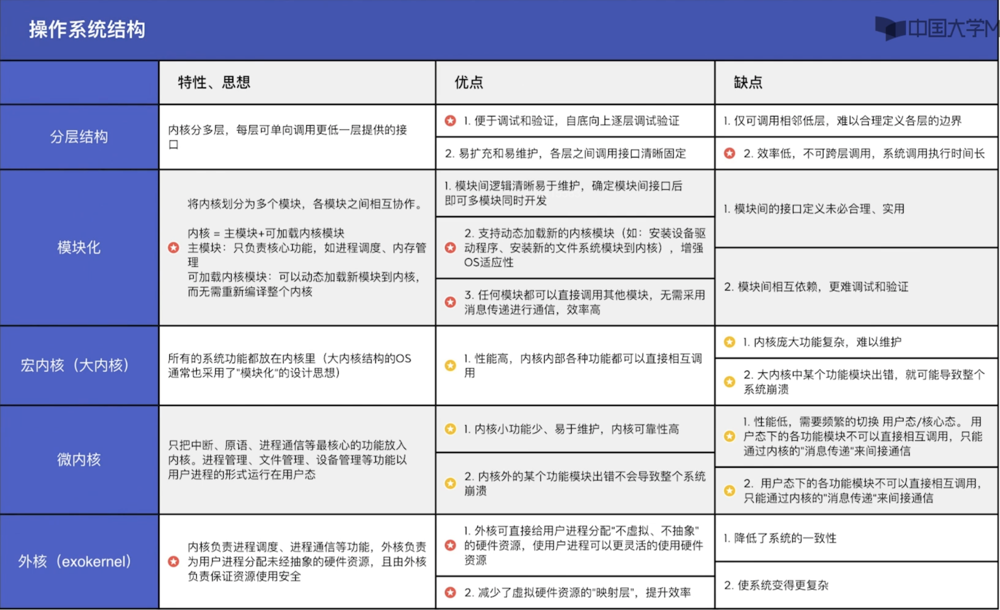
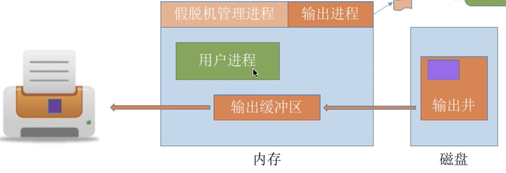

# Ch1. 计算机系统概述

## 1.1 操作系统的基本概念

### 1.1.1 操作系统的概念

操作系统OS：是指控制和管理整个计算机系统的硬件与软件资源，合理组织调度计算机的工作与资源的分配，进而为用户和其他软件提供方便接口与环境的程序集合。

操作系统是计算机系统中最基本的系统软件

### 1.1.2 操作系统特征

⚠️并发和共享是OS最基本的两个特征，两者之间互为存在条件

**1. 并发**
并发：指两个或多个事件在同一时间间隔内发生。这些事件宏观上是同时发生的，但微观上是交替发生的
并行：指两个或多个事件在同一时刻同时发生

【注】（重要考点）：
单核CPU同一时刻只能执行一个程序，各个程序只能并发地执行
多核CPU同一时刻可以同时执行多个程序，多个程序可以并行地执行

**2. 共享**

共享即资源共享，是指系统中的资源可供内存中多个并发执行的进程共同使用。

- 互斥共享方式：系统中的某些资源，虽然可以提供给多个进程使用，但-一个时间段内只允许一个进程访问该资源
  临界资源：在一段时间内只允许一个进程访问的资源
- 同时共享方式：系统中的某些资源，允许一个时间段内由多个进程 “同时”对它们进行访问
  【注】：所谓的“同时”往往是宏观上的，而在微观上，这些进程可能是交替地对该资源进行访问的（即分时共享）

**3. 虚拟**（并发为前提）

虚拟是指把一个物理上的实体变为若干逻辑上的对应物，用于实现虚拟的技术称为虚拟技术。

虚拟技术：

- 时分复用技术——处理器的分时共享
- 空分复用技术——虚拟存储器

**4. 异步**（并发为前提）

进程的异步性：多道程序环境允许多个程序并发执行，但资源有限，进程的执行并不是一贯到底的，而是走走停停的，它以不可预知的速度向前推进

### 1.1.3 操作系统的目标和功能

**1. 作为计算机系统资源的管理者**

1. 处理机管理——进程管理
2. 存储器管理——内存管理
3. 文件管理
4. 设备管理——IO设备管理

**2. 作为用户与计算机硬件系统之间的接口**

1. 命令接口
   - 联机命令接口（交互式命令接口），适用于分时或实时系统的接口。用户通过Terminal或cmd与系统进行命令交互
   - 脱机命令接口（批处理命令接口），适用于批处理系统，由一组作业控制命令组成。如*.bat文件

2. 程序接口——由一组系统调用（广义指令）组成。如GUI

   【注】：普通用户无法之间使用程序接口，只能通过编写代码调用程序接口

**3. OS实现了对计算机资源的扩充**

裸机：没有任何软件支持的计算机
虚拟机（扩充机）：覆盖了软件的机器

## 1.2 操作系统发展历程

### 1.2.1 手工操作阶段（无OS）

主要缺点：

1. 用户独占全机，资源利用率低
2. CPU等待手工操作，CPU利用不充分

### 1.2.2 批处理阶段（OS开始出现）

**1. 单道批处理系统**

主要特征：

1. 自动性：在顺利的情况下，磁带上的一批作业可以自动地逐个执行
2. 顺序性：FIFO
3. 单道性：监督程序每次从磁带上调入一道程序进入内存运行

主要优点：缓解了一定程度的人机速度矛盾，资源利用率有所提升。

主要缺点：内存中仅能有一道程序运行，只有该程序运行结束之后才能调入下一道程序CPU有大量的时间是在空闲等待1/0完成。资源利用率依然很低。

**2. 多道批处理系统**

多道程序技术允许多个程序同时进入内存并允许它们在CPU中交替运行，共享系统中的各种软件/硬件资源。特点是多道、宏观上并行，微观上串行

主要优点：多道程序并发执行，共享计算机83资源。资源利用率大幅提升，CPU和其他资源更能保持 “忙碌” 状态，系统吞吐量增大。

主要缺点：用户响应时间长，没有人机交互功能（用户提交自己的作业之后就只能等待计算机处理完成，中间不能控制自己的作业执行。eg：无法调试程序/无法在程序运行过程中输入一些参数）
### 1.2.3 分时操作系统

分时操作系统：计算机以时间片为单位轮流为各个用户/作业服务，各个用户可通过终端与计算机进行交互。

主要特征：

1. 同时性（多路性）：允许多个终端用户同时使用一台计算机
2. 交互性：用户可以通过程序进行人机交互
3. 独立性：系统中多个用户可以彼此独立地进行操作互不干扰
4. 及时性：用户请求能在很短时间内获得响应

主要优点：用户请求可以被即时响应，解决了人机交互问题。允许多个用户同时使用一台计算机，并且用
户对计算机的操作相互独立，感受不到别人的存在

主要缺点：不能优先处理一些紧急任务。操作系统对各个用户/作业都是完全公平的，循环地为每个用户/
作业服务一个时间片，不区分任务的紧急性

### 1.2.4 实时操作系统

实时操作系统：能在某个时间限制内完成某些紧急任务而不需要时间片排队

- 硬实时系统——以须在绝对严格的规定时间内完成外理，如：导弹控制系统、自动驾驶系统
- 软实时系统——能接受偶尔违反时间规定，如：12306火车订票系统

主要特点是及时性和可靠性

### 1.2.5 网络操作系统和分布式计算机系统。。。

### 1.2.6 个人计算机操作系统。。。

## 1.3 操作系统运行环境

### 1.3.1 处理器运行模式

两种程序：

- 内核程序
- 应用程序

两种指令：

- 特权指令：不允许用户直接使用的指令
- 非特权指令：允许用户直接使用的指令

两种处理器状态：

- 用户态（目态）
- 核心态（内核态、管态）
- 内核态、用户态的切换
  1. 内核态 -> 用户态：执行一条特权指令一一修改PSW的标志位为 “用户态”，这个动作意味着操作系统
     将主动让出CPU使用权
  2. 用户态 -> 内核态：由“中断” 引发，硬件自动完成变态过程，触发中断信号意味着操作系统将强行夺
     回CPU的使用权

### 1.3.2 中断和异常的概念

**1. 定义**

- 中断（外中断）：是指来自CPU执行外部的事件
- 异常（内中断）：是指CPU执行指令内部的事件

**2. 分类**

- 中断
  1. 可屏蔽中断
  2. 不可屏蔽中断
- 异常
  1. 故障（Fault）：由错误条件引起的，可能被内核程序修复。内核程序修复故障后会把 CPU使用权还给应用程序，让它继续执行下去。
  2. 内陷（Trap）：由陷入指令引发，是应用程序故意引发的
  3. 终止（Abort）：由致命错误引起内核程序无法修复该错误，因此一般不再将CPU使用权还给引发终止的应用程序，而是直接终止该应用程序。

**3. 处理过程**

不同的中断信号，需要用不同的中断处理程序来处理。当CPU检测到中断信号后，会根据中断信号
的类型去查询“中桥向量表〞，以此来找到相应的中断处理程序在内存中的存放位置。

### 1.3.3 系统调用

系统调用：OS对应用程序/程序员提供的接口

分类：

- 设备管理
- 文件管理
- 进程管理
- 进程通信
- 内存管理

系统调用与库函数的区别：有的库函数是对系统调用的再封装，有的库函数没有使用系统调用

系统调用过程：

1. 传递系统调用参数 
2. 执行陷入指令 (用户态）
3. 执行相应的内请求核程序处理系统调用（核心态）
4. 返回应用程序

【注】
1.陷入指令是在用户态执行的，执行陷入指令之后立即引发一个内中断，使CPU进入核心态
2.发出系统调用请求是在用户态，而对系统调用的相应处理在核心态下进行

## 1.4 操作系统结构

**1. 分层结构【NEW】**

单向依赖：每层只能调用紧邻它的低层的功能和服务

**2. 模块化【NEW】**

模块化是将操作系统按功能划分为若千个具有一定独立性的模块。每个模块具有某方面的管理功能，并规定好各模块间的接口，使各模块之间能通过接口进行通信。还可以进一步将各模块细分为若干个具有一定功能的子模块，同样也规定好各子模块之间的接口。


内核 = 主模块 + 可加载内核模块

主模块：只负责核心功能，如进程调度、内存管理
可加载内核模块：可以动态加载新模块到内核，而无需重新编译整个内核

**3. 大内核**

Def：将操作系统的主要功能模块都作为系统内核，运行在核心态


**4. 微内核**

（1）基本概念

Def：只把最基本的功能（时钟管理，中断处理，原语）保留在内核

微内核将OS分为了两大结构：微内核和多个服务器（进程）

（2）基本功能

1. 进程（线程）管理：进程（线程）间的通信功能、进程的切换、调度以及多处理机之间的同步等
2. 低级存储器管理：微内核只配置最基本的低级存储器管理机制（如：逻辑地址转物理地址，而存储管理策略应放在微内核外的存储器管理服务器中）
3. 中断和陷入处理：微内核的主要功能就是捕获所发生的中断和陷入事件，并进行中断响应处理（发送给相关的服务器来处理）

（3）特点

1. 扩展性和灵活性：添加系统服务时，不必修改内核
2. 可靠性和安全性：某个功能模块出问题不会影响整个系统的运行
3. 可移植性：与CPU和I/O硬件有关的代码放在内核，其他与硬件平台无关的服务器在外，所以移植OS 到另一个平台损失小
4. 分布式计算：客户/服务器，服务器/服务器之间通信采用消息传递，使微内核系统能很好的支持分布式系统和网络系统

**5. 外核【NEW】**

内核负责进程调度、进程通信等功能，外核负责为用户进程分配*未经抽象*的硬件资源，且由外核负责保证资源使用安全（检查使用这些资源的企图，以确保没有机器会使用他人资源）



## 1.5 操作系统引导boot【NEW】

操作系统引导：

1. CPU从一个特定主存地址开始，取指令，执行ROM中的引导程序（先进行硬件自检，再开机）
2. 将磁盘的第一块——主引导记录 读入内存，执行磁盐引导程序，扫描分区表
3. 从活动分区（又称主分区，即安装了操作系统的分区）读入分区引导记录，执行其中的程序
4. 从根目录下找到完整的操作系统初始化程序（即启动管理器）并执行，完成“开机”的一系列动作


## 1.6 虚拟机【NEW】

【注】：虚拟机可以既可以用软件实现，也可以用硬件实现

### 1.6.1 虚拟机基本概念

虚拟机：使用虚拟化技术，将一台物理机器虚拟化为多台虚拟机器(Virtual Machine, VM)，每个虚拟机器都可以独立运行一个操作系统

同义术语：虚拟机管理程序/虚拟机监控程序/Virtual Machine Monitor/Hypervisor

**1. 第一类虚拟机管理程序**（裸金属架构）

第一类虚拟机管理程序就像一个OS。

- 内核空间：运行第一类VMM
- 用户空间
  - 虚拟内核空间（Guest OS内核空间）：运行虚拟机的OS
  - 虚拟用户空间（Guest OS用户空间）：运行虚拟机中用户进程

 【注】：虚拟机作为用户态的一个进程运行，不允许执行敏感命令。当虚拟机OS执行了一条CPU处于内核态才允许执行的命令时，会陷入虚拟机管理程序

**2. 第二类虚拟机管理程序**（寄居架构）

- 内核空间（Host OS内核空间）：运行宿主OS
- 用户空间
  - Host OS 用户空间：运行第二类VMM和一些宿主OS的用户进程
  - Guest OS 内核空间：运行虚拟机的OS
  - Guest OS 用户空间：运行虚拟机中的用户进程


**3. 两类VMM对比**


# Ch2. 进程与线程

## 2.1 进程与线程

### 2.1.1 进程的概念和特征

**1. 进程的概念**

程序：是静态的，就是个存放在磁盘里的可执行文件，就是一系列的指令集合。
进程 （Process）：是动态的，是程序的次执行过程。

进程控制块PCB（【注】：PCB是进程存在的唯一标志！）

- 进程描述信息

  ​	进程标识符PID
  ​	用户标识符UID

- 进程控制和管理信息

  ​	CPU、磁盘、网络流量使用情况统计...
  ​	进程当前状态：就绪态/阻塞态/运行态...

- 资源分配清单

  ​	正在使用哪些文件
  ​	正在使用哪些内存区城
  ​	正在使用哪些10设备

- 处理机相关信息

  ​	如PSW、PC等等各种寄存器的值（用于实现进程切换）

操作系统对进程进行管理工作所需的信息都存在PCB中

进程实体（进程映像）的组成：

- PCB

- 程序段——程序的代码（指令序列）

- 数据段——运行过程中产生的各种数据（如：程序中定义的变量）

  =>进程的Def：进程是进程实体的运行过程，是系统进行资源分配和调度的一个独立单位。

Eg. C语言程序分段：

1. 正文段（代码和赋值数据段）：存放二进制代码和常量
2. 数据堆段：存放动态分配的存储区
3. 数据栈段：存在临时使用变量

**2. 进程的特征**

- 动态性（基本特征）——进程是程序的一次执行过程，是动态地产生、变化和消亡的
- 并发性——内存中有多个进程实体，各进程可井发执行
- 独立性——进程是能独立运行、独立获得资源、独立接受调度的基本单位
- 异步性——各进程按各自独立的、不可预知的速度向前推进，操作系统要提供"进程同步机制"来解决异步问题
- 结构性——每个进程都会配置一个PCB。结构上看，进程由程序段、数据段、PCB组成

### 2.1.2 进程的状态与转换

3种基本状态+2种状态（进程PCB中，会有一个交量 state 米表示进程的当前状态）：

- 运行态 (Running)——占有CPU，并在CPU上运行（单CPU情况下，同一时刻只会有一个进程处于运行态，多核CPU情况下，可能有多个进程处于运行态）
- 就绪态 (Ready)——已经具备运行条件，但由于没有空闲CPU，而暂时不能运行
- 阻塞态 (Waiting/Blocked， 又称：等待态)——因等待某一事件而暂时不能运行

【注】：进程的整个生命周期中大部分时间都处于以上三种基本状态

- 创建态 (New，又称：新建态）——进程正在被创建，操作系统为进程分配资源、初始化PCB
- 终止态（Terminated，又称（结束态）——进程正在从系统中撒销，操作系统会回收进程拥有的资源、撒销PCB


### 2.1.3 进程的组织方式

- 链接方式——按照进程状态将PCB分为多个队列，操作系统持有指向各个队列的指针
- 索引方式——根据进程状态的不同，建立几张索引表，操作系统持有指向各个索引表的指针

### 2.1.4 进程控制

进程控制就是要实现进程状态的转换，由控制原语实现（原语由关/开中断实现）

**1. 进程创建**

- 创建原语
  1. 申请空白PCB
  2. 为新进程分配所需资源
  3. 初始化PCB
  4. 将PCB插入就绪队列（创建态 -> 就绪态）

- 引起进程创建的事件

  用户登录——分时系统中，用户登录成功，系统会建立为其建立一个新的进程
  作业调度——多道批处理系统中，有新的作业放入内存时，会为其建立一个新的进程
  提供服务——用户向操作系统提出某些请求时，会新建一个进程处理该请求
  应用请求——由用户进程主动请求创建一个子进程
  
  【注】：设备分配是通过在系统中设置相应的数据结构实现的，不需要创建进程

**2. 进程终止**——(就绪态/阻塞态/运行态 ->终止态 -> 无)

- 终止原语

  1. 从PCB集合中找到终止进程的PCB
  2. 若进程正在运行，立即剥夺CPU，将CPU分配给其他进程
  3. 终止其所有子进程
  4. 将该进程拥有的所有资源归还给父进程或操作系统
  5. 删除PCB

- 引起进程终止的事件

  正常结束
  异常结束
  外界干预

**3. 进程阻塞和唤醒**

- 进程阻塞——（运行态 -> 阻塞态）

  - 阻塞原语

    1. 找到要阻塞的进程对应的PCB
    2. 保护进程运行现场，将PCB的状态信息设置为“阻塞态”，暂时停止进程运行
    3. 将PCB插入相应事件的等待队列

  - 引起进程阻寒的事件

    需要等待系统分配某种资源
    需要等待相互合作的其他进程完成工作

-  进程唤醒——（阻塞态 -> 就绪态）

  - 唤醒原语
    1. 在事件等待队列中找到PCB
    2. 将PCB从等待队列移除，设置进程为就绪态
    3. 将PCB插入就绪队列，等待被调度
  - 引起迸程唤醒的事件——等待事件发生（因何事阻塞，就应由何事唤醒）

**4. 进程切换**

- 切换原语——（运行态 ->阻塞态/就绪态，就绪态 -> 运行态）

  1. 将运行环境信息（进程上下文Context）存入PCB
  2. PCB移入相应队列
  3. 选择另一个进程执行，井更新其PCB
  4. 根据PCB恢复新进程所需的运行环境

- 引起进程切换的事件

  当前进程时间片到
  有更高优先级的进程到达
  当前进程主动阻塞
  当前进程终止

### 2.1.5 进程通信IPC

**1. 共享存储**

Def：设置一个共享区域，并映射到进程的虚拟地址空间；而且进程间要互斥地访问共享空间（由进程自己负责实现互斥）

- 基于数据结构的共享（低级）：比如共享空间里只能放一个长度为10的数组。这种共享方式速度慢、限制多
- 基于存储区的共享（高级）：操作系统在内存中划出一块共享存储区，数据的形式、存放位罝都由通信进程控制，而不是操作系统。

**2. 消息传递**

Def：进程间的数据交换以格式化消息（消息头+消息体）为单位

- 直接通信方式：源进程指明目的进程的ID，把消息直接挂到目的进程的消息队列里
- 间接（信箱）通信方式：源进程把消息发送到某个内核中的中间实体（信箱），目的进程从中取得消息

**3. 管道通信**

Def：“管道”是-一个特殊的共享文件，又名pipe文件。其实就是在内存中开辟一个大小固定的内存缓冲区，数据结构类似循环队列，满足FIFO

特点：

1. 管道只能采用半双工通信，某一时间段内只能实现单向的传输。如果要实现双向同时通信，则需要设罝
   两个管道
2. 各进程要互斥地访问管道（由操作系统实现）
3. 当管道写满时，写进程将阻塞，直到读进程将管道中的数据取走，即可唤醒写进程。
   当管道读空时，读进程将阻塞，直到写进程往管道中写入数据，即可唤醒读进程．
4. 管道中的数据一旦被读出，就彻底消失。因此，当多个进程读同一个管道时，可能会错乱。对此，通常有两种解决方案：
   - 一个管道允许多个写进程，一个读进程（2014年408真题高教社官方答案）
   - 允许有多个写进程，多个读进程，但系统会让各个读进程轮流从管道中读数据（Linux的方案）
5. 只要管道没空就可以读
   只要管道没满就可以写

### 2.1.6 线程和多线程模型。。。

**1. 线程的基本概念**

线程是一个基本的CPU执行单元，也是程序执行流的最小单位。

引入线程之后，不仅是进程之间可以并发，进程内的各线程之间也可以并发，从而进一步提升了系统的并发度，使得一个进程内也可以并发处理各种任务

引入线程后，进程只作为除CPU之外的系统资源的分配单元，而线程则作为处理机的分配单元

**2. 线程与进程的比较**

- 调度：进程是资源分配的基本单位，线程是调度的基本单位
- 并发性：各线程间也能并发（包括不同进程的线程），提升了并发度
- 资源分配：进程是系统中拥有资源的最小单位，而线程不拥有系统资源（仅有一点必不可少、能保证独立运行的资源）
- 独立性：某进程中的线程对其他进程不可见，同一进程中的不同线程共享进程的地址空间和资源
- 系统开销：传统的进程问并发，需要切换进程的运行环境，系统开销很大；线程间并发，如果是同一进程内的线程切换，则不需要切换进程环境，系统开销小
- 支持多处理机系统：多线程进程可以将进程中的多个线程分配到多个处理机上去

**3. 线程的属性**

- 线程是处理机调度的单位
- 多CPU计算机中，各个线程可占用不同的CPU
- 每个线程都有一个线程ID、线程控制块 (TCB)
- 线程也有就绪、阻塞、运行三种基本状态
- 线程几乎不拥有系统资源
- 同一进程的不同线程间共享进程的资源，但同进程的不同线程的栈指针不共享
- 由于共享内存地址空间，同一进程中的线程间通信甚至无需系统干预
- 同一进程中的线程切换，不会引起进程切换
  不同进程中的线程切换，会引起进程切换
- 不同线程可以执行相同程序，即同一服务程序被不同用户调用时，OS把他们创建成不同线程

**4. 线程的状态与转换**

**5. 线程的组织与控制**

**6. 线程的实现方式**

1. 用户级线程（ULT）

   - 用户级线程由应用程序通过线程库实现，所有的线程管理工作都由应用程序负责（包括线程切换）

   - 用户级线程中，线程切换可以在用户态下即可完成，无需操作系统干预。

   - 在用户看来，是有多个线程。但是在操作系统内核看来，并意识不到线程的存在“ 用户级线程” 就是“从用户视角看能看到的线程”

     优点：用户级线程的切换在用户空间即可完成，不需要切换到核心态，线程管理的系统开销小，效率高
     缺点：当一个用户级线程被阻塞后，整个进程都会被阻塞，并发度不高。多个线程不可在多核处理机上并行运行

2. 内核级线程（KLT）

   - 内核级线程的管理工作由操作系统内核完成

   - 线程调度、切换等工作都由内核负责，因此内核级线程的切换必然需要在核心态下才能完成

   - 操作系统会为每个内核级线程建立相应的TCB (Thread Control Block，线稈控制块）通过TCB对线程进行管理。“内核级线程” 就是“从操作系统内核视角看能看到的线程”

     优点：当一个线程被阻塞后，别的线程还可以继续执行，并发能力强。多线程可在多核处理机上并行执行
     缺点：一个用户进程会占用多个内核级线程，线程切换由操作系统内核完成，需要切换到核心态，因此线程管理的成本高，开销大

**7. 多线程模型**

⚠️操作系统只“看得见”内核级线程，因此只有内核级线程才是处理机分配的单位。

1. 一对一模型：每个用户级线程映射到一个内核级线程
   - 优点：当一个线程阻塞后，其他线程还可以继续执行，并发能力强。多线程可以在多核处理机上并行执行
   - 缺点：一个用户进程会占用多个内核级线程，线程切换由OS完成，需要切换到核心态，线程管理成本高，开销大
2. 多对一模型：多个用户级线程映射到一个内核级线程。且一个进程只被分配一个内核级线程。
   - 优点：用户级线程的切换在用户空间即可完成不需要切换到核心态，线程管理的系统开销小，效率高
   - 缺点：当一个用户级线程被阻塞后，整个进程都会被阻塞，并发度不高。多个线程不可在多核处理机上并行运行
3. 多对多模型：n用户及线程映射到 m个内核级线程（n>=m）。每个用户进程对应m 个内核级线程。
   - 特点：克服了多对一模型并发度不高的缺点（一个阻塞全体阻塞），又克服了一对一模型中一个用户进程占用太多内核级线程，开销太大的缺点

【注】：
用户级线程是“代码逻辑”的载体，内核级线程是“运行机会”的载体，一段“代码逻辑”只有获得了 “运行机会”才能被CPU执行
内核级线程中可以运行任意一个有映射关系的用户级线程代码，只有两个内核级线程中正在运行的代码逻辑都阻塞时，这个进程才会阻塞


## 2.2 处理机调度

### 2.2.1 调度到概念

**1. 调度的基本概念**

处理机调度就是对CPU进行分配，即从就绪队列中按照一定的算法（公平高效的原则）选择一个进程并将CPU分配给它运行，以实现进程并发执行

**2. 调度的层次**

1. 高级调度（作业调度）：按一定的原则从外存的作业后备队列中挑选一个作业调入内存，并创建进程每个作业只调入一次，调出一次，作业调入时会建立PCB，调出时才撤销PCB。
   【简化理解】：好几个程序需要启动，到底先启动哪个

2. 中级调度（内存调度）：按照某种策略决定将哪个处于挂起状态的进程重新调入内存。一个进程可能会被多次调出、调入内存，因此中级调度发生的频率要比高级调度更高。 

   内存不够时，可将某些进程的数据调出外存。等内存空闲或者进程需要运行时再重新调入内存
   暂时调到外存等待的进程状态为挂起状态。被挂起的进程PCB会被组织成挂起队列

   **七状态模型**

   

2. 低级调度（进程调度/处理机调度）：按照某种策略从就绪队列中选取一个进程，将处理机分配给它
   进程调度是OS中最基本的一种调度，在一般OS中都必须配置进程调度，频率很高，一般几十ms/次

**3. 三级调度的联系**


### 2.2.2 调度的目标（评价标准）

1. CPU利用率
   $$
   CPU利用率=\frac{CPU有效工作时间}{CPU有效+空闲时间}
   $$

2. 系统吞吐量：单位时间CPU完成作业的数量
   $$
   系统吞吐量=\frac{总共完成了多少道作业}{总共花了多少时间}
   $$

3. 周转时间：从作业提交到作业完成所经历的时间 = 作业等待 + 在就绪队列排队 + 在处理机上运行 + I/O操作的时间总和
   $$
   作业周转时间=作业完成时间-作业提交时间\\
   平均周转时间=\frac{各作业周转时间之和}{作业数}\\
   带权周转时间=\frac{作业周转时间}{作业实际运行时间}\\
   平均作业带权周转时间=\frac{1}{n}\sum作业_i带权周转时间
   $$

4. 等待时间：指进程/作业处于等待处理机状态时间之和，等待时间越长，用户满意度越低

   - 对于进程来说，等待时间就是指进程建立后等待被服务的时间之和，在等待1/0完成的期间其实进程也是在被服务的，所以不计入等待时间
   - 对于作业来说，不仅要考虑建立进程后的等待时间，还要加上作业在外存后备队列中等待的时间。

   【注】：调度算法其实只会影响作业/进程的等待时间 

5. 响应时间：指用户提交请求到系统首次产生响应所用时间

6. 

### 2.2.3 调度的实现。。。

**1.调度程序（调度器）**

**2.调度的时机、切换与过程**

*需要进行进程调度与切换的情况*

- 当前运行的进程主动放弃处理机
  - 进程正常终止
  - 运行过程中发生异常而终止
  - 进程主动请求阻塞（如：等IO）
- 当前运行的进程被动放弃处理机
  - 分给进程的时间片用完
  - 有更紧急的事需要处理（如：IO中断）
  - 有更高优先级的进程进入就绪队列

*不能进行进程调度与切换的情况*

1. 在处理中断的过程中。中断处理过程复杂，与硬件密切相关，很难做到在中断处理过程中进行进程切换
2. 进程在操作系统内核程序临界区中。
3. 在原子操作过程中（原语）。原子操作不可中断，要一气呵成（如之前讲过的修改PCB中进程状态标志，并把PCB放到相应队列）

*进程切换的过程*

1. 对原来运行进程各种数据的保存
2. 对新的进程各种数据的恢复

【注】：进程切换是有代价的，因此如果过于频繁的进行进程调度、切换，必然会使整个系统的效率降低，使系统大部分时间都花在了进程切换上，而真正用于执行进程的时间减少

- 狭义的进程调度：指的是从就绪队列中选中一个要运行的进程。（这个进程可以是刚刚被暂停执行的进程，也可能是另一个进程，后一种情况就需要进程切换）
- 进程切换是指一个进程让出处理机，由另一个进程占用处理机的过程。

- 广义的进程调度：包含了选择一个进程和进程切换两个步骤

**3. 进程的调度方式**

1. 非剥夺调度方式（非抢占方式）：即只允许进程主动放弃处理机。在运行过程中即便有更紧迫的任务到达，当前进程依然会继续使用处理机，直到该进程终止或主动要求进入阻塞态。
   - 特点：实现简单，系统开销小但是无法及时处理紧急任务，适合于早期的批处理系统

2. 剥夺调度方式（抢占方式）：站一个进程正在处理机上执行时，如果有一个更重要或更紧迫的进程需要使用处理机，则立即暂停正在执行的进程，将处理机分配给更重要紧迫的那个进程。
   - 特点：可以优先处理更紧急的进程，也可实现让各进程按时间片轮流执行的功能（通过时钟中断）。适合于分时OS、实时OS。

**4. 闲逛进程**

在进程切换时，如果系统没有就绪进程，就会调用闲逛进程（idle）一直运行，并在执行过程中测试中断

idle的优先级最低，不需要CPU之外的资源，且不会被阻塞

**5. 两种线程的调度**

1. 用户级线程调度：内核感知不到用户线程的存在，内核只是给用户进程时间，由进程中的调度程序调度线程
   - 特点：用户级线程的切换在同一进程中进行，仅需要少量的机器命令
2. 内核级线程调度：内核选择一个特定线程运行，赋予一个时间片，超过时间片就会强制挂起该线程
   - 特点：内核级线程的切换要完整的上下文切换、修改内存映像、使高速缓存失效，和用户级线程切换相差几个数量级

### 2.2.4 典型的调度算法。。。

**1. 先来先服务（FCFS）**

Def ：根据作业/进程的到达次序调度，也就是先运行等待时间最长的作业/进程

- 算法思想 ：主要从“公平”的角度考虑
- 算法规则：按照作业/进程到达的先后顺序进行服务
- 用于作业/进程调度：用于作业调度时，考虑的是哪个作业先到达后备队列；用于进程调度时，考虑的是哪个进程先到达就绪队列
- 是否可抢占？：非抢占式的算法
- 优缺点
  - 优点：公平、算法实现简单
  - 缺点：排在长作业（进程）后面的短作业需要等待很长时间，带权周转时间很大，对短作业来说用户体验不好。，即FCFS算法对长作业有利，对短作业不利 （Eg：排队买奶茶…）
- 是否会导致饥饿？：不会

**2. 短作业优先（SJF，Shortest Job First）**

Def：每次调度时选择当前已到达且运行时间最短的作业/进程

- 算法思想：追求最少的平均等待时间，最少的平均周转时间、最少的平均平均带杈周转时间
- 算法规则：最短的作业/进程优先得到服务（所谓“最短”，是指要求服务时间最短）
- 用于作业/进程调度：既可用于作业调度，也可用于进程调度。用于进程调度时称为“短进程优先 (SPF, Shortest Process First) 算法”
- 是否可抢占？：SJF和SPF是非抢占式的算法。但是也有抢占式的版本一一最短剩余时间优先算法 (SRTN, Shortest Remaining Time Next)
- 优缺点
  - 优点：“最短的〞 平均等待时间、平均周转时问
  - 缺点：不公平。对短作业有利，对长作业不利。可能产生饥饿现象。另外，作业/进程的运行时间是由用户提供的，并不一定真实，不一定能做到真正的短作业优先
- 是否会导致饥饿？：会。如果源源不断地有短作业/进程到来，可能使长作业/进程长时问得不到服务，产生“饥饿”现象。如果一直得不到服务，则称为“饿死”。

【注】：

1. 如果题目中未特别说明，所提到的“短作业/进程优先算法”默认是非抢占式的
2. “在所有进程都几乎同时到达（所有进程同时可运行）时，采用SIF调度算法的平均等待时间、平均周转时间最少，否则抢占式的短作业/进程优先调度算法（最短剩余时问优先,SRNT）的平均等待时间、平均周较时间最少

**2‘. 最短剩余时间优先（SRTN，抢占式SJF）**

Def：：每当有进程加入就绪队列改交时就需要调度，如果新到达的进程剩余时间比当前运行的进程剩余时间更短，则由新进程抢占处理机，当前运行进程重新回到就绪队列。另外，当一个进程完成时也需要调度

**3. 优先级调度**

- 算法思想：随着计算机的发展，特别是实时操作系统的出现，越来越多的应用场景需要根据任务的紧急程度来决定处理顺序
- 算法规则：调度时选择优先级最高的作业/进程
- 用于作业/进程调度：既可用于作业调度，也可用于进程调度。甚至，还会用于I/O调度中
- 是否可抢占？
  1. 非抢占式：只有当运行的进程完成后才在就绪队列中选择优先级最高的进程上处理机
  2. 抢占式：当某个优先级高的进程进入队列时立即暂停正在运行的进程，将高优先级进程上处理机
- 优缺点
  - 优点：用优先级区分紧急程度、重要程度，适用于实时操作系统。可灵活地调整对各种作业/进程的偏好程度。
  - 缺点：若源源不断地有高优先级进程到来，则可能导致饥饿
- 是否会导致饥饿？：不会。
- 优先级分类
  1. 静态优先级：优先级是在创建进程时确定的，整个运行期间不变
  2. 动态优先级：创建进程时有一个初始值，之后会根据情况动态地调整优先级（如：HRRN）
     - 如果某进程在就绪队列中等待了很长时间，则可以适当提升其优先级——公平角度
     - 如果某进程占用处理机运行了很长时间，则可适当降低其优先级——提升资源角度
     - 如果发现一个进程频繁地进行I/O操作，则可适当提升其优先级——利用率角度
- 原则
  1. 系统进程优先级 > 用户进程
  2. 前台进程优先级 > 后台进程
  3. I/O型进程（或称 I/O繁忙型进程）> 计算型进程【重在理解！！！】

**4. 高响应比优先（HRRN，Highest Response Ratio Next）**

Def：非抢占式的调度算法，只有当前运行的进程主动放弃CPU时（正常/异常完成，或主动阻塞），才需要进行调度，调度时计算所有就绪进程的响应比，选响应比最高的进程上处理机。
$$
响应比=\frac{等待时间+要求服务时间}{要求服务时间}
$$


- 算法思想：要综合考虑作业/进程的等待时间和要求服务的时间

- 算法规则：在每次调度时先计算各个作业/进程的响应比，选择响应比最高的作业/进程为其服务

- 用于作业/进程调度：既可用于作业调度，也可用于进程调度

- 是否可抢占？：非抢占式的算法。因此只有当前运行的作业/进程主动放弃处理机时，才需要调度，才需要计算响应比

- 优缺点

  综合考虑了等待时间和运行时间（要求服务时间）
  等待时间相同时，要求服务时间短的优先（SJF的优点）
  要求服务时间相同时，等待时间长的优先 (FCFS 的优点）
  对于长作业来说，随着等待时间越来越久，其响应比也会越来越大，从而避免了长作业饥饿的问题

- 是否会导致饥饿？：会。

**5. 时间片轮转（RR，Round-Robin）调度算法**

- 算法思想：公平地、轮流地为各个进程服务，让每个进程在一定时间间隔内都可以得到响应
- 算法规则：按照各进程到达就绪队列的顺序，轮流让各个进程执行个时间片（如 100ms)。若进程未在一个时间片内执行完，则剥夺处理机，将进程重新放到就绪队列队尾重新排队
- 用于作业/进程调度：用于进程调度 （只有作业放入内存建立了相应的进程后，才能被分配处理机时间片）
- 是否可抢占？：抢占式的算法。由时钟装置发出时钟中桥来通知CPU时间片已到
- 优缺点
  - 优点：公平；响应快，适用于分时操作系统
  - 缺点：由于高频率的进程切换，因此有一定开销；不区分任务的紧急程度
- 是否会导致饥饿？：不会。
- 【补】时间片大小的影响
  - 时间片过大：以至于所有进程都可在一个时间片内执行完，则该算法退化为FCFS算法
  - 时间片过小：处理机会在进程间频繁切换，增大处理机开销
  - 时间片长短确定因素：系统响应时间、就绪队列中的进程数目、系统处理能力

**6. 多级队列调度算法**

- 算法思想：
- 算法规则：
- 用于作业/进程调度：
- 是否可抢占？：
- 优缺点：
- 是否会导致饥饿？：

**7. 多级反馈队列调度算法（前几种方法的融合）**

- 算法思想：对其他调度算法的折中权衡

- 算法规则：

  1. 设置多级就绪队列，各级队列优先级从高到低，时间片从小到大
  2. 新进程到达时先进入第1级队列，按FCFS原则排队等待被分配时
     问片，若用完时间片进程还未结束，则进程进入下一级队列队尾
     如果此时己经是在最下级的队列，则重新放回该队列队尾
  3. 只有第k级队列为空时，才会为k+1 级队头的进程分配时间片

- 用于作业/进程调度：用于进程调度

- 是否可抢占？：抢占式的算法。
  在k级队列的进程运行过程中，若更上级的队列(1~k-1级）中进入了一个新进程，则由于新进程处于优先级更高的队列中，因此新进程会抢占处理机，原来运行的进程放回k级队列队尾。

- 优缺点：

  对各类型进程相对公平（FCFS的优点）
  每个新到达的进程都可以很快就得到响应（RR的优点）
  短进程只用较少的时间就可完成(SPF的优点）
  不必实现估计进程的运行时间（避免用户作假）
  可灵活地调整对各类进程的偏好程度，比如CPU密集型进程、I/O密集型进程（拓展：可以将因I/O而阻塞的进程重新放回原队列，这样I/O型进程就可以保持较高优先级）

- 是否会导致饥饿？：会。

### 2.2.5 进程切换

（1）上下文切换：切换CPU到另一个进程需要保存当前进程状态并恢复另一个进程状态

流程：

1. 挂起一个进程，保存CPU上下文（程序计数器和其他CPU寄存器）
2. 更新PCB信息
3. 把进程的PCB移入相应队列（如：就绪、阻塞队列）
4. 选择另一个进程执行，并更新其PCB
5. 跳转到新进程PCB程序计数器所指位置
6. 恢复处理机上下文

（2）上下文切换的消耗

上下文切换通常是计算密集型的，对系统消耗大量的CPU时间

【注】：有些处理器提供多个寄存器组，上下文切换时只需要简单改变当前寄存器组的指针即可

（3）上下文切换与模式切换

模式切换：用户进程最开始都运行在用户态，因为中断或异常进入核心态，执行完后又返回用户态。此用户态和核心态之间的切换称为模式切换。CPU逻辑上还在执行同一进程

上下文切换只能发生在内核态，是多任务OS的一个特性

## 2.3 同步与互斥

### 2.3.1 同步与互斥的基本概念

**1. 临界资源**

Def：一次仅允许一个进程使用的资源

临界资源访问过程：

- 进入区：负责检查是否可进入临界区，若可进入，则应设置正在访问临界资源的标志（可理解为“上锁〞，以阻止其他进程同时进入临界区
- 临界区：进程中访问临界资源的那段代码
- 退出区：负责解除正在访问临界资源的标志（可理解为“解锁”）
- 剩余区：做其他处理

```c++
do{
  entry section; //进入区
  critical section; //临界区（临界段）
  exit section; //退出区
  remainder section; //剩余区
}
```

【注】：进入区和退出区是负责实现互斥的代码段

**2. 同步**

同步亦称直接制约关系，它是指为完成某种任务而建立的两个或多个进程，这些进程因为需要在某些位置上协调它们的工作次序而产生的制约关系。

进程间的直接制约关系就是源于它们之间的相互合作。

**3. 互斥**

互斥也称间接制约关系。当一个进程进入临界区使用临界资源时，另一个进程必须等待，当占用临界资源的进程退出临界区后，另一个进程才允许区访问此临界资源

互斥需要遵循的原则：

1. 空闲让进：临界区空闲时，可以允许一个请求进入临界区的进程立即进入临界区；
2. 忙则等待：当已有进程进入临界区时，其他试图进入临界区的进程必须等待；
3. 有限等待：对请求访问的进程，应保证能在有限时间内进入临界区（保证不会饥饿）；
4. 让权等待：当进程不能进入临界区时;应立即释放处理机，防止进程忙等待

### 2.3.2 实现临界区互斥的基本方法

**1. 软件实现方法**

1）*单标志法*

算法思想：两个进程在访问完临界区后会把使用临界区的权限转交给另一个进程。也就是说每个进程进入临界区的权限只能被另一个进程赋予。设置一个int turn，用于指示被允许进入临界区的进程编号

```c
int turn=0;
//P0进程：
while(turn!=0); //进入区
critical section; //临界区
turn=1; //退出区
remainder section; //剩余区
//P1进程：
while(turn!=1); //进入区
critical section; //临界区
turn=0; //退出区
remainder section; //剩余区
```

算法特点：

1. 可以实现“同一时刻最多只允许一个进程访问临界区”
2. 违背“空闲让进”原则，若某个进程不再进入临界区，则另一个进程也无法进入临界区

2）*双标志先检查法*

算法思想：设置一个布尔型数组 flag[]，数组中各个元素用来标记各进程想进入临界区的意愿，比如“flag[0]=ture” 意味着0号进程 P0 现在想要进入临界区。每个进程在进入临界区之前先检查当前有没有别的进程想进入临界区，如果没有，则把自身对应的标志 flag[i] 设为 true，之后开始访问临界区。

```c
bool flag[2]; //表示进入临界区意愿的数组
flag[0]=flag[1]=false; //初始值两个进程都不想进入临界区
//P0进程：
while(flag[1]); //进入区
flag[0]=true; //进入区
critical section; //临界区
flag[0]=false; //退出区
remainder section; //剩余区
//P1进程：
while(flag[0]); //进入区
flag[1]=true; //进入区
critical section； //临界区
flag[1]=false; //退出区
remainder section; //剩余区
```

算法主要问题：违反 “忙则等待”原则。原因在于，进入区的“检查” 和“上锁” 两个处理不是一气呵成的。“检查〞后，“上锁”前可能发生进程切换

3）*双标志后检查法*

算法思想：双标志先检查法的改版。前一个算法的问题是先 “检查”后“上锁”，但是这两个操作又无法一气呵成，因此导致了两个进程同时进入临界区的问题。因此，人们又想到先 “上锁” 后“检查”的方法，来避免上述问题

```c
bool flag[2]; //表示进入临界区意愿的数组
flag[0]=flag[1]=false; //初始值两个进程都不想进入临界区
//P0进程：
flag[0]=true; //进入区——标志
while(flag[1]); //进入区——检查
critical section; //临界区
flag[0]=false; //退出区
remainder section; //剩余区
//P1进程：
flag[1]=true; //进入区——标志
while(flag[0]); //进入区——检查
critical section； //临界区
flag[1]=false; //退出区
remainder section; //剩余区
```

算法特点：解决了 “忙则等待” 的问题，但是又违背了 “空闲让进” 和“有限等待”原则，会因各进程都长期无法访问临界资源而产生 “饥饿”现象（双方都卡在while处）。

4）*Peterson算法*

算法思想：结合双标志法、单标志法的思想。如果双方都争着想进入临界区，那可以让进程尝试“孔融让梨”(谦让）。做一个有礼貌的进程

。利用flag解决临界资源的互斥访问，利用turn解决饥饿

```c
bool flag[2]; //表示进入临界区意愿的数组
flag[0]=flag[1]=false; //初始值两个进程都不想进入临界区
int turn=0; //表示优先让哪个进程进入临界区
//P0进程：
flag[0]=true; //进入区——标志
turn=1; //进入区
while(flag[1] && turn==1); //进入区——检查
critical section; //临界区
flag[0]=false; //退出区
remainder section; //剩余区
//P1进程：
flag[1]=true; //进入区——标志
turn=0; //进入区
while(flag[0] && turn==0); //进入区——检查
critical section； //临界区
flag[1]=false; //退出区
remainder section; //剩余区
```

算法特点：解决了进程互斥问题，遵循了空闲让进、忙则等待、有限等待 三个原则，但是依然未遵循让权等待的原则。相较于之前三种软件解决方案来说，是最好的，但依然不够好。

**2. 硬件实现方法**

1）中断屏蔽方法

Def：利用“开/关中断指令”实现（与原语的实现思想相同，即在某进程开始访问临界区到结束访问为止都不允许被中断，也就不能发生进程切换，因此也不可能发生两个同时访问临界区的情况）

```c
关中断;
临界区;
开中断;
```

- 优点：简单高效
- 缺点：不适用于多处理机；只适用于操作系统内核进程，不适用于用户进程（因为开/关中断指令只能运行在内核态，这组指令如果能让用户随意使用会很危险）

2）TestAndSet（TSL）

TSL指令是用硬件实现的，执行的过程不允许被中断，只能一气呵成。以下用C语言描述其逻辑

```c
//布尔型共享变量lock表示当前临界区是否被加锁
//true 表示已加锁，false 表亓未加锁
bool TestAndset (bool *lock){
	bool old;
  old=*lock; //old用来存放lock原来的值
  *lock=true; //无论之前是否已加锁，都将lock设为true
  return old; //返回lock原来的值
}
//以下是使用 TSL 指令实现互斥的算法逻辑
while (TestAndset (&lock))；//上锁井"检查"
临界区代码段...
lock = false; //"解锁"
剩余区代码段...
```

相比软件实现方法，TSL指令把“上锁”和“检查”操作用硬件的方式变成了一气呵成的原子操作。

- 优点：实现简单，无需像软件实现方法那样严格检查是否会有逻辑漏洞；适用于多处理机环境
- 缺点：不满足“让权等待〞原则，暂时无法进入临界区的进程会占用CPU并循环执行TSL指令而导致“忙等”

3）Swap指令（Exchange指令/XCHG指令）

Swap 指令是用硬件实现的，执行的过程不允许被中断，只能一气呵成。以下是用C语言描述的逻辑

```c
//Swap 指令的作用是交换两个变量的值
Swap （bool *，bool *){
	bool temp;
	temp = *a;
	*a = *b;
	*b = temp;
}
//以下是用 Swap 指令实现互斥的算法逻辑
//lock 表示当前临界区是否被加锁
bool key = true;
while (key == true)
	Swap (&lock, &key);
临界区代码段...
lock = false;
剩余区代码段...
```

- 优点：实现简单，无需像软件实现方法那样严格检查是否会有逻辑漏洞；适用于多处理机环境
- 缺点：不满足“让权等待〞原则，暂时无法进入临界区的进程会占用CPU并循环执行TSL指令而导致“忙等”

### 2.3.3 互斥锁（mutex lock）

```c
acquire(){
  while(!avaliable); //忙等待 
  available=false; //获得锁
}
release(){
  avaliable=true; //释放锁
}
```

### 2.3.4 信号量

Wait(S)——P操作：申请一个资源S，如果资源不够就阻塞等待
signal(S)——V操作：释放一个资源S，如果有进程在等待该资源，则唤醒一个进程

信号量的值=这种资源的剩余数量（信号量的值如果小于0，说明此时有进程在等待这种资源）

**1. 整型信号量**

用一个整数型的变量作为信号量，用来表示系统中某种资源的数量

```c
int S = 1; //初始化整型信号量s，表示当前系统中可用的打印机资源数
void wait (int S) { //wait 原语，相当子“进入区”
  while (S<=0); //如果资源数不够，就一直循环等待
  S=S-1; //如果资源数够，则占用一个资源
}
void signal(int S){ //signal原语，相当于“退出区”
  S=S+1; //使用完资源后， 在退出区释放资源
}
```

该机制不遵循“让权等待”的准则，而是使进程处于“忙等”状态“

**2. 记录型信号量**

```c
/*记录型信号量的定义*/
typedef struct {
	int value; //剩余资源数
	Struct process *L; //等待队列
} semaphore;
/*某进程需要使用资源时，通过 wait 原语申请*/
void wait (semaphore S) {
	S.value--:
	if (S.value<0)
		block (S.L);
}
/*述程使用完资源后，通过 signal 原语釋放水*/
void signal (semaphore S) {
	S.value++:
	if (S.value <= 0)
		wakeup(S.L);
}
```

对信号量S的一次P操作意味着进程请求一个单位的该类资源，因此需要执行 S.value--,表示资源数减1，当s.value<0时表示该类资源己分配完毕，因此进程应调用block 原语进行自我阻塞（当前运行的进程从运行态 -> 阻塞态），主动放弃处理机，并插入该类资源的等待队列S.L中。可见，该机制遵循了“让权等待” 原则，不会出现 “忙等”现象。

对信号量S的一次V操作意味着进程释放一个单位的该类资源，因此需要执行 S.value++，表示资源数加1，若加1后仍是 S.value <=0，表示依然有进程在等待该类资源，因此应调用 wakeup 原语唤醒等待队列中的第个进程（被唤醒进程从阻塞态 -> 就绪态）。

**3. 利用信号量实现进程同步**

用信号量实现进程同步：
1. 分析什么地方需要实现“同步关系”，即必须保证 “—前一后”执行的两个操作（或两句代码）
2. 设置同步信号量S,初始为0
3. 在“前操作”之后执行V（S）
4. 在“后操作”之前执行P（S）

```c
//信号量机制实现同步
semaphore S=0; //初始化信号量=0
//要求y语句必须在x语句执行后才可执行
P1(){
  x; //语句x
  V(S); //告知P2，x已执行完
}
P2(){
  P(S); //检查x是否已经执行完
  y; //语句y
}
```

**4. 利用信号量实现进程互斥**

```c++
//信号量机制实现互斥
semaphore mutex=1; //初始化信号量=1

P1(){
  ...
  P(mutex); //访问，上锁
  临界区;
  V(mutex); //结束访问，解锁
  ...
}
P2(){
  ...
  P(mutex); //访问，上锁
  临界区;
  V(mutex); //结束访问，解锁
  ...
}
```

【注】：对不同的临界资源需要设置不同的mutex；PV操作必须成对出现！	 

**5. 利用信号量实现前驱关系**

其实每一对前驱关系都是一个进程同步问题（需要保证一前一后的操作）：
1. 要为每一对前驱关系各设置一个同步信号量
2. 在“ 前操作“之后对相应的同步信号量执行V操作
3. 在“后操作” 之前对相应的同步信号量执行P操作

**6. 分析PV操作题目的分析步骤**

1. 关系分析——找出题目中描述的各个进程，分析它们之间的同步、互斥关系。
2. 整理思路——根据各进程的操作流程确定P、V操作的大致顺序。
3. 设置信号量——并根据题目条件确定信号量初值。（互斥信号量初值一般为1，同步信号量的初始值要看对应资源的初始值是多少）

### 2.3.5 管程

**1. 管程的定义**

管程是一种特殊的软件模块，有这些部分组成：
1. 局部于管程的共享数据结构说明：
2. 对该数据结构进行操作的一组过程（函数）
3. 对局部于管程的共享数据设置初始值的语句；
4. 管程有一个名字。

管程的基本特征
1. 局部于管程的数据只能被局部于管程的过程所访问；
2. 一个进程只有通过调用管程内的过程才能进入管程访问共享数据；
3. 每次仅允许一个进程在管程內执行某个内部过程；
4. 由编译器负责实现各进程互斥地进入管程中的过程
5. 管程是被进程调用的，管程是语法范围，无法创建和撤销

**2. 条件变量**

condition x;

x.wait()：当x的条件不满足时，正在调用管程的进程调用x.wait()将自己插入x条件的等待队列，并释放管程。此时其他进程可使用该管程

x.signal()；x对应的条件发生了变化，则调用x.signal()，唤醒一个因x条件而阻塞的进程

*管程的定义描述代码*：

```c
monitor Demo{ //名为Demo的管程
  共享数据结构S;
  condition x;
  init code(){
    S=1; //初始资源数=1
  }
  take_away(){ //申请资源
    if(S<=0)
      x.wait();
    S--;
  }
  give_back(){ //归还资源
    if(有进程在等待)
      x.signal();
    S++;
  }
}
```

**扩展：用管程解决生产者-消费者问题**

```c
monitor ProducerConsumer
  condition full, empty; //条件condition用来实现同步（排队）
	int count=0; //缓冲区产品数
	void insert(Item item){ //把item加入到缓冲区
    if(count==N)
      full.wait();
    count++;
    insert_item(item);
    if(count==1)
      empty.signal();
  }
	Item remover(){ //从缓冲区取出一个产品
    if(count==0)
      empty.wait();
    count--;
    if(count==N-1)
      full.signal();
    return remove_item();
  }
end monitor;

producer(){
  while(1){
    produce item;
  	ProducerConsumer.insert(item);
  }
}

consumer(){
  while(1){
    item = ProducerConsumer.remove();
    consume item;
  }
}
```

条件变量和信号量比较：

- 相似点：condition的wait/signal操作类似PV操作，可以实现进程的阻塞/唤醒
- 不同点：condition是没有值的，仅实现了“排队等待”的功能；信号量是有值的，反映了剩余资源数；管程中剩余资源数用共享数据结构记录

### 2.3.6 经典同步问题

**1. 生产者-消费者问题**

- 问题描述：

  系统中有一组生产者进程和一组消费者进程，生产者进程每次生产•一个产品放入缓冲区，消费者进程每次从缓冲区中取出一个产品并使用。（注：这里的“产品”理解为某种数据）
  生产者、消费者共享一个初始为空、大小为n的缓冲区

  - 缓冲区没满 -> 生产者生产：只有缓冲区没满时，生产者才能把产品放入缓冲区，否则必须等待
  - 缓冲区没空 -> 消费者消费：只有缓冲区不空时，消费者才能从中取出产品，否则必须等待
  - 互斥关系：缓冲区是临界资源，各进程必须互斥地访问


- 生产者-消费者进程描述

  ```c
  semaphore mutex=1; //互斥信号量，实现对缓冲区的互斥访问
  semaphore empty=n; //同步信号量，表示空闲缓冲区的数量
  semaphore full=0; //同步信号量，表示产品的数量，也即非空缓冲区的数量
  
  pruducer(){
    while(1){
      P(empty); //消耗一个空闲区
      P(mutex); 
      生产;
      V(mutex);
      V(full); //增加一个产品
    }
  }
  consumer(){
    while(1){
      P(full); //消耗一个产品（非空缓冲区）
      P(mutex);
      消费;
      V(mutex);
      V(empty); //增加一个空缓冲区
    }
  }
  ```

  【注】：P(mutex)必须在P(empty)/P(full)之后，否则会发生死锁！！！

**2. 读者-写者问题**

- 问题描述

  有读者和写者两组并发进程，共享一个文件，当两个或两个以上的读进程同时访问共享数据时不会产生副作用，但若某个写进程和其他进程(读进程或写进程）同时访问共享数据时则可能导致数据不一致的错误。因此要求：

  1. 允许多个读者可以同时对文件执行读操作；
  2. 只允许一个写者往文件中写信息
  3. 任一写着在完成写操作之前不允许其他读者或写者工作
  4. 写者执行写操作前，应让已有的读者和写者全部退出

- 读写者问题进程代码

  ```c
  semaphore rw=1; //用于实现对共享文件的互斥访问
  int count=0; //记录当前有几个读进程在访问文件
  semaphore mutex = 1;//用于保证对count变量的互斥访问
  
  writer(){
    while(1){
      P(rw); //写之前上锁
      writing...;
      V(rw); //写之后解锁
    }
  }
  reader()
  {
    while(1){
      P(mutex); //各读进程互斥访问count
      if(count==0) //第一个读进程负责上锁
        P(rw); //读之前上锁
      count++; //读者+1
      V(mutex);
      reading...;
      P(mutex);
      count--; //读者-1
      if(count==0) //最后一个读进程负责解锁
        V(rw); //读之后解锁
      V(mutex);
    }
  }
  ```

  【注】：上述方案存在潜在问题，当读者源源不断时，写者一直处于阻塞状态，写进程可能会饿死

  **读写公平法**——添加一个信号量w解决写者饿死

  ```c
  int count=0; //记录当前有几个进程在访问文件
  semaphore Lock=1; //用于实现对共享文件的互斥访问
  semaphore mutex = 1;//用于保证对count变量的互斥访问
  semaphore queue=1; //实现“读写公平”——将queue理解为一个队列，读写者一起排队
  
  writer(){
    while(1){
      P(queue); 
      P(Lock); //写之前上锁
      writing...;
      V(Lock); //写之后解锁
      V(queue); //唤醒队列中的下一个进程
    }
  }
  reader(){
    while(1){
      P(queue);
      P(mutex); //各读进程互斥访问count
      if(count==0) //第一个读进程负责上锁
        P(Lock); //读之前上锁
      count++; //读者+1
      V(mutex);
      V(queue);
      reading...;
      P(mutex);
      count--; //读者-1
      if(count==0) //最后一个读进程负责解锁
        V(Lock); //读之后解锁
      V(mutex);
    }
  }
  ```
  
  **写者优先法**
  
  ```c
  ---------------------
  |                   |
  |                  read     reader1,reader2,...
  |                   |
  |                 write     writer1,writer2,...
  |                   |
  ---------------------
  int rcount, wcount; //读写者数
  semaphore read=1; //用于给读者上锁
  semaphore write=1; //用于给写者上锁
  semaphore rmutex=1, wmutex=1; //互斥访问rcount,wcount
  
  reader(){
    while(1){
      P(read); //每个读者到达时先对read上锁
    	P(rmutex);
    	if(rcount==0)
      	P(write); //第一个读者对写者上锁
    	rcount++;
    	V(rmutex);
  	  V(read); //每个读者开始读之前对read解锁，使后序读者进入
  	  reading...;
  	  P(rmutex);
    	if(rcount==1) 
      	V(write); //最后一个读者对写者解锁
    	V(rmutex);
    }
  }
  
  writer(){
    while(1){
      P(wmutex);
    	if(wcount==0) 
      	P(read); //第一个写着对读者上锁
  	  wcount++;
  	  V(wcount);
    	P(write); //写之前上锁，保证写者之间互斥
  	  writing...;
    	V(write); //写之后解锁
  	  P(wmutex);
    	if(wcount==1)
  	    V(read); //最后一个写者对读者解锁
    	wcount--;
  	  V(wmutex);
    }
  }
  ```
  
  

**3. 哲学家进餐问题**

- 问题描述

  一张圆桌上坐着5名哲学家，每两个哲学家之问的桌上摆一根筷子，桌子的中间是一碗米饭。哲学家们倾注毕生的精力用于思考和进餐，哲学家在思考时，并不影响他人。只有当哲学家饥饿时才试图拿起左、右两根筷子（一根一根地拿起）。如果筷子己在他人手上，则需等待。饥饿的哲学家只有同时拿起两根筷子才可以开始进餐，当进餐完毕后，放下筷子继续思考。
  

- 问题分析

  1. 关系分析：系统中有5个哲学家进程，5位哲学家与左右邻居对其中间筷子的访问是互斥关系
  2. 整理思路：每个哲学家进程需要同时持有两个临界资源才能开始吃饭。如何避免临界资源分配不当造成的死锁现象，是哲学家问题的精髓
  3. 信号量设置：定义互斥信号量数组chopstics[5]={1,1,1,1,1} 用于实现对5个筷子的互斥访问。并对哲学家按0~4编号，哲学家i左边的筷子编号为i，右边的筷子编号为 (i+1)%5。

- 防止死锁的解决办法

  1. 至多允许4名哲学家同时进餐
  2. 仅当一名哲学家左右两边筷子都可用时，才允许他拿起筷子
  3. 对哲学家进行编号，要求奇数号哲学家先拿起左边筷子，然后再拿起右边筷子，偶数号哲学家相反

- 哲学家问题进程代码（防死锁方法2）

  ```c
  semoaphore chopstick[5]={1,1,1,1,1}; //初始化信号量
  semoaphore mutex=1; //设置取筷子的信号量
  
  Pi(){ //i号哲学家的进程
    while(1){ 
      p(mutex); //取筷子前上锁
      P(chopstick[i]); //取左筷子
      P(chopstick[(i+1)%5]); //取右筷子
      V(mutex); //取完筷子解锁
      eating...;
      V(chopstick[i]); //放下左筷子
      V(chopstick[(i+1)%5]); //放下右筷子
      thinking...;
    }
  }
  ```

**4. 吸烟者问题**——（可生产多种产品的单生产者 -> 多消费者）

- 问题描述

  假设一个系统有三个抽烟者进程和一个供应者进程。每个抽烟者不停地卷烟并抽掉它，但是要卷起并抽掉一支烟，抽烟者需要有三种材料：烟草、纸和胶水。三个抽烟者中，第一个拥有烟草、第二个拥有纸、第三个拥有胶水。供应者进程无限地提供三种材料，供应者每次将两种材料放桌子上，拥有剩下那种材料的抽烟者卷一根烟并抽掉它，并给供应者进程一个信号告诉完成了，供应者就会放另外两种材料再桌上，这个过程一直重复（让三个抽烟者轮流地抽烟）
  

- 吸烟者问题进程代码

  ```c
  semaphore offerl= 0; //组合一的数量
  semaphore offer2= 0; //组合二的数量
  semaphore offer3= 0; //组合三的数量
  semaphore finish= 0; //抽烟是否完成
  int i=0; //用于实现“三个抽烟者轮流抽烟”
  
  provider(){
    while(1){
      if(i==0)
        V(offer1);
      else if(i==1)
        V(offer2);
      else
        V(offer3);
      P(finish);
      i=(i+1)%3;
    }
  }
  smoker[i](){
    while(1){
      P(offer[i+1]);
      V(finish);
    }
  }
  ```

  【注】：此处无需设置mutex，因为每一时刻至多只有一个offer=1，自动实现了互斥

**【补】理发师问题**

- 无等位上限且服务员可休息

  *变量及信号量*

  ```c
  int waiting=0; //等待服务的顾客数
  semaphore mutex=1; //互斥访问waiting
  semaphore customer=0; //顾客资源
  semaphore server=0; //服务员资源
  ```

  *服务员进程*

  ```c
  server_i(){
    while(1){
      P(customer); //开始服务前先消耗一个“顾客资源”，若无顾客则休息
      P(mutex);
      waiting--; //等位顾客-1，相当于”叫号“
      V(mutex);
      V(server); //释放一个“服务员资源”
      提供服务...;
    }
  }
  ```

  *顾客进程*

  ```c
  customer(){
    P(mutex);
    waiting++; //等待队列顾客数+1，相当于“取号”
    V(mutex);
    V(customer); //释放一个“顾客资源”
    P(server); //被服务需要消耗一个“服务员资源”，若暂无服务员则阻塞等待
    被服务...;
  }
  ```

- 没有客人时服务员不可休息（不可阻塞，必须不断忙等）

  *变量及信号量*

  ```c
  int waiting=0; //等待服务的顾客数
  semaphore mutex=1; //互斥访问waiting
  semaphore server=0; //服务员资源
  ```

  *服务员进程*

  ```c
  server_i(){
    while(1){
      P(mutex);
      if(waiting>0){ //有顾客
        waiting--; //等位顾客-1，相当于”叫号“
      	V(mutex);
      	V(server); //释放一个“服务员资源”
      }else{
        V(mutex);
        continue; //继续轮询检查是否有顾客，“忙等”
      }
      提供服务...;
    }
  }
  ```

  *顾客进程*

  ```c
  customer(){
    P(mutex);
    waiting++; //等待队列顾客数+1，相当于“取号”
    V(mutex);
    P(server); //被服务需要消耗一个“服务员资源”，若暂无服务员则阻塞等待
    被服务...;
  }
  ```

- 有等位上限=m，没有位置顾客会离开

  *变量及信号量*

  ```c
  #define WAITING_MAX=m;
  int waiting=0; //等待服务的顾客数
  semaphore mutex=1; //互斥访问waiting
  semaphore server=0; //服务员资源
  ```

  *服务员进程*

  ```c
  server_i(){
    while(1){
      P(customer); //开始服务前先消耗一个“顾客资源”，若无顾客则休息
      P(mutex);
      waiting--; //等位顾客-1，相当于”叫号“
      V(mutex);
      V(server); //释放一个“服务员资源”
      提供服务...;
    }
  }
  ```

  *顾客进程*

  ```c
    customer(){
      P(mutex);
      if(waiting<WAITING_MAX){ //还有座位，找位置坐下等待
        waiting++;
        V(mutex);
        V(customer); //释放一个“顾客资源”
        P(server); //被服务需要消耗一个“服务员资源”，若暂无服务员则阻塞等待
        被服务...;
      }else{
        V(mutex);
        人满离开...;
      }
    }
  ```

  

## 2.4 死锁

### 2.4.1 死锁的概念

**1. 死锁的定义**

在并发环境下，各进程因竞争资源而造成的一种互相等待对方手里的资源，导致各进程都阻塞，都无法向前推进的现象，就是“死锁”。发生死锁后若无外力干涉，这些进程都将无法向前推进。

**死锁、饥饿、死循环的区别**

饥饿：由于长期得不到想要的资源，某进程无法向前推进的现象。比如：在短进程优先 (SPF）算法中，若有源源不断的短进程到来，则长进程将一直得不到处理机，从而发生长进程“饥饿”

死循环：某进程执行过程中一直跳不出某个循环的现象。有时是因为程序逻辑bug 导致的，有时是程序员故意设计的。


**2. 死锁产生的原因**——对不可剥夺资源的不合理分配，可能导致死锁

（1）系统资源的竞争

各进程对不可剥夺的资源（如打印机）的竞争可能引起死锁，对可剥夺的资源（CPU）的竞争是不会引起死锁的

（2）进程推进顺序非法

请求和释放资源的顺序不当，也同样会导致死锁。例如，并发执行的进程P1、P2分别申请并古有了资源R1、R2，之后进程P1又紧接着申请资源R2，而进程P2又申请资源R1，两者会因为申请的资源被对方占有而阻塞，从而发生死锁，

（3）信号量的使用不当也会造成死锁

如生产者-消费者问题中，如果实现互斥的P操作在实现同步的P操作之前，就有可能导致死锁。（可以把互斥信号量、同步信号量也看做是一种抽象的系统资源）

（4）死锁产生的必要条件

1. 互斥条件：只有对必须互斥使用的资源的争抢才会导致死锁 （如哲学家的筷子、打印机设备）像内存、、扬声器这样可以同时让多个进程使用的资源是不会导致死锁的 （因为进程不用阻塞等待这种资源）
2. 不剥夺条件：进程所获得的资源在末使用完之前，不能由其他进程强行夺走，只能主动释放。
3. 请求和保持条件：进程已经保持了至少一个资源，但又提出了新的资源请求，而该资源又被其他进程占有，此时请求进程被阻塞，但又对自己己有的资源保持不放。
4. 循环等待条件：存在一种进程资源的循环等待链，链中的每一个进程己获得的资源同时被下一个进程所请求。

【注】：发生死锁时一定有循环等待，但是发生循环等待时未必死锁（循环等待是死锁的必要不充分条件，但当同类资源数=1时，循环等待就成了充要条件）

**3. 死锁的处理策略**

1. 预防死锁。破坏死锁产生的四个必要条件中的一个或几个。
2. 避免死锁。用某种方法防止系统进入不安全状态，从而避免死锁（银行家算法）
3. 死锁的检测和解除。允许死锁的发生，不过操作系统会负责检测出死锁的发生，然后采取某种措施解除死锁，

### 2.4.2 死锁预防

**1. 破坏互斥条件**

这种方法不太可行，而且在有些场合应该保持这种互斥性

**2. 破坏不剥夺条件**

（法1）当某个进程请求新的资源得不到满足时，它必领立即释放保持的所有资源，待以后需要时再重新申请。也就是说，即使某些资源尚未使用完，也需要主动释放，从而破坏了不可剥夺条件。

（法2）当某个进程需要的资源被其他进程所占有的时候，可以由操作系统协助，将想要的资源强行剥夺。这种方式一般需要考虑各进程的优先级（比如：剥夺调度方式，就是将处理机资源强行剥夺给优先级更高的进程使用）

缺点：

1. 实现起来比较复杂
2. 释放己获得的资源可能造成前一阶段工作的失效。因此这种方法一般只适用于易保存和恢复状态的资源，如CPU.
3. 反复地申请和释放资源会增加系统开销，降低系统吞吐量
4. 若采用法1，意味着只要暂时得不到某个资源，之前获得的那些资源就都需要放弃，以后再重新申请。如果一直发生这样的情况，就会导致进程饥饿。

**3. 破坏请求并保持条件**

*静态分配方法*：即进程在运行前一次申请完它所需要的全部资源，在它的资源未满足前，不让它投入运行。一旦投入运行后，这些资源就一直归它所有，该进程就不会再请求别的任何资源了。

缺点：有些资源可能只需要用很短的时间，因此如果进程的整个运行期间都一直保持着所有资源，就会造成严重的资源浪费，资源利用率极低。另外，该策略也有可能导致某些进程饥饿，

**4. 破坏循环等待条件**

*顺序资源分配法*：首先给系统中的资源编号，规定每个进程必须按编号递增的顺序请求资源，同类资源（即编号相同的资源）一次申请完

原理分析：一 个进程只有己占有小编号的资源时，才有资格申请更大编号的资源。按此规则，已持有大编号资源的进程不可能逆向地回来申请小编号的资源，从而就不会产生循环等待的现象。

缺点：

1. 不方便增加新的设备，因为可能需要重新分配所有的编号
2. 进程实际使用资源的顺序可能和编号递增顺序不一致，会导致资源浪费
3. 必须按规定次序申请资源，用户编程麻烦

### 2.4.3 死锁避免

**1. 系统安全状态**

安全序列：指如果系统按照这种序列分配资源，则每个进程都能顺利完成。只要能找出一个安全序列，系统就是安全状态。当然，安全序列可能有多个

【注】：如果系统处于安全状态，就一定不会发生死锁。如果系统进入不安全状态，就可能发生死锁（处于不安全状态未必就是发生了死锁，但发生死锁时一定是在不安全状态）

**2. 银行家算法**

算法思想：在资源分配之前预先判断这次分配是否会导致系统进入不安全状态，以此决定是否答应资源分配请求。

（1）数据结构描述

假设有n个进程，m类资源
$$
可利用资源向量Available:其中每个元素代表一类可用资源数目,Available[j]=K表示系统中有R_j类资源K个\\
最大需求矩阵Max_{n\times m}:定义系统中n个进程中每个进程对m类资源的最大需求,Max[i,j]=K表示进程i最大需要R_j类资源K个\\
分配矩阵Allocation_{n\times m}:定义系统中美类资源当前已分配给每个进程对资源数,Allocation[i,j]=K表示当前进程i已经分配到K个R_j资源\\
需求矩阵Need_{n\times m}:表示接下来进程最多还需要多少资源,Need[i,j]=K表示进程i最多还需要K个R_j类资源\\
Need=Max-Allocation\\
进程i的请求向量Request_i:Request_i[j]=K表示进程i需要R_j类资源K个
$$
（2）银行家算法描述

```c
if(Request_i[j]<=Need[i,j]){ //1. 检查此次申请是否超过了之前声明的最大需求数
  if(Request_i[j]<=Available[j]){ //2. 检查此时系统剩余的可用资源是否还能满足这次请求
    //3. 试探着分配，更改各数据结构
    Available = Available-Request;
    Allocation[i,j] = Allocation[i,j]+Request_i[j];
    Need[i,j] = Need[i,j]-Request_i[j];
    //4. 用安全性算法检查此次分配是否会导致系统进入不安全状态
    ...
  }
}
```

（3）安全性算法

检查当前的剩余可用资源是否能满足某个进程的最大需求，如果可以，就把该进程加入安全序列，并把该进程持有的资源全部回收。
不断重复上述过程，看最终是否能让所有进程都加入安全序列。

### 2.4.4 死锁的检测和解除

**1. 资源分配图**——死锁的检测

两种结点：

- 进程结点——对应一个进程
- 资源结点——对应一类资源，一类资源可能有很多个

两种边：

- 请求边：进程结点—>资源结点，表示进程想申请几个资源（每条边代表一个）
- 分配边：资源节点—＞进程结点，表示已经为进程分配了几个资源 （每条边代表一个）

**2. 死锁定理**

死锁检测算法：依次消除不阻塞进程（申请资源数还足够的进程）相连的边，直到无边可消

死锁定理：当且仅当S状态的资源分配图是不可简化的

**3. 死锁解除**

1）资源剥夺法：挂起（暂时放到外存上）某些死锁进程，并抢占它的资源，将这些资源分配给其他的死锁进程。但是应防止被挂起的进程长时间得不到资源而饥饿。

2）撤销进程法（终止进程法）：强制撤销部分、甚至全部死锁进程，并剥夺这些进程的资源。这种方式的优点是实现简单，但所付出的代价可能会很大。因为有些进程可能己经运行了很长时间，己经接近结束了，一旦被终止可谓功亏一篑，以后还得从头再来

3）进程回退法：让一个或多个死锁进程回退到足以避免死锁的地步。这就要求系统要记录进程的历史信息，设置还原点

如何决定对哪个进程动手：

1. 进程优先级
2. 已执行多长时间
3. 还要多久能完成
4. 进程己经使用了多少资源
5. 进程是交互式的还是批处理式的

# Ch3. 内存管理

## 3.1 内存管理概念

### 3.1.1 内存管理的基本原理和要求。。。

内存管理的主要功能

- 内存空间的分配与回收
- 地址转换
- 内存空间的扩充
- 内存共享
- 存储保护

**1. 程序的链接与装入**


- 编译：由编译程序将用户源代码编译成若干个目标模块（编译就是把高级语言翻译为机器语言）
- 链接：由链接程序将编译后形成的一组目标模块，以及所需库西数链接在一起，形成一个完整的装入模块——确定逻辑地址
- 装入（装载）：由装入程序将装入模块装入内存运行——确定物理地址

*链接方式：*

（1）静态链接：在程序运行之前，先将各目标模块及它们所需的库函数连接成一个完整的可执行文件（装入模块），之后不再拆开

（2）装入时动态链接：将各目标模块装入内存时，边装入边链接的链接方式。其优点是便于修改和更新，便于实现对目标模块的共享

（3）运行时动态链接：在程序执行中需要该目标模块时，才对它进行链接。其优点是能加快程序的装入过程，还可节省大量内存空间

*装入方式：*

（1）绝对装入：在编译时，如果知道程序将放到内存中的哪个位置，编译程序将产生绝对地址的目标代码。装入程序按照装入模块中的地址，将程序和数据装入内存。

（2）可重定位装入（静态重定位）：指令中的地址都是相对地址，可根据内存的情况将装入模块装入到合适位置。在装入时对目标程序中指令和数据地址的修改过程称为“重定位”，将逻辑地址转为物理地址
【注】：地址变换是在装入时一次完成的；当一个作业装入内存时，必须给它分配全部的内存空间，若没有足够的空间则无法装入；作业一旦进入内存，整个运行期间不能移动，也不能申请新内存空间

（3）动态运行时装入（动态重定位）：。装入程序把装入模块装入内存后，并不会立即把逻辑地址转换为物理地址，而是把地址转换推迟到程序真正要执行时才进行。因此装入内存后所有的地址依然是逻辑地址。这种方式需要一个重定位寄存器的支持（重定位寄存器存放装入模块存放的起始位置）
优点：

1. 可将程序分配到不连续的存储区中
2. 在程序运行前只需装入它的部分代码即可投入运行，然后在运行期间，根据需要动态申请分配内存
3. 便于程序段的共享，可以向用户提供个比存储空间大得多的地址空间
4. 采用动态重定位时允许程序在内存中发生移动

**2. 逻辑（相对）与物理地址**

逻辑（相对）地址：每个目标模块都从0号单元开始编址

物理地址：地址转换的最终地址，进程在运行时执行指令和访问数据都要通过物理地址从主存中存取

地址重定位：逻辑转物理地址（OS通过内存管理部件（MMU）实现）

**3. 进程的内存映像**

**4. 内存保护**

1）在CPU中设置一对上、下限寄存器，存放进程的上、下限地址。进程的指令要访问某个地址时，CPU检查是否越界。

2）采用重定位寄存器（又称基址寄存器）和界地址寄存器（又称限长寄存器）来实现。
		重定位寄存器含最小物理地址值
		界地址寄存器含逻辑地址最大值


**5. 内存共享**

**6. 内存分配与回收**

### 3.1.2 覆盖与交换*

### 3.1.3 连续分配管理方式

连续分配：系统为用户分配的是一个连续的内存空间

**1. 单一连续分配**

在单一连续分配方式中，内存被分为系统区和用户区。系统区通常位于内存的低地址部分，用于存放操作系统相关数据；用户区用于存放用户进程相关数据
内存中只能有一道用户程序，用户程序独占整个用户区空间。

- 优点：实现简单;无外部碎片；可以采用覆盖技术扩充内存；不一定需要采取内存保护(eg：早期的PC操作系统 MS-DOS)
- 缺点：只能用于单用户、单任务的操作系统中；有内部碎片；存储器利用率极低

**2. 固定分区分配**

将整个用户空间划分为若干个固定大小的分区，在每个分区中只装入一道作业，这样就形成了最早的、最简单的一种可运行多道程序的内存管理方式。

- 分区大小相等：缺乏灵活性，但是很适合用于用一台计算机控制多个相同对象的场合
- 分区大小不等：增加了灵活性，可以满足不同大小的进程需求。根据常在系统中运行的作业大小情况进行划分

操作系统需要建立一个数据结构一一分区说明表，来实现各个分区的分配与回收。每个表项对应一个分区，通常按分区大小排列。每个表项包括对应分区的大小、起始地址、状态（是否己分配）


- 优点：实现简单，无外部碎片。
- 缺点：
  1. 当用户程序太大时，可能所有的分区都不能满足需求，此时不得不采用覆盖技术来解决，但这又会降低性能
  2. 会产生内部碎片，内存利用率低

**3. 动态分区分配**（可变分区分配）

这种分配方式不会预先划分内存分区，而是在进程装入内存时，根据进程的大小动态地建立分区，并使分区的大小正好适合进程的需要。因此系统分区的大小和数目是可变的。

动态分区分配没有内部碎片，但是有外部碎片

- 内部碎片：分配给某进程的内存区域中，如果有些部分没有用上。
- 外部碎片：是指内存中的某些空闲分区由于太小而难以利用
  【注】：可以通过紧凑（拼凑，Compaction）技术来解决外部碎片。

*动态分配算法：*


*动态分区分配与回收：*

- 分配：检索空闲分区表（链），找到合适的分区，装入进程，若该仍有剩余空闲内存，则修改开心分区表内对应内容；若无剩余空间内存，则删除对应表项
- 回收：将装入进程回收后产生的连续的空闲分区合并，产生的新的空闲分区添加到空闲分区表

### 3.1.4 基本分页存储管理

**1. 分页存储的基本概念**

（1）页面和页面大小

将内存空间分为一个个大小相等的分区（比如：每个分区4KB），每个分区就是一个“页框”(页框=页帧=内存块=物理块=物理页面）。每个页框有一个编号，即“页框号”（页框号=页帧号-内存块号-物理块号-物理页号），页框号从0开始

将进程的逻辑地址空间也分为与页框大小相等的一个个部分每个部分称为一个“页”或“页面”，每个页面也有一个编号，即“页号”页号也是从0开始。

操作系统以页框为单位为各个进程分配内存空间。进程的每个页面分别放入一个页框中。也就是说，进程的页面与内存的页框有一一对应的关系。

各个页面不必连续存放，可以放到不相邻的各个页框中。

（2）地址结构


页号 = 逻辑地址/ 页面长度（取除法的整数部分）
页内偏移量 = 逻辑地址 ％ 页面长度（取除法的余数部分）

【注】：如果有K位表示“页内偏移量”，则说明该系统中一个页面的大小是2^K个内存单元
如果有M 位表示“页号”，则说明在该系统中，一个进程最多允许有2^M个页面

（3）页表

页表记录了页面在内存中对应的物理块号，一般存放在PCB中，作用是实现从页号到物理块号的地址映射

【注】：页表记录的只是内存块号，而不是内存块的起始地址！（J号内存块的起始地址=J* 内存块大小）
			   页表中页号是隐含的，不占用存储空间

如何实现地址转换？

1. 计算出逻辑地址对应的【页号，页内偏移量】
2. 找到对应页面在内存中存放的位置（查页表）
3. 物理地址 = 页面起始地址 + 页内偏移量

**2. 基本地址变换机构**

基本地址变换机构可以借助进程的页表将逻辑地址转换为物理地址。


通常会在系统中设置一个页表寄存器（PTR)存放页表在内存中的起始地址F 和页表长度M。进程未执行时，页表的始址和页表长度放在进程控制块（PCB） 中，当进程被调度时，操作系统内核会把它们放到页表寄存器中

设页面大小为L（2的整数幂），逻辑地址A到物理地址E的变换过程如下：

1. 计算页号P 和页内偏移量W
2. 比较页号P和页表长度M，若P≥M，则产生越界中断，否则继续执行。（注意：页号是从o开始的，而页表长度至少是1，因此P=M时也会越界）
3. 页表中页号P对应的页表项地址=页表起始地址F + 页号P* 页表项长度，取出该页表项内容b即为内存块号。【第一次访问内存：查页表】
   - 页表长度指的是这个页表中总共有几个页表项，即总共有几个页
   - 页表项长度指的是每个页表项占多大的存储空间
   - 页面大小指的是一个页面占多大的存储空间

4. 计算E=b*L+W，用得到的物理地址E 去访存。（如果内存块号、页面偏移量是用二进制表示的，那么把二者拼接起来就是最终的物理地址了）
   【第二次访问内存：访问目标内存单元】

页式管理中地址空间是一维的：只需给出一个整数（逻辑地址）就可确定对应的物理地址，因为页面大小L是固定的。

分页管理方式存在的问题：

1. 每次访存操作都需要进行逻辑地址到物理地址的转换，地址转换过程必须足够快，否则访存速度会降低
2. 每个进程引入页表，用于存储映射机制，页表不能太大，否则内存利用率会降低

**3. 具有快表的地址变换机构**

 快表，又称联想寄存器 (TLB， translation lookaside buffer），是一种访问速度比内存快很多的高速缓存(TLB不是内存！），用来存放最近访问的页表项的副本，可以加速地址变换的速度。与此对应，内存中的页表常称为慢表

【注】：TLB和 普通 Cache 的区别一一TLB中只有页表项的副本，而普通 Cache 中可能会有其他各种数据的副本


具有快表的地址变换过程：

1. CPU给出逻辑地址，由某个硬件算得页号、页内偏移量，将页号与快表中的所有页号进行比较。
2. 如果找到匹配的页号，说明要访问的页表项在快表中有副本，则直接从中取出该页对应的内存块号再将内存块号与页内偏移量拼接形成物理地址，最后，访问该物理地址对应的内存单元。因此，若快表命中，则访问某个逻辑地址仅需一次访存即可。
3. 如果没有找到匹配的页号，则需要访问内存中的页表，找到对应页表项，得到页面存放的内存块号，再将内存块号与页内偏移量拼接形成物理地址，最后，访问该物理地址对应的内存单元。因此，若快表未命中，则访问某个逻辑地址需要两次访存(注意：在找到页表项后，应同时将其存入快表，以便后面可能的再次访问。但若快表已满，则必须按照一定的算法对旧的页表项进行替换）

【注】：有些处理机设计为快表慢表同时查找。如下


**基本地址变换和有快表地址变换对比**


**4. 两级页表**

逻辑地址结构：


 两级页表地址变换步骤：

1. 按照地址结构将逻辑地址拆分成三部分
2. 从PCB 中读出页目录表始址，再根据一级页号查页目录表，找到下一级页表在内存中的存放位置
3. 根据二级页号查表，找到最终想访问的内存块号
4. 结合页内偏移量得到物理地址

【注】：多级页表中，各级页表的大小不能超过一个页面。若两级页表不够，可以分更多级
			   多级页表的访存次数（假设没有快表）——N级页表访问一个逻辑地址需要N+1次访存

**如何确定需要分几级页表？**

Step 1：确定逻辑地址总位数、页内偏移量位数，从而确定页号总位数

Step 2：确定每个页表最多可存放多少个页表项，从而即可确定需要多少位二进制数来映射这些页表项，即确定了每一级页表的页号占多少位

Step 3：页号总位数/每一级页号位数=页表级数

### 3.1.5 基本分段存储管理

 **1. 分段**

Def：进程的地址空间：按照程序自身的逻辑关系划分为若干个段，每个段都有一个段名（在低级语言中，程序员使用段名来编程），每段从0开始编址
内存分配规则：以段为单位进行分配，每个段在内存中占据连续空间，但各段之间可以不相邻。

```c
//由于是按逻辑功能模块划分，用户编程更方便，程序的可读性更高
LOAD 1,[D]|<A>; // 将分段D中的A单元内的值读入寄存器1
STORE 1,[X]|<B>; // 将寄存器1的内容存入X分段的B单元中
//注：编译程序会将段名转换为段号
```

分段系统的逻辑地址结构由段号 （段名）和段内地址 （段内偏移量）所组成。如：


段号的位数决定了每个进程最多可以分几个段，段内地址位数决定了每个段的最大长度是多少

**2. 段表**

Def：程序分多个段，各段离散地装入内存，为了保证程序能正常运行，就必须能从物理内存中找到各个逻辑段的存放位置。为此，需为每个进程建立一张段映射表，简称“段表“。每个段对应一个段表项，其中记录了该段在内存中的起始位置（又称“基址”）和段的长度。


```
Eg：某系统按字节寻址，采用分段存储管理，逻辑地址结构为（段号16位，段内地址16位），因此用16位即可表示最大段长。物理内存大小为4GB（可用32位表示整个物理内存地址空间）。

Ans：因此，可以让每个段表项占 16+32=48位，即6B。由于段表项长度相同，因此段号可以是隐含的，不占存储空间。若段表存放的起始地址为M，则k号段对应的段表项存放的地址为M+K*6。
```

**3. 地址变换机构**


【注】：其中第Step4.与分页存储不同——分页存储中每个页面的大小是相同的，所以无需判断页内地址是否越界；而分段存储中每个段段长度不同，所以需要判断段内是否越界。

**4. 段的共享与保护**

- 段的共享：通过两个作业的段表中相应表项指向被共享的段段同一个物理副本来实现的

  【注】：不能修改的代码（纯代码/可重入代码：不属于临界资源）和不能修改的数据可以共享，而可修改的代码和数据不能共享

- 段的保护：
  1. 存取控制保护
  2. 地址越界保护：比较段号和段内地址是否越界

### 3.1.6 段页式管理


段号的位数决定了每个进程最多可以分几个段；页号位数决定了每个段最大有多少页；页内偏移量决定了页面大小、内存块大小是多少


```
Eg：在上述例子中，若系统是按字节寻址的，则段号占16位
因此在该系统中，每个进程最多有2^16=64K 个段;
页号占4位，因此每个段最多有2^4=16页
页内偏移量占12位，因此每个页面(每个内存块)大小为 2^12=4096= 4KB
```

每个段对应一个段表项，每个段表项由段号、页表长度、页表存放块号（页表起始地址）组成。每个段表项长度相等，段号是隐含的。每个页面对应一个页表项，每个页表项由页号、页面存放的内存块号组成。每个页表项长度相等，页号是隐含的


### 分段与分页管理的对比

页是信息的物理单位——分页的主要目的是为了实现离散分配，提高内存利用率。分页仅仅是系统管理上的需要，完全是系统行为，对用户是不可见的。
段是信息的逻辑单位——分段的主要目的是更好地满足用户需求。一个段通常包含着一组属于一个逻辑模块的信息。分段对用户是可见的，用户编程时需要显式地给出段名。

页的大小固定且由系统决定。段的长度却不固定，决定于用户编写的程序。

分页的用户进程地址空间是一维的，程序员只需给出一个记忆符即可表示一个地址
分段的用户进程地址空间是二维的，程序员在标识一个地址时，既要给出段名，也要给出段内地址


分段比分页更容易实现信息的共享和保护。不能被修改的代码称为纯代码或可重入代码（不属于临界资源），这样的代码是可以共享的。可修改的代码是不能共享的

访问一个逻辑地址需要几次访存？
分页（单级页表）：第一次访存一一查内存中的页表，第二次访存一一访问目标内存单元。总共两次访存
分段：第一次访存一一查内存中的段表，第二次访存一一访问目标内存单元。总共两次访存

与分页系统类似，分段系统中也可以引入快表机构，将近期访问过的段表项放到快表中，这样可以少一次访问，加快地址奕换速度。

## 3.2 虚拟内存管理

### 3.2.1 虚拟内存的基本概念

**1. 传统存储管理方式的特征**

- 一次性【虚拟内存可解决】：作业必须一次性全部装入内存后才能开始运行。这会造成两个问题：
  1. 作业很大时，不能全部装入内存，导致大作业无法运行
  2. 当大量作业要求运行时，由于内存无法容纳所有作业，因此只有少量作业能运行，导致多道程序并发度下降

- 驻留性：一旦作业被装入内存，就会一直驻留在内存中，直至作业运行结束。事实上，在一个时间段内，只需要访问作业的一小部分数据即可正常运行，这就导致了内存中会驻留大量的、暂时用不到的数据，浪费了宝贵的内存资源。

**2. 局部性原理**

- 时间局部性：如果执行了程序中的某条指令，那么不久后这条指令很有可能再次执行；如果某个数据被访问过，不久之后该数据很可能再次被访问。（因为程序中存在大量的循环）
- 空间局部性：一旦程序访问了某个存储单元在不久之后，其附近的存储单元也很有可能被访问．(因为很多数据在内存中都是连续存放的，并且程序的指令也是顺序地在内存中存放的）

**3. 虚拟存储器的定义和特征**

*Def*：

1. 基于局部性原理，在程序装入时，可以将程序中很快会用到的部分装入内存，暂时用不到的部分留在外存就可以让程序开始执行

2. 在程序执行过程中，当所访问的信息不在内存时，由操作系统负责将所需信息从外存调入内存，然后继续执行程序

3. 若内存空间不够，由操作系统负责将内存中暂时用不到的信息换出到外存。
4. 在操作系统的管理下，在用户看来似乎有一个比实际内存大得多的为存，这就是虚报肉存

*特征*：

- 多次性：无需在作业运行时一次性全部装入内存，而是允许被分成多次调入内存
- 对换性：在作业运行时无需一直常驻内存，而是允许在作业运行过程中，将作业换入、换出
- 虛拟性：从逻辑上扩充了内存的容量，使用户看到的内存容量，远大于实际的容量。

**4. 虚拟内存技术的实现**

虚拟内存技术，允许一个作业分多次调入内存。如果采用连续分配方式，会不方便实现。因此，虛拟内存的实现需要建立在离散分配的内存管理方式基础上，

*与传统内存管理的区别*：

- 在程序执行过程中，当所访问的信息不在内存时，由操作系统负责将所需信息从外存调入内存，然后继续执行程序——请求调页（或请求调段）功能
- 若内存空间不够，由操作系统负责将内存中暂时用不到的信息换出到外存。——页面置换（或段置换）的功能

**虚拟内存空间大小的决定因素**

- 虚存的实际容量 <= 内存容量和外存容量之和
- 虚存的最大容量 <= 计算机地址位数能容量的最大容量

实际虚存的容量是要去以上两个条件的交集

### 3.2.2 请求分页管理方式

**1. 页表机制**


**2. 缺页中断机构**

在请求分页系统中，每当要访问的页面不在内存时，便产生一个缺页中断，然后由操作系统的缺页中断处理程序处理中断。此时缺页的进程阻塞，放入阻塞队列，调页完成后再将其唤醒，放回就绪队列。

- 如果内存中有空闲块，则为进程分配一个空闲块，将所缺页面装入该块，并修改页表中相应的页表项。
- 如果内存中没有空闲块，则由页面罝换算法选择一个页面淘汰，若该页面在内存期间被修改过，则要将其写回外存。未修改过的页面不用写回外存。

**3. 地址变换机构**

请求分页存储管理与基本分页存储管理的主要区别：

1. 在程序执行过程中，当所访问的信息不在内存时，由操作系统负责将所需信息从外存调入内存，继续执行程序

2. 若内存空问不够，由操作系统负责将内存中暂时用不到的信息换出到外存


*补充细节*：

- 只有“写指令”才需要修改“修改位”，并且一般来说只需修改快表中的数据，只有要将快表项删除时才需要写回内存中的慢表。这样可以减少访存次数。
- 和普通的中断处理一样，缺页中断处理依然需要保留CPU现场
- 需要用某种“页面置换算法”来决定一个换出页面
- 换入/换出页面都需要启动慢速的IO操作，可见，如果换入/换出太频繁，会有很大的开销。
- 页面调入内存后，需要修改慢，同时也需要将表项复制到快表中

*地址变换步骤*：

1. 查快表(未命中)
2. 查慢表(发现未调入内存)
3. 调页(调入的页面对应的表项会直接加入快表)
4. 查快表(命中——访问目标内存单元）

【注】：只有写指令才会重置修改位

### 3.2.3 页框分配

**1. 驻留集大小**

驻留集：指请求分页存储管理中给进程分配的物理块的集合
【注】：在采用了虚拟存储技术的系统中，驻留集大小一般小于进程的总大小。

**2. 内存分配策略**

（1）固定分配局部置换：系统为每个进程分配一定数量的物理块，在整个运行期间都不改变。若进程在运行中发生缺页，则只能从该进程在内存中的页面中选出一页换出，然后再调入需要的页面。
这种策略的缺点是：很难在刚开始就确定应为每个进程分配多少个物理块才算合理。（采用这种策略的系统可以根据进程大小、优先级、或是根据程序员给出的参数来确定为一个进程分配的内存块数）

（2）可变分配全局置换：刚开始会为每个进程分配一定数量的物理块。操作系统会保持一个空闲物理块队列。当某进程发生缺页时，从空闲物理块中取出一块分配给该进程：若己无空闲物理块，则可选择个未锁定的页面换出外存，再将该物理块分配给缺页的进程。采用这种策略时，只要某进程发生缺页都将获得新的物理块，仅当空闲物理块用完时，系统才选择一个未锁定的页面调出。被选择调出的页可能是系统中任何一个进程中的页，因此这个被选中的进程拥有的物理块会减少，缺页率会增加。——【只要缺页就给分配新物理块】

（3）可变分配局部置换：刚开始会为每个进程分配一定数量的物理块。当某进程发生缺页时，只允许从该进程自己的物理块中选出一个进行换出外存。如果进程在运行中频繁地缺页，系统会为该进程多分配几个物理块，直至该进程缺页率趋势适当程度；反之，如果进程在运行中缺页率特别低，则可适当减少分配给该进程的物理块。——【要根据发生缺页的频率来动态地增加或减少进程的物理块】·······=800寸/nblcnbbcvzyc7r75\]eogfdykl**页表的起始物理地址**

**3. 物理块调入算法**

前提条件：采用固定分配策略

1）平均分配算法——将系统中所有可供分配的物理块平均分配给各个进程

2）按比例分配算法——根据进程的大小按比例分配物理块

3）优先权分配算法——为重要和紧迫的进程分配较多的物理块（通常把可分配物理块划分成两部分：一部分按比例分；一部分根据优先权分配）

**4. 调入页面的时机**

1）预调页策略（运行前调入）：根据局部性原理，一次调入若干个相邻的页面可能比一次调入一个页面更高效。但如果提前调入的页面中大多数都没被访问过，则又是低效的。

2）请求调页策略（运行时调入）：进程在运行期间发现缺页时才将所缺页面调入内存。由这种策略调入的页面一定会被访问到，但由于每次只能调入一页，而每次调页都要磁盘IO操作，因此IO开销较大。

**5. 从何处调入页面**

1）系统拥有足够的对换区空间：页面的调入、调出都是在内存与对换区之间进行，这样可以保证页面的调入调出速度很快。在进程运行前，需将进程相关的数据从文件区复制到对换区


2）系统缺少足够的对换区空间：

- 不会被修改的文件都直接从文件区调入，换出这些页面时由于未修改所以无需换出
- 可能被修改的文件换出时调到对换区，以后需要时再从对换区调入（读速度>写速度）
  

3）UNIX方式：运行之前进程有关的数据全部放在文件区

- 故未使用过的页面，都可从文件区调入。
- 若被使用过的页面需要换出，则写回对换区，下次需要时从对换区调入。
  

### 3.2.4 页面置换算法

**1. 最佳置换算法（OPT）**

最佳置换算法 (OPT, Optimal)：每次选择淘汰的页面将是以后永不使用，或者在最长时间内不再被访问的页面，这样可以保证最低的缺页率。

【注】：缺页时未必发生页面置换，若还有可用的空闲内存块就不用进行页面置换。理想化方法，现实无法实现

**2. 先进先出置换算法（FIFO）**

先进先出置换算法（FIFO）：每次选择淘汰的页面是最早进入内存的页面

实现方法：把调入内存的页面根据调入的先后顺序排成一个队列，需要换出页面时选择队头页面即可。队列的最大长度取决于系统为进程分配了多少个内存块。

Belady 异常一一当为进程分配的物理块数增大时，缺页次数不减反增的异常现象。

【注】：只有FIFO 算法会产生Belady异常。另外，FIFO算法虽然实现简单，但是该算法与进程实际运行时的规律不适应，因为先进入的页面也有可能最经常被访问。因此，算法性能差。

**3. 最近最久未使用置换算法（LRU）**——最接近OPT算法的

最近最久未使用置换算法 (LRU, least recently used)：每次淘汰的页面是最近最久未使用的页面

实现方法：赋子每个页面对应的页表项中，用访问字段记录该页面自上次被访问以来所经历的时间t。当需要淘汰一个页面时，选择现有页面中t值最大的，即最近最久未使用的页面。

【注】：该算法的实现需要专门的硬件支持，虽然算法性能好，但实现困难，开销大

**4. 时钟置换算法（CLOCK）**

时钟置换算法：一种性能和开销较均衡的算法，又称CLOCK算法，或最近未用算法 (NRU, Not Recently Used)

- 简单的CLOCK 算法实现方法：

  1. 为每个页面设置一个访问位，再将内存中的页面都通过链接指针链接成一个循环队列。
  2. 当某页被访问时，其访问位置为1。
  3. 当需要淘汰一个页面时，只需检查页的访问位。如果是0，就选择该页换出；如果是1，则将它置为0，暂不换出，继续检查下一个页面
  4. 若第一轮扫描中所有页面都是1，则将这些页面的访问位依次置为0后，再进行第二轮扫描

  （第二轮扫描中一定会有访问位为0的页面，因此简单的CLOCK 算法选择一个淘汰页面最多会经过两轮扫描）

- 改进的CLOCK算法思想——在其他条件都相同时，应优先淘汰没有修改过的页面，避免IO操作。（只有被淘汰的页面被修改过时，才需要写回外存）
  算法规则：将所有可能被置换的页面排成一个循环队列个循环队列

  1. 从当前位置开始扫描到第一个（0,0）的帧用于替换。本轮扫描不修改任何标志位【第一优先级：最近没访问，且没修改的页面】

  2. 若第一轮扫描失败，则重新扫描，查找第一个（0,1）的帧用于替换。本轮将所有扫描过的帧访问位设为0【第二优先级：最近没访间，但修改过的页面】

  3. 若第二轮扫描失败，则重新扫描，查找第一个（0,0）的帧用于替换。本轮扫描不修改任何标志位【第三优先级：最近访问过，但没修改的页面】

  4. 若第三轮扫描失败，则重新扫描，查找第一个（0,1）的帧用于替换【第四优先级：最近访问过且修改过的页面】

     由于第二轮已将所有帧的访问位设为0，因此经过第三轮、第四轮扫描一定会有一个帧被选中，因此改进型CLOCK置换算法选择一个淘汰页面最多会进行四轮扫描

【注】：用（访问位，修改位）的形式表示各页面状态


### 3.2.5 抖动和工作集

**1. 抖动**

Def：频繁的页面调度成为抖动或颠簸

根本原因：系统中同时运行的进程太多，分配给每个进程的物理块太少，不能满足进程正常运行的基本要求

**2. 工作集**

Def：在某段时间间隔内，进程要访问的页面集合。（区分驻留集）

基于局部性原理，可以用最近访问过的页面来确定工作集

### 3.2.6 内存映射文件

Def：内存映射文件MMF将磁盘文件的全部或部分内容与进程的虚拟地址空间的某个区域建立映射关系，便可以直接访问被映射的文件，而不必执行文件IO操作，也无需对文件内容进行缓存处理。适合用来管理大尺寸文件

特性：

1. 进程可使用系统调用，请求操作系统将文件映射到进程的虛拟地址空间
2. 以访问内存的方式读写文件
3. 进程关闭文件时，操作系统负责将文件数据与回磁盘，并解除内存映射
4. 多个进程可以映射同一个文件，方便共享

优点：

1. 程序员编程更简单，已建立映射的文件，只需按访问内存的方式读写即可
2. 文件数据的读写完全由操作系统负责，IO效率可以由操作系统负责优化

### 3.2.7 虚拟存储器性能影响因素

主要影响因素——缺页率（缺页率高 = 抖动）

- 根据局部性原理，页面较大则缺页率较低
- 分配给进程的物理块数越多，缺页率就越低
  【注】：当物理块超过一定数目时，再增加物理块对缺页率的改善不明显
- 好的页面置换算法可使在运行过程中具有较低的缺页率

### 3.2.8 地址翻译。。。

# Ch4. 文件管理

## 4.1 文件系统基础

### 4.1.1 文件的基本概念

文件是以硬盘为载体的存储在计算机上的信息集合

在系统运行时，计算机以己成为基本单位进行资源的调度和分配；而在用户输入/输出时，以文件为基本单位

### 4.1.2 文件控制块和索引结点

**1. 文件的属性**

文件名、标识符、类型、位置、大小、保护信息…

**2. 文件控制块（FCB）**

FCB是用来存放控制文件需要的各种信息的数据结构，以实现“按名存取”。FCB的有序集合称为文件目录，一个FCB就是一个文件目录项。FCB主要包含以下信息：

- 基本信息：文件名，物理位置，逻辑结构...
- 存取控制信息：存取权限
- 使用信息：建立时间，修改时间...

【注】：一个文件目录也被视为一个文件，成为目录文件

**3. 索引结点（inode）**

在检索文件时，只需要对比其文件名，所以采用文件名和文件描述信息分开的方式，将文件描述信息单独形成一个索引结点，每个目录项仅有文件名和指向该文件对应索引结点的指针构成。

（1）磁盘索引结点

每个文件有唯一一个存在磁盘上的磁盘索引结点

（2）内存索引结点

文件被打开时，将文件的磁盘索引结点复制到内存索引结点（存放在内存中），并增添部分信息

### 4.1.3 文件的操作

**1. 文件的基本操作**

- 创建文件（create系统调用）
- 写文件（write系统调用）
- 读文件（read系统调用）
- 重新定位文件 （文件定位）：搜索目录找到对应条目，并将当前文件位置指针重新定位到给定值
- 删除文件（delete系统调用）
- 截断文件：允许文件的所有属性不变，并删除文件内容，将其长度置为0并释放其空间

**2. 文件的打开与关闭**

- 打开文件（open系统调用）
  1. 根据文件存放路径找到相应的目录文件，从目录中找到文件名对应的的目录项，并检查该用户是否有指定的操作权限
  2. 将目录项复制到内存中的“打开文件表”中。并将对应表目的编号返回给用户。之后用户使用打开文件表的编号来指明要操作的文件。
- 关闭文件（close系统调用）
  1. 将进程的打开文件表相应表项删除
  2. 回收分配给该文件的内存空间等资源
  3. 系统打开文件表的打开计数器count 减1，若 count =0，则删除对应表项。

### 4.1.4 文件保护

**1. 口令保护**

为文件设置一个"口令"，用户想要访问文件时需要提供口令，由系统验证口令是否正确

实现开销小，但"口令"一般存放在FCB或索引结点中(也就是存放在系统中）因此不太安全

**2. 密码保护**

用一个“密码〞对文件加密，用户想要访问文件时，需要提供相同的"密码"才能正确的解密

安全性高，但加密/解密需要耗费一定的时间 （Eg：异或加密）

**3. 访问控制**

用一个访问控制表(ACL）记录各个用户（或各组用户）对文件的访问权限

对文件的访问类型可以分为：读/写/执行/删除等

实现灵活，可以实现复杂的文件保护功能

### 4.1.5 文件的逻辑结构

**无结构文件（流式文件）**

文件内部的数据就是一系列二进制流或字符流组成。如：windows 操作系统中的.txt 文件。
**有结构文件（记录式文件）**

由一组相似的记录组成。每条记录又若干个数据项组成。如：数据库表文件。一般来说，每条记录有一个数据项可作为关键宇。根据各条记录的长度（占用的存储空间）是否相等，又可分为定长记录和可变长记录两种。

有结构文件按记录的组织形式可分为；

（1）*顺序文件*

- 可变长记录：无法实现随机存取。每次只能从第一个记录开始依次往后查找
- 定长记录：
  1. 实现随机存取，记录长度为L，则第i个记录存放的相对位置是 i*L
  2. 若采用串结构，无法快速找到某关键字对应的记录
  3. 若采用顺序结构，可以快速找到某关键字对应的记录（如折半查找）

（2）*索引文件*

建立一张索引表，为主文件的每个记录在索引表中分别设置一个表项，包含指向变长记录的指针（逻辑起始地址）和记录长度，索引表按关键字排序，所以索引表本身也是一个定长记录的顺序文件

（3）*索引顺序文件*

索引顺序文件将顺序文件中的所有记录分为若干组，为顺序文件建议一张索引表，在索引表中为每组中的第一条记录建立一个索引项，其中含有该记录的关键字值和指向该记录的指针

【注】：索引文件和索引顺序文件都提高了存取速度，但因为配置索引表而增加了存储空间

（4）直接文件或散列文件（Hash File）

给定记录的键值或通过散列函数转换的键值直接决定记录的物理位置，不同于顺序或索引文件，没有顺序特性。

散列文件由很高的存储速度，但是会引起冲突，即不同关键字的散列函数值相同

### 4.1.6 文件的物理结构

文件数据在物理存储设备上是如何分配和组织的？

- 文件的分配方式：对磁盘非空闲块的管理
- 文件的存储空间管理：对磁盘空闲块的管理

**1. 连续分配**

连续分配方式要求每个文件在磁盘上占有一组连续的块。

优点：支持顺序访问和直接访问（即随机访问）；连续分配的文件在顺序访问时速度最快
缺点：不方便文件拓展；存储空间利用率低，会产生磁盘碎片

**2. 链接分配**

链接分配采取离散分配的方式，可以为文件分配离散的磁盘块。分为隐式链接和显式链接两种。

（1）隐式链接

除文件的最后一个盘块之外，每个盘块中都存有指向下一个盘块的指针。文件目录包括文件第一块的指针和最后一块的指针。

优点：很方便文件拓展，不会有碎片问题，外存利用率高
缺点：只支持顺序访问，不支持随机访问，查找效率低，指向下一个盘块的指针也需要耗费少量的存储空间

（2）显示链接

把用于链接文件各物理块的指针显式地存放在一张表中，即文件分配表 (FAT, FileAllocation Table)。一个磁盘只会建立一张文件分配表。开机时文件分配表放入内存，并常驻内存，所以逻辑块号转物理块号无需读取磁盘。

优点：很方便文件拓展，不会有碎片问题，外存利用率高，并且支持随机访问。相比于隐式链接来说，地址转换时不需要访问磁盘，因此文件的访问效率更高。
缺点：文件分配表的需要占用一定的存储空间。

**3. 索引分配**

索引分配允许文件离散地分配在各个磁盘块中，系统会为每个文件建立一张索引表，索引表中记录了文件的各个逻辑块对应的物理块（索引表的功能类似于内存管理中的页表一一建立逻辑页面到物理页之间的映射关系）。
索引表存放的磁盘块称为索引块。
文件数据存放的磁盘块称为数据块

- 链接索引：将多个索引块链接起来存放
  - 缺点：若文件很大，索引表很长，就需要将很多个索引块链接起来。读取某个索引块需要先读取前面所有索引块，磁盘IO次数过多，查找效率低下

- 多层索引：建立多层索引（原理类似于多级页表）。采用K层索引结构，且顶级索引表未调入内存，则访问一个数据块只需要K+1次读磁盘操作。
  - 缺点：即使是小文件，访问一个数据块依然需要K+1次读磁盘

- 混合索引：多种索引分配方式的结合（Eg. 直接索引+单层索引表+两层索引表）。
  - 优点：对于小文件来说，访问一个数据块所需的读磁盘次数更少。

**4. 混合索引分配**


**不同分配方式比较**


## 4.2 目录

### 4.2.1 目录的基本概念

FCB的有序集合称为文件目录，一个FCB就是一个文件目录项，包含有关文件的属性、位置和所有权等

目录管理的功能：

- 实现“按名存取”（用户需求）
- 提高对目录的检索速度：目录的存取效率直接影响系统的性能
- 提供用于访问控制文件的信息：应允许不同用户访问同一文件

### 4.2.2 目录结构

**1. 单级目录结构**

Def：整个文件系统只建立一张目录表，每个文件占一个目录项

- 访问文件：根据文件名查找对应FCB，经合法性检查后执行相应操作
- 新建文件：先检索所有目录项保证没有重名文件在新建文件
- 删除文件：先从目录中找到该文件对应的目录项，回收该文件占用空间并清除该目录项

特点：实现了按名存取，但查找速度慢、文件不允许重名、不便于文件共享，故不适用于多用户的OS

**2. 两级目录结构**

Def：将文件目录分成主文件目录（MFD)和用户文件目录（UFD）两级。用户访问文件时只需搜索对应的UFD

- 主文件目录项记录用户名及对应用户文件目录所在的存储位置
- 用户文件目录项记录该用户文件的FCB

特点：提高了检索速度，解决了多用户之间的文件重名问题，文件系统可以在目录上实现访问限制；但缺乏灵活性，不能对文件分类

**3. 树形目录结构**

- 绝对路径：从根目录出发的路径
- 当前目录（工作目录）：进程对各文件的访问都是相对于当前目录进行的
- 相对路径：用户访问某个文件时使用相对路径标识文件

优点：可以很方便地对文件进行分类，层次结构清晰，更有效地进行文件的管理和保护
缺点：查文件需要按路径名逐级访问中间结点，增加了磁盘访问次数，降低了查询速度；不便于实现文件共享

**4. 无环图目录结构**

Def：在树形目录结构基础上增加一些指向同一结点的有向边（以实现文件的共享），使整个目录成为一个有向无环图

共享计数器：当图中增加（减少）对该结点的共享链时，计数器++(--)；当且仅当计数器=0时才删除该结点，否则仅删除请求用户的共享链

### 4.2.5 文件共享

**1. 基于索引结点的共享方式（硬链接）**

各个用户的目录项指向同一个索引结点

索引结点中需要有链接计数 count

某用户想删除文件时，只是删除该用户的目录项，且count--

只有 count == 0时才能真正删除文件数据和索引结点，否则会导致指针悬空

**2. 基于符号链的共享方式（软链接）**

在一个 Link 型的文件中记录共享文件的存放路径(Windows 快捷方式）

操作系统根据路径一层层查找目录，最终找到共享文件

即使软链接指向的共享文件已被删除，Link 型文件依然存在，只是通过 Link 型文件中的路径去查找共享文件会失败（找不到对应目录项）

由于用软链接的方式访问共享文件时要查询多级目录，会有多次磁盘IO，因此用软链接访问

**Eg.**


User1/User2为硬链接，User3为软链接

## 4.3 文件系统

### 4.3.1 文件系统结构

【注】：该节内容与王道书上内容不同

 

用一个例子来辅助记忆文件系统的层次结构：
假设某用户请求州除文件“D:/工作目录/学生信息.xsx〞的最后100条记录。
1. 用户需要通过操作系统提供的接口发出上述请求一一用户接口
2. 由于用户提供的是文件的存放路径，因此需要操作系统一层一层地查找目录，找到对应的目录项——文件目录系统
3. 不同的用广对文件有不同的操作权限，因此为了保证安全，需要检查用户是否有访问权限——存取控制模块（存取控制验证层）
4. 验证了用户的访问权限之后，需要把用户提供的“记录号〞转变为对应的逻辑地址一一逻辑文件系统与文件信息缓冲区
5. 知道了目标记录对应的逻辑地址后，还需要转换成实际的物理地址——物理文件系统
5. 要删除这条记录，必定要对磁盘设备发出请求——设备管理程序模块
5. 删除这些记录后，会有一些盘块空闲，因此要将这些空闲盘块回收一一辅助分配模块
### 4.3.2 文件系统布局

**1. 文件系统在磁盘中的结构**


1）主引导记录MBR：位于磁盘的0号扇区，用来引导计算机，MBR后面是分区表，该表给出每个分区的起始和结束地址
计算机启动时，BIOS读入并执行MBR，随即MBR确定活动分区，读入它的第一块——即引导块

2）引导块：MBR执行引导块中的程序负责启动该分区中的操作系统

3）超级块：包含文件系统的所有关键信息；在计算机启动时或在该文件系统首次使用时，超级块会被载入内存

**2. 文件系统在内存中的结构**

1）内存中的安装表（mount table）：包含每个已安装文件系统分区的有关信息

2）内存中的目录结构的缓存：包含最近的访问目录的信息（对于安装分区的目录，它可以包含一个指向分区表的指针

3）整个系统的打开文件表：包含每个打开文件的FCB副本及其他信息

4）每个进程的打开文件表：包含一个指向系统打开文件表中适当条目的指针及其他信息

**open系统调用打开文件的背后过程**


### 4.3.3 外存空闲空间管理

存储空间的划分：将物理磁盘划分为一个个文件卷（逻辑卷、逻辑盘）。
有的系统支持超大型文件，可支持由名个物理磁盘组成一个文件卷

存储空间的初始化：将各个文件卷划分为目录区、文件区
目录区主要存放文件目录信息（FCB)、用于磁盘存储空间管理的信息；文件区用于存放文件数据

**1. 空闲表法**——适用于连续分配方式

- 分配磁盘块：与内存管理中的动态分区分配很类似，为一个文件分配连续的存储空间。同样可采用首次适应、最佳适应、最坏适应等算法来决定要为文件分配哪个区间。

- 回收磁盘块：与内存管理中的动态分区分配很类似，当回收某存储区时需要有四种情况

  ①回收区的前后都没有相邻空闲区：
  ②回收区的前后都是空闲区；
  ③回收区前面是空闲区
  ④回收区后面是空闲区

  总之，回收时需要注意表项的合并问题

**2. 空闲链表法**


1）空闲盘块链——将磁盘上的所有空闲空间以盘块为单位拉成一条链，由OS保存链头、链尾指针

- 分配：若某文件申请K个盘块，则从链头开始依次摘下K个盘块分配，并修改空闲链的链头指针。

- 回收：回收的盘块依次挂到链尾，并修改空闲链的链尾指针。

【注】：适用于离散分配的物理结构。分配和回收一个盘块的过程非常简单，为文件分配多个盘块时可能要重复多次操作，效率较低。以盘块为单位，空闲盘块链会很长

2）空闲盘区链——将磁盘上所有空闲盘区（每个盘区可能包含若干盘块）拉成一条链，由OS保存链头、链尾指针

- 分配：若某文件申请K个盘块，则可以采用首次适应、最佳适应等算法，从链头开始检索按照算法规则找到一个大小符合要求的空闲盘区分配给文件。若没有合适的连续空闲块，也可以将不同盘区的盘块同时分配给一个文件，注意分配后可能要修改相应的链指针、盘区大小等数据
- 回收：若回收区和某个空闲盘区相邻，则需要将回收区合并到空闲盘区中。若回收区没有和任何空闲区相邻，将回收区作为单独的一个空闲盘区挂到链尾

【注】：离散分配、连续分配都适用。分配与回收的过程比较复杂，但为一个文件分配多个盘块时效率更高，且空闲盘区链较短

**3. 位示图法**——利用二进制的一位来表示磁盘中的一个盘块的使用情况


- 分配：若文件需要k个块
  1. 顺序扫描位示图，找到K个相邻或不相邻的0
  2. 根据字号、位号算出对应的盘块号，将相应盘块分配给文件；
  3. 将相应位设置为1

- 回收：
  1. 根据回收的盘块号计算出对应的字号、位号
  2. 将相应二进制位设为“0”

**4. 成组链接法**


UNIX系统采用的方法，结合了空闲表和空闲链表两种方法，具有两种方法的优点

- 分配：若需要K个块
  1. 检查第一个分组的块数是否足够（n>k）
  2. 若够，分配并修改超级块内容
  3. 若不够，分配第一个分组中的100个空闲块。但是由于300号块内存放了再下一组的信息，因此300号块的数据需要复制到超级块中。

- 回收：假设第一个分组还可回收m块，需回收k块
  1. 若m>=k，直接回收至第一分组并修改超级块内容即可
  2. 若m<k，需要将超级块中的数据复制到新回收的块中，并修改超级块的内容，让新回收的块中的第k-m块成为第一个分组的第一块

### 4.3.4 虚拟文件系统【NEW】


虚拟文件系统的特点：

1. 向上层用户进程提供统一标准的系统调用接口，屏蔽底层具体文件系统的实现差异
2. VFS要求下层的文件系统必须实现某些规定的函数功能
3. 每打开一个文件，VFS就在主存中新建一个vnode，用统一的数据结构表示，文件无论该文件存储在哪个文件系统。
   【注】：vnode 只存在于主存中，而inode 既会被调入主存，也会在外存中存储
   

为了实现VFS，Linux系统抽象了四种对象：

- 超级块对象：表示一个已安装的特定文件系统
- 索引结点对象：表示一个特定的文件
- 目录项对象：表示一个特定的目录项
- 文件对象：表示一个与进程相关的已打开文件

### 4.3.5 分区和安装

**分区**

一个磁盘可以划分为多个分区，每个分区都可以用于创建单独的文件系统，每个分区还可以包含不同的OS。

分区是原始的，可以没有文件系统——such as：UNIX交换空间可以使用原始磁盘格式，不使用文件系统

**文件系统挂载**：文件系统安装/装载一一如何将一个交件系统挂载到操作系统中？

要做的事：

1. 在VFS中注册新挂载的文件系统内存中的挂载（安装）表(mount table）包含每个文件系统的相关信息，包括文件系统类型、容量大小等
2. 新挂载的文件系统，要向VFS提供一个函数地址列表
3. 将新文件系统加到挂载点 (mountpoint)，也就是将新文件系统挂载在某个父目录下

# Ch5. 输入/输出管理

## 5.1 IO管理概述

### 5.1.1 IO设备

**1. 设备的分类**——以信息交换单位分类

1）块设备：数据传输的基本单位是“块”；传输速率较高，可寻址，即对它可随机地读/写任一块

2）字符设备：数据传输的基本单位是字符；传输速率较慢，不可寻址，在输入/输出时常采用中断驱动方式

**2. IO接口**

接口用来传输信号，IO逻辑即设备控制器，用来实现对设备的控制


IO接口的主要功能：

1. 接收和识别CPU发来的命令：有相应的控制寄存器来存放命令和参数
2. 数据交换：有相应的数据寄存器。输出时数据寄存器用于暂存CPU发来的数据，之后再由控制器传送设备。
3. 标识和报告设备的状态以供CPU处理：有相应的状态寄存器用于记录IO设备的当前状态。
4. 地址识别：区分设备控制器中的各个寄存器，也需要给各个寄存器设置个特定的“地址”
5. 数据缓冲
6. 差错控制

**3. IO端口**

- 数据寄存器：实现CPU和外设之间的数据缓冲
- 状态寄存器：获取执行结果和设备的状态信息
- 控制寄存器：由CPU写入，以便启动命令或更改设备模式

实现CPU和IO端口通信的方法：

1）独立编址：控制器中的寄存器与内存地址统一编址

2）统一编址（内存映射IO）：寄存器独立编制，控制器中的寄存器使用单独的地址


【注】：左图为1），右图为2）

### 5.1.2 IO控制方式

**1. 程序直接控制方式**——轮询

- 完成一次读写操作的流程
  
- CPU干预的频率：每次IO操作开始之前、完成之后需要CPU介入；在等待IO完成的过程中CPU需要不断的轮询检查
- 数据传送单位：每次读写一个字
- 数据的流向
  - 读操作（数据输入）：IO设备 -> CPU（其中的寄存器） -> 内存
  - 写操作（数据输出）：内存 -> CPU（其中的寄存器） -> IO设备
    【注】：每个字的读写都需要CPU的帮助
- 优点：实现简单。
  缺点：CPU和IO设备只能串行工作，CPU需要CPU需要一直轮询检查，长期处于 “忙等”状态，CPU利用率低。

**2. 中断驱动方式**

- 完成一次读写操作的流程
  
- CPU干预的频率：每次IO操作开始之前、完成之后需要CPU介入；等待IO完成的过程中CPU可以切换到别的进程执行。
- 数据传送单位：每次读写一个字
- 数据的流向
  - 读操作（数据输入）：IO设备 -> CPU（其中的寄存器） -> 内存
  - 写操作（数据输出）：内存 -> CPU（其中的寄存器） -> IO设备
- 优点（对比程序直接控制）：IO控制器会通过中断信号主动报告IO己完成，CPU不再需要不停地轮询。CPU和IO设备可并行工作，CPU利用率得到明显提升。
  缺点：每个字在IO设备与内存之间的传输，都需要经过CPU。而频繁的中断处理会消耗较多的CPU时间

【注】：①CPU会在每个指令周期的末尾检查中断；
			   ②中断处理过程中需要保存、恢复进程的运行环境，这个过程是需要一定时间开销的。可见，如果中断发生的频率太高，也会降低系统性能。

**3. DMA（直接存储器存取）**

- DMA控制器的组成


1. DR （Data Register，数据寄存器）：暂存从设备到内存，或从内存到设备的数据。
2. MAR （Memory Address Register， 内存地址寄存器）：在输入时，MAR 表示数据应放到内存中的什么位置：输出时 MAR 表示要输出的数据放在内存中的什么位置。
3. DC （Data Counter，数据计数器）：表示剩余要读/写的字节数
4. CR（Command Register，命令/状态寄存器）：用于存放CPU发来的IO命令，或设备的状态信息

- 完成一次读写操作的流程
  
  1. 初始化DMA控制器（告知所需数据的存放位置、取多少等信息）并启动磁盘
  2. 从磁盘传输一块数据到内存缓冲区
  3. DMA控制器发出中断请求
  4. 执行“DMA结束”中断服务程序
  
- CPU干预的频率：仅在传送一个或多个数据块的开始和结束时，才需要CPU干预。
- 数据传送单位：每次读/写一个或多个块（PS：每次读写的只能是连续的多个块，且这些块读入内存后在内存中也必须是连续的）
- 数据的流向（无需经过CPU）
  - 读操作（数据输入）：IO设备 -> 内存
  - 写操作（数据输出）：内存 -> 设备

- 优点：数据传输以“块” 为单位，CPU介入频率进一步降低。数据的传输不再需要先经过CPU再写入内存，数据传输效率进一步增加。CPU和IO设备的并行性得到提升
  缺点：CPU每发出一条IO指令，只能读/写一个或多个连续的数据块

### 5.1.3 IO软件层次结构


（1)用户层软件

实现与用户交互的接口，用户可直接调用在用户层提供的、与IO操作有关的库函数

（2）设备独立性软件

设备独立性也称设备无关性，使得应用程序独立于具体使用的物理设备

主要功能：

- 向用户层（or文件层）提供统一接口
- 对设备保护（有些OS将IO设备看做一种文件，相当于文件保护）
- 差错控制
- 对设备的分配与回收（临界区资源）
- 数据缓冲区管理
- 将逻辑设备名映射为物理设备名；根据设备类型选择调用相应的驱动程序
  - 设备独立性软件需要通过 “逻辑设备表 (LUT, Logical UhitTable）”来确定逻辑设备对应的物理设备，并找到该设备对应的设备驱动程序
    
  - LUT的管理方式
    - 整个系统只设置一张LUT，这就意味着所有用户不能使用相同的逻辑设备名，因此这种方式只适用于单用户操作系统。
    - 为每个用户设置一张LUT，各个用户使用的逻辑设备名可以重复，适用于多用户操作系统。系统会在用户登录时为其建立一个用户管理进程，而LUT就存放在用户管理进程的PCB中

（3）设备驱动程序

与硬件直接相关，负责具体实现系统对设备发出的操作指令（如：计算柱面号、磁头号、扇区号），驱动IO设备工作的驱动程序，常以进程的方式存在

【注】：每类设备只需一个设备驱动程序

（4）中断处理程序

当IO任务完成时，IO控制器会发送一个中断信号，系统会根据中断信号类型找到相应的中断处理程序并执行。中断处理程序的处理流程如下：


### 5.1.4 应用程序IO接口【NEW】


（1）字符设备接口

字符设备：数据的存取和传输是以字符为单位的设备（Such as：键盘、打印机）

基本特征：传输速率低、不可寻址、IO采用中断驱动方式

（2）块设备接口

块设备：数据的存取和传输是以块为单位的设备（Such as：磁盘）

基本特征：传输速率较高、可寻址、IO通常采用DMA

（3）网络设备接口

大部分OS提供的网络IO接口为网络套接字接口（Socket），套接字接口的系统调用使应用程序创建本地套接字和远程套接字连接，通过此连接发送和接收数据


（4）阻塞/非阻塞设备接口

阻塞IO：应用程序发出IO系统调用， 进程需转为阻塞态等待。（eg.字符设备接口——从键盘读一个字符 get）

非阻塞IO：应用程序发出IO系统调用，系统调用可迅速返回，进程无需阻塞等待。（eg.块设备接口——往磁盘写数据 write）

## 5.2 设备独立性软件

### 5.2.1 与设备无关的软件

与设备无关的软件是IO系统的最高层软件，它的下层是设备驱动，其间的界限因OS和设备的不同有差异

设备的独立性（用户使用设备的透明性）：用户程序和实际使用的物理设备无关

### 5.2.2 高速缓存和缓冲区

**1. 磁盘高速缓存（Disk Cache）**

**2. 缓冲区（Buffer）**

作用：

- 缓和CPU与IO设备之间速度不匹配的矛盾
- 减少对CPU的中断频率，放宽对CPU中断相应时间的限制
- 解決数据粒度不匹配的问题（如：输出进程每次可以生成一块数据，但IO设备每次只能输出一个字符）
- 提高CPU与IO设备之间的并行性

（1）*单缓冲*

采用单缓冲的策略，操作系统会在主存中为其分配一个缓冲区
（若题目中没有特别说明，一个缓冲区的大小就是一个块）

【注】：当缓冲区数据非空时，不能往缓冲区冲入数据，只能从缓冲区 把数据传出；
			   当缓冲区为空时，可以往缓冲区冲入数据，但必须把缓冲区充满以后，才能从缓冲区把数据传出


结论：采用单缓冲策略，处理一块数据平均耗时 Max(C, T)+M

（2）*双缓冲*

OS在单缓冲的基础上多分配一个缓冲区2，当缓冲区1满了后可以装填缓冲区2

平均耗时分析：

- T < C+M：输入数据的速度大于CPU处理的速度，很难回到最初假设的初始状态

  ​	平均耗时 = C+M

- T > C+M：输入数据速度小于CPU处理速度

  ​    平均耗时 = T

  结论：采用双缓冲策略，处理一块数据的平均耗时Max(C+M, T)

（3）*循环缓冲*

Def：缓冲区形成一个循环单链表

- in指针：在输入时指向可以输入数据的第一个空缓冲区，输出反之

- out指针：在输入时指向可以提取数据的第一个缓冲区，输出反之

（4）*缓冲池*

缓冲池由系统中共用的缓冲区组成。这些缓冲区按使用状况可以分为：空缓冲队列、装满输入数据的缓冲队列（输入队列）、装满输出数据的缓冲队列（输出队列）。


设置了四种工作缓冲区：用于收容输入数据的工作缓冲区 （hin）、用于提取输入数据的工作缓冲区（sin）、用于收容输出数据的工作缓冲区（hout）、用于提取输出数据的工作缓冲区 (sout)。


### 5.2.3 设备的分配与回收

**1. 设备分类**

- 独占式设备
- 分时式共享设备——可寻址和可随机访问
- 以SPOOLing方式使用外部设备——虚拟设备

**2. 设备分配的数据结构**

- 设备控制表（DCT）：系统为每个设备配置一张DCT，用于记录设备情况
  

  【注】：“进程管理”章节中曾经提到过 “系统会根据阻塞原因不同，将进程PCB挂到不同的阻塞队列中”

- 控制器控制表(COCT)：每个设备控制器都会对应一张COCT。操作系统根据COCT的信息对控制器进行操作和管理。
  

- 通道控制表（CHCT）：每个通道都会对应一张CHCT。操作系统根据CHCT的信息对通道进行操作和管理
  

- 系统设备表（SDT）：记录了系统中全部设备的情况，每个设备对应一个表目。
  

**3. 设备分配策略**

1）分配原则：主要考虑的因素——IO设备的固有属性、分配算法、分配的安全性、设备独立性

2）分配方式：

-  静态分配——进程运行前为其分配全部所需资源，运行结束后归还资源，破坏了 “请求和保持”条件，不会发生死锁；适用于独占设备的分配
- 动态分配——进程执行过程中通过系统调用命令请求资源，某资源用完立即释放

3）（动态）分配算法：FIFO、优先级等

**4. 设备分配的安全性**

1）安全分配方式：为进程分配一个设备后就将进程阻塞，本次IO完成后才将进程唤醒。【一个时段内每个进程只能使用一个设备】

- 优点：破坏了 “请求和保持” 条件，不会死锁
- 缺点：对于一个进程来说，CPU和IO设备只能串行工作

2）不安全分配方式：进程发出IO请求后，系统为其分配IO设备，进程可继续执行，之后还可以发出新的IO请求。只有某个IO请求得不到满足时才将进程阻寒。【一个进程可以同时使用多个设备】

- 优点：进程的计算任务和IO任务可以并行处理，使进程迅速推进
- 缺点：有可能发生死锁（死锁避免、死锁的检测和解除）

**5. 逻辑—物理设备名的映射**

见5.1.3（2）中逻辑设备表LUT

**设备、控制器、通道的关系**

一个通道可以控制多个控制器，一个控制器可以控制多个设备。


通道又称IO处理机，是一种硬件机制，用于实现内存与外设之间的信息传输，编制好的通道程序存放在主存中。
通道要做的事：

1. 收到CPU发来的IO指令后
2. 从内存中取出本次要执行的通道程序并执行
3. 仅当通道完成规定的IO任务后，才向CPU发出中断信号

**设备分配步骤**

1. 根据进程请求的物理设备名查找SDT（注：物理设备名是进程请求分配设备时提供的参数）
   【改进】=>根据进程请求的逻辑设备名查找SDT（注：用户编程时提供的逻辑设各名其实就是“设备类型”）
2. 根据SDT找到DCT，若设备忙碌则将进程PCB挂到设备等待队列中，不忙碌则将设备分配给进程。
   【改进】=>查找SDT，找到用户进程指定类型的、并且空闲的设备，将其分配给该进程。OS在LUT中新增一个表项
   
3. 根据DCT找到COCT，若控制器忙碌则将进程PCB挂到控制器等待队列中，不忙碌则将控制器分配给进程。
4. 根据COCT找到CHCT，若通道忙碌则将进程PCB挂到通道等待队列中，不忙碌则将通道分配给进程。

【注】：只有设备、控制器、通道三者都分配成功时，设备分配才算成动，之后便可启动IO设备进行数据传送

### 5.2.4 SPOOLing（假脱机）技术

假脱机技术是OS采用将独占设备改造成共享设备的技术。要实现SPOOLing技术，必须要有多道程序技术的支持，系统会建立 “输人进程”和 “输出进程”。

- SPOOLing系统的组成：
  

（1）输入井和输出井

输入井模拟脱机输入时的磁盘，用于收容IO设备输入的数据；输出井模拟脱机输出时的磁盘，用于收容用户程序的输出数据。

（2）输入/输出缓冲区——数据中转站

（3）输入/输出进程——模拟脱机输入/输出时的外围控制机

- 共享打印机原理分析
  

  假脱机管理进程为每个进程做两件事
  (1）在磁盘输出井中为进程申请一个空闲缓冲区（也就是说，这个缓冲区是在磁盘上的），并将要打印的数据送入其中；
  (2）为用户进程申请一张空白的打印请求表，并将用户的打印请求填入表中（其实就是用来说明用户的打印数据存放位置等信息的），再将该表挂到假脱机文件队列上。

  当打印机空闲时，输出进程会从文件队列的队头取出一张打印请求表，并根据表中的要求将要打印的数据从输出井传送到输出缓冲区，再输出到打印机进行打印。用这种方式可依次处理完全部的打印任务。

- SPOOLing技术的特点：
  - 提高了IO速度——将低速的IO设备的IO操作改为对磁盘缓冲区数据的存取
  - 将独占设备改造为共享设备
  - 实现虚拟设备功能——对每个进程而言，它们都认为自己独占了一个设备

## 5.3 磁盘和SSD

### 5.3.1 磁盘

**扇区和簇**

- 扇区——物理上限制读写的一次基本单位
- 簇——扇区的整数倍，OS限制存储空间分配的基本单位


磁盘物理地址用（柱面号、盘面号、扇区号）表示


【注】：存储密度由外道至内道增加，磁盘的存储能力受限于最内道的最大记录密度

磁盘分类：

- 固定头磁盘：磁头相对于盘片的径方向固定的
- 活动头磁盘：每个磁道一个磁头，磁头可移动，磁头臂可来回伸缩定位磁道
- 固定盘磁盘：磁盘永久固定在磁盘驱动器内
- 可换盘磁盘：磁盘可以移动和替换的

### 5.3.2 磁盘的管理

**1&2. 磁盘初始化 & 分区**

Step 1：进行低级格式化（物理格式化），将磁盘的各个磁道划分为扇区。
		一个扇区通常可分为 头、数据区域（如512B大小）、尾三个部分组成。
		管理扇区所需要的各种数据结构一般存放在头、尾两个部分，包括扇区校验码（如奇偶校验、CRC循环冗余校验码等，校验码用于校验扇区中的数据是否发生错误）

Step 2：将磁盘分区，每个分区由若干柱面组成（即分为我们熟悉的C盘、D盘、E盘）

Step 3：进行逻辑格式化，创建文件系统。包括创建文件系统的根目录、初始化存储空问管理所用的数据结构（如 位示图、空闲分区表）

**3. 引导块**

计算机在启动时需要运行一个初始化程序（自举程序），初始化各个硬件然后启动OS

自举程序通常存放在ROM中，为了方便更新自举程序，只在ROM中保留很小的自举装入程序，而将完整功能的引导程序保存在磁盘的启动块上，启动块位于磁盘的固定位置。

具有启动分区的磁盘称为启动磁盘（系统磁盘）

**4. 坏块**

简单磁盘的处理方式：执行逻辑格式化时会扫描磁盘检查坏块，并在FAT表上标明，程序就不会使用。这种方式对OS不透明

复杂磁盘的处理方式——扇区备用：磁盘控制器维护磁盘内的坏块列表，低级格式化时将一些块保留做备用，OS看不到这些块，控制器可以采用备用块来逻辑替换坏块，对OS透明

### 5.3.3 磁盘调度算法

**评估参数**

1）寻找时间Ts——活动头磁盘在读信息前，将磁头移动到指定磁道所用时间。
$$
T_s=m\times n +s
$$
其中m是与磁盘驱动器有关的常数，n是需跨越的磁道数，s是启动磁臂时间

2）旋转延迟时间Tr——磁头定位到某一磁道扇区所需要的时间，磁盘的转速为r，平均需要转半圈
$$
T_r=\frac{T}{2}=\frac{1}{2r}
$$
3）传输时间Tt——从磁盘读出或写入数据所经历的时间，取决于每次读写的字节数b和转速
$$
T_t=\frac{b}{rN}
$$
其中r为磁盘每秒转数，N为一个磁道上的字节数

4）总平均存取时间Ta
$$
T_a=T_s+\frac{1}{2r}+\frac{b}{rN}
$$
寻道时间与磁盘调度算法相关；延迟时间和传输时间都与磁盘的转速线性相关

**调度算法**

（1）先来先服务FCFS——按访问请求到达的先后顺序进行处理

（2）最短寻找时间优先SSTF（贪心）——每次都优先响应距离磁头最近的磁道访问请求
				缺点：可能导致饥馁

（3）扫描算法SCAN（电梯调度算法）——只有磁头移动到最边缘的磁道时才可以改变磁头移动方向
				缺点：对各个位置磁道的响应频率不平均

- LOOK算法——SCAN 算法的改进，只要在磁头移动方向上不再有请求，就立即改变磁头方向

（4）循环扫描算法C-SCAN——只有磁头朝某个方向移动时才会响应请求，移动到边缘后立即让磁头返回起点，返回途中不响应任何请求

- C-LOOK算法——C-SCAN 算法的改进，只要在磁头移动方向上不再有请求，就立即让磁头返回

**减少延迟时间**：

因为磁盘是连续自转设备，读写一个物理块后，需要经过短暂的处理时间才能开始读写下一块。所以可以对盘面扇区进行交替编号；对磁盘片组中的不同盘错位命名的方法，让磁头转到下一块的时候就可以直接进行读写。

### 5.3.4 固态硬盘


1. 原理——基于闪存技术Flash Memory，属于电可擦除ROM，即EEPROM
2. 组成：
   - 闪存翻译层——负责翻译逻辑块号，找到对应页（Page）
   - 存储介质——多个闪存芯片（Flash Chip），每个芯片包含多个块（block），每块包含多个页（Page）
3. 读写性能特性：
   - 以页 (page）为单位读/写，相当于磁盘的"扇区”
   - 以块（block） 为单位"擦除”，擦干净的块，其中的每页都可以写一次，读无限次
   - 支持随机访问，系统给定一个逻辑地址，闪存翻译层可通过电路迅速定位到对应的物理地址
   - 读快、写慢。要写的页如果有数据，则不能写入，需要将块内其他页全部复制到一个新的 （擦除过的）块中，再写入新的页
4. 与机械硬盘相比的特点：
   - SSD读写速度快，随机访问性能高，用电路控制访问位置；机械硬盘通过移动磁臂旋转磁盘控制访问位置，有寻道时间和旋转延迟
   - SSD 安静无噪音、耐摔抗震、能耗低、造价更贵
   - SSD的一个“块"被擦除次数过多（重复写同一个块）可能会坏掉，而机械硬盘的扇区不会因为写的次数太多而坏掉
5. 磨损均衡技术——思想：将“擦除，平均分布在各个块上，以提升使用寿命
   - 动态磨损均衡——写入数据时，优先选择累计擦除次数少的新闪存块
   - 静态磨损均衡【NICE】——SSD监测并自动进行数据分配、迁移，让老旧的闪存块承担以读为主的储存任务，让较新的闪存块承担更多的写任务
