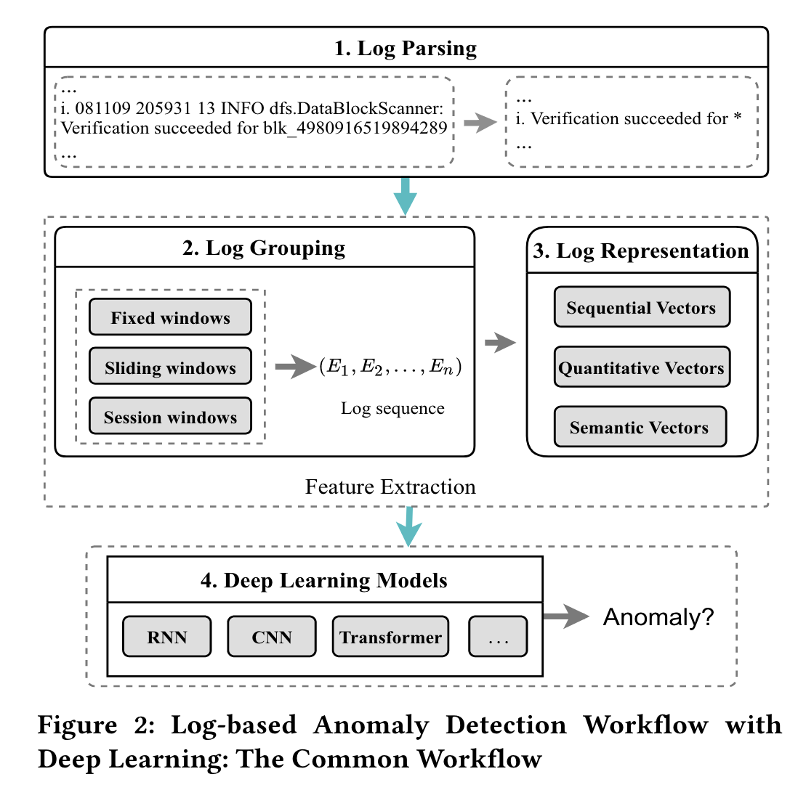
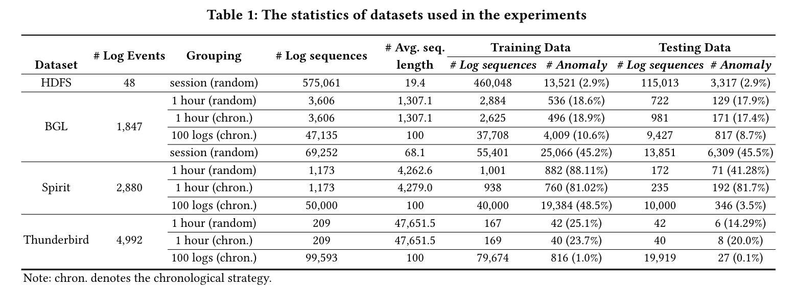
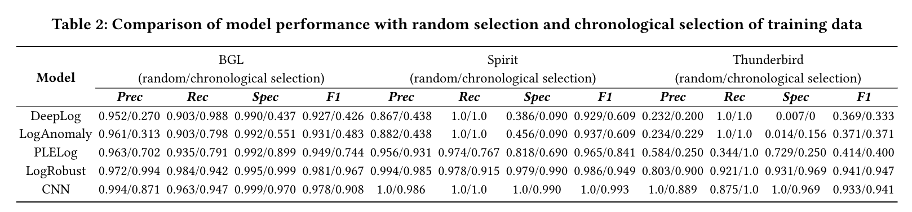
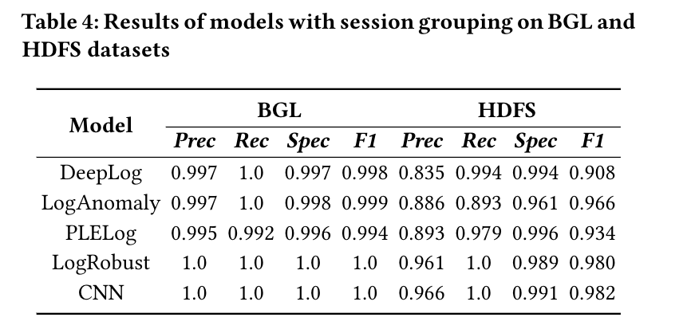
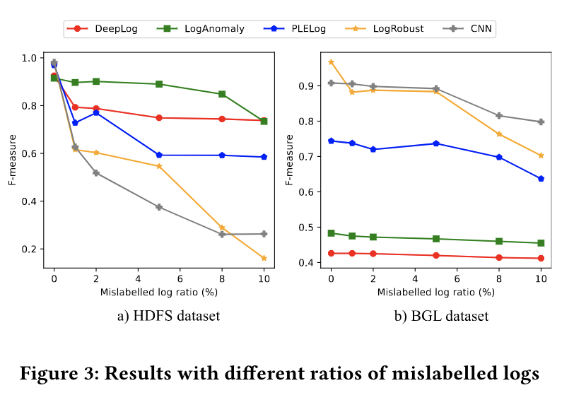
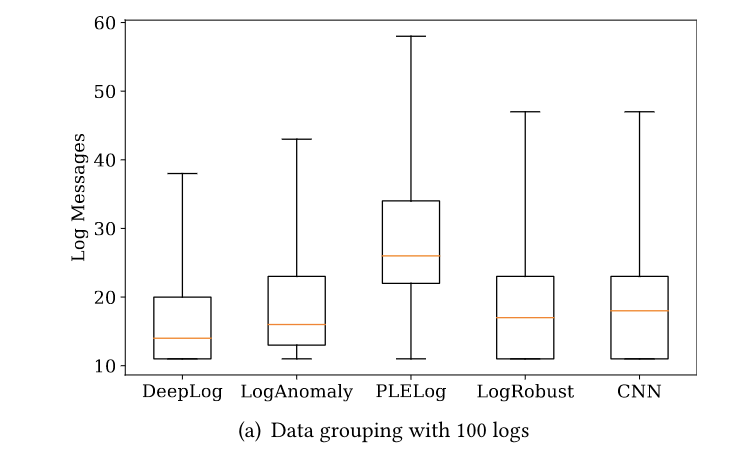
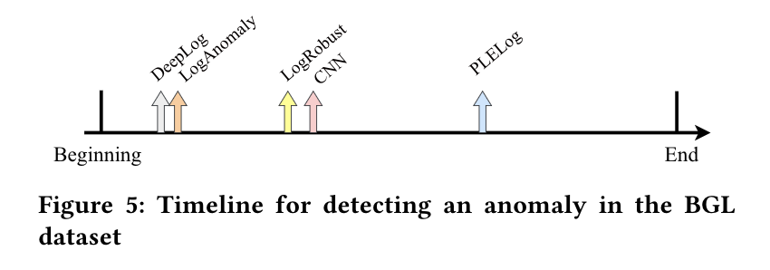
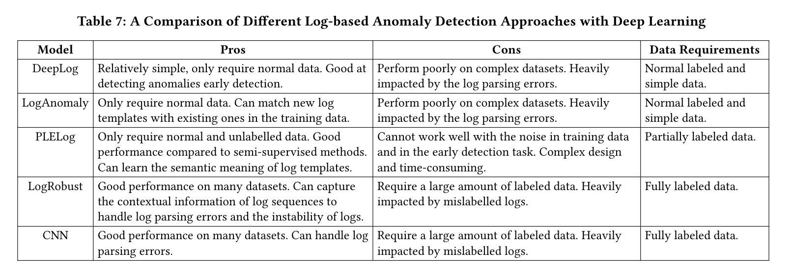

## Log-based Anomaly Detection with Deep Learning

**文章主要研究的问题**

- 基于日志的深度学习异常检测方法是否像他们声称的那样好？
- 影响他们表现的主要因素是什么？

**本文架构**

1. 在四个数据集（包括HDFS、BGL、Spirit和Thunderbird）上，对五个代表性的基于日志的深度学习模型（包括DeepLog[12]、LogAnomaly[36]、PLELog[48]、LogRobust[54]和CNN[33]）进行了系统评估。
2. 首先对训练数据选择和分组技术进行分析
3. 探讨了数据集的不同特征（包括数据噪声和类分布）对模型性能的影响
4. 分析模型在异常早期检测中的能力。
5. 通过扩展实验，获得了以下关于当前基于日志的异常检测深度学习模型的主要发现：
   - 训练数据选择策略（随机或时序）对基于日志的半监督日常检测模型有显著影响
     随机选择训练数据可能会导致数据泄漏问题和不合理的高检测精度
   - 不同的日志数据分组方法对模型的性能有很大的影响。在处理较短的日志序列时，模型往往会失去准确性
   - 高度不平衡的阶级分布严重影响了模型的有效性
     常用的度量（Precision、Recall、F-measure）对于评估具有高度不平衡数据的基于日志的异常检测模型来说不够全面
   - 少量数据噪声（包括标记错误的日志和日志解析错误）会降低异常检测性能。
     与半监督方法相比，监督模型对训练数据中标记错误的日志更敏感。
     理解日志数据语义的可建模性可以减少日志解析错误的影响
   - 不同的模型在系统异常的早期检测中具有不同的能力

**文章的contribution**

- 我们对基于日志的异常检测的五种代表性深度学习模型进行了广泛评估
- 我们得出的结论是，现有模型没有得到全面评估，在不同的实验设置中不能很好地推广根据评估结果
- 我们指出了现有模型的优缺点，并对基于日志的异常检测的未来研究工作提出了建议

**代表性基于日志的缺陷检测模型**

- *Deeplog*：利用LSTM模型通过预测给定之前事件的下一个日志事件来了解系统的正常执行。它通过确定传入日志事件是否违反LSTM模型的预测结果来检测异常。
  DeepLog可以在HDFS数据集上实现0.96的F-measure
- *LogAnomaly*：它将日志计数向量作为训练LSTM模型的输入。他们还提出了template2vec，一种基于同义词和反义词的方法，将日志模板表示为语义向量，以匹配新的日志事件和现有模板。与DeepLog一样，基于预测的检测模型旨在预测下一个日志事件，如果检查的日志事件违反了预测结果，它将被标记为异常。
  在HDFS和BGL数据集上，LogAnomaly的F-measure分别为0.95和0.96
- *PLELog*：通过概率标签估计解决了标签不足的问题，并设计了一个基于注意的GRU神经网络来检测异常。建立了基于GRU的检测模型，将日志序列分为正常和异常两类。
  实验结果表明，PLELog优于现有的半监督方法，并在HDFS和BGL数据集上取得了较高的性能（分别为0.96和0.98）
- *LogRobus*：整合了一个预先训练好的Word2vecmodel，即FastText[23]，并将其与TF-IDF权重相结合，以学习日志模板的表示向量。然后，将这些向量输入到基于注意的Bi-LSTM模型中，以检测异常。
  实验结果表明，*LogRobust*可以消除日志事件的不稳定性，在原始HDFS数据集上达到0.99的F-measure，在合成数据集上实现0.89-0.96的F-measure
- *CNN*：将卷积神经网络（CNN）应用于基于日志的异常检测。日志被分组为会话，然后转换为可培训矩阵。*CNN*模型使用此矩阵作为输入进行训练，以将日志序列分类为正常或异常。
  CNN模型可以在HDFS数据集上实现0.98的F-measure

**基于日志的异常检测的DL模型的通用总体框架**

1. 日志解析 *Log Parsing*：用于自动将每个日志消息转换为与参数（即变量部分）关联的特定事件模板（常量部分）
2. 日志分组 *Log Grouping*：主要目的是将日志分成不同的组，其中每个组表示一个有限的日志块。这些组称为日志序列，从中提取特征并输入异常检测模型
3. 日志表示 *Log Representing*：日志分组后，日志以DL模型所需的不同格式表示。基于DL的日常检测模型将日志转换为三种主要类型：
   - 顺序向量*sequential vectors*：反映窗口中日志事件的顺序
   - 量化向量*quantitative vectors*：类似于日志计数矢量(*Log count vectors*)，用于在日志窗口中保存每个日志事件的发生
   - 语义向量*semantic vectors*.：每个日志窗口都被转换为检测模型的一组语义向量来表示日志事件的语义
4. 深度学习模型 *Deep Learning Models*：提取的特征被送入深度学习模型，用于异常检测任务。
   多种DL技术已应用于基于日志的异常检测，Eg.——RNN、CNN、Transformer

**基于常见工作流来评估模型**

1. 训练数据的选择

   - 𝑐ℎ𝑟𝑜𝑛𝑜𝑙𝑜𝑔𝑖𝑐𝑎𝑙策略：训练和测试数据是基于日志的时间戳选择的

   - *random*策略：应用固定/滑动窗口将日志事件分组为日志序列，然后在将所有日志序列拆分为训练集和测试集之前将其洗牌

     这种策略可能会导致培训阶段的数据泄漏问题。也就是说，训练集可能包含部分未来数据，而测试集可能包含一些过去的数据，因此使得它不适合于仅使用历史日志来构建检测模型的真实场景。应研究采用不同训练数据选择策略（随机序时）的模型的有效性

2. 日志数据的分组：日志数据可以按会话、滑动或固定窗口分组为序列。目的是选择合适的窗口大小

3. 类别分布不均衡：

   - 异常日志序列通常占数据集的少数。高度不平衡的数据给异常检测带来了挑战。通常，机器学习技术很难从大量日志中识别少量异常。正常和异常类之间的不平衡可能导致模型表现不佳
   - 高度不平衡的类别分布也对评估指标有影响

   =>研究常用的度量是否能够有效评估基于日志的异常检测模型在不平衡类分布情况下的有效性

4. 数据的质量：为了评估基于日志的异常检测模型，需要标记数据，在手动标记过程中可能会产生数据噪音（误报/漏报），可能会降低现有模型的性能。噪声可能来自预处理阶段的错误（即日志解析），日志解析错误会导致许多错误的日志事件，从而降低异常检测性能

   =>研究具有不同程度数据噪声的模型的有效性

5. 早期检测能力：一个有效的异常检测模型应该能够识别系统异常的早期信号，尽早检测异常，并确保较高的检测精度

Conclusion：认为应重新评估基于深度学习的异常检测技术的能力。在这项工作中设计了实验来测量这些因素对基于日志的异常检测的五种典型DL模型的影响

**数据集**

- *HDFS(Hadoop Distributed File System) dataset*
- *BGL(Blue Gene/L) dataset*：是劳伦斯·利弗莫尔国家实验室（LLNL）收集的超级计算系统日志数据集
- *Spirit dataset*：是Sandia国家实验室Spirits超级计算系统的系统日志数据的聚合
- *Thunderbird dataset*：是从桑迪亚国家实验室（SNL）的一台ThunderBird超级计算机收集的开放日志数据集

**Research Question**

*RQ1：现有方法在不同的培训数据选择策略下的表现如何？*

（1）随机选择：对于每个数据集，我们首先按时间戳对日志进行排序，然后应用固定窗口分组技术生成日志序列。接下来，对这些日志序列进行混淆，并按80:20的比率分成训练/测试集。

[^注]: 固定窗口分组的窗口大小设置为1小时

（2）时序选择：对于每个数据集，我们使用前80%的原始日志（按时间顺序出现）进行训练，剩余的20%进行测试。接下来，我们应用固定窗口分组技术来生成日志序列。在这种策略中，我们不会改变生成的日志序列。因此，我们可以保证在培训阶段只使用历史日志，并且在这个阶段不会使用将来的日志

[^注]: HDFS数据集不包含时间戳信息，所以时序选择不使用与HDFS

*RQ2：现有模型如何使用不同的数据分组方法？*

（1）固定窗口分组，窗口大小为1小时（如RQ1中使用的那样）和0.5小时；
（2）固定窗口组，窗口大小从20到200条日志消息不等；
（3）会话窗口分组。对于第一种情况，我们使用BGL、Spirit和Thunderbirdatasets

[^注]: 对于会话窗口，我们使用block_idandnode_id分别对HDFS和BGL数据集上的日志进行分组

*RQ3：现有的方法可以处理不同的类分布吗？*

通过从主题数据集中随机删除正常/异常日志序列来模拟不同的不平衡场景。对于现实生产系统，异常的数量远小于正常事件的数量。因此，我们将不平衡率从0.1%变为15%，这表示数据集中异常的百分比。通过这种方式，我们创建了六个综合数据集，其平衡率分别为0.1%、0.5%、1%、5%、10%和15%

*RQ4：现有的方法可以处理不同程度的数据噪声吗？*

- 半监督方法：在训练数据中随机添加了一些异常值（从1%到10%）
- 监督方法：随机更改特定部分的标签（从1%到10%），以模拟标记错误的日志。

通过这种方式，我们创建了五个误标比例分别为1%、2%、5%、8%和10%的合成数据集。
此外，为了测量日志解析错误产生的噪声影响，我们对四种常用的日志解析器进行了实验，包括Drain[17]、Spell[11]、AEL[22]和IPLoM[34]。

*RQ5：现有模型能在多早的时候检测到在线检测中的异常？*

评估了四个数据集上的研究模型，以研究它们在早期发现异常的能力。
为此，在联机检测设置中，在每个模型对日志序列发出异常警报之前，我们记录检查日志消息的数量

**实验设置（Steps）**

（1）*Log Parasing*

从日志数据中提取日志模板，我们使用带有默认参数设置的日志解析器Drain。日志数据表示为：
$$
L=\{l_1,l_2,...,l_{N_L}\},where\space N_L = the\space number\space of\space log\space messages
$$
=>每个日志消息𝑙𝑖解析为日志模板𝐸(𝑙𝑖) denoted as 𝑒𝑖

（2）*Log Grouping*

- HFDS数据集：使用block_id将会话窗口，每个会话都使用基本事实(ground truth)进行标记

- 其他数据集：使用固定窗口策略将日志数据分组到𝑁𝑆块（即日志序列）
  $$
  S=\{s_1,s_2,...,s_{N_S}\},where\space s_u=\{e_i,e_{i+1},...,e_j\}\space is\space a\space set\space of\space log\_templets
  $$
  如果日志序列包含根据ground truth的异常日志消息（由域工程人员标记），则该日志序列是异常的。

  [^𝐹]: 表示每个日志序列的大小。在本研究中，我们改变了𝐹 从20、100、200条日志消息到0.5和1小时，取决于每个研究问题

（3）*Log Representation*

日志序列现在被转换为数字矢量，可以输入到DL模型中。DeepLog通过为每个日志事件分配索引，将日志序列转换为序列向量。

- LogAnomaly利用序列向量和定量向量来训练模型。对每个日志事件的发生进行计数，并形成数量矢量，表示系统执行行为[36]。
- PLELog通过使用预先训练的Glove模型来提取日志模板的语义向量[41]。
- LogRobust和CNN也使用预先训练的word2vec模型将日志序列转换为语义向量。我们采用预先训练的FastText[23]模型来计算LogRobust和CNN的语义向量

（4）*Deep Learning Model*

使用上一阶段生成的相应特征向量训练DL模型。

- DeepLog和LogAnomaly有两个LSTM层，共128个神经元。
- LogRobust包含两层Bi-LSTM，128个神经元和一个注意层。
- PLELog使用一层GRU网络。
- CNN有三个具有不同过滤器的卷积层和一个用于特征提取的最大池层。

避免随机性带来的偏差，对每个实验进行了五次，取平均结果。

**评估指标**

- *Precision*：模型检测到的所有异常日志序列中正确检测到的异常日志序列的百分比
  $$
  Prec=\frac{TP}{TP+FP}
  $$

- *Recall*：正确识别为异常的日志序列在所有实际异常中所占的百分比
  $$
  Rec=\frac{TP}{TP+FN}
  $$

- *Specificity*：正确识别为正常的日志序列占所有实际正常序列的百分比
  $$
  Spec=\frac{TN}{TN+FP}
  $$

- *F-Measure*：Prec和Rec的调和平均值
  $$
  F1=\frac{2*Prec*Rec}{Prec+Rec}
  $$

**实验结果和发现**

*RQ1*

- Result：

  1. 对于半监督模型（即LogAnomaly、DeepLog和PLELog），随机选择的结果比按时间顺序选择的结果要好得多。

     Reason：

     - 随机选择可以让模型可以在训练阶段看到未来的日志事件（即数据泄漏），因此可以做出更准确的预测。
     - Be-sides、DeepLog和LogAnomaly使用日志事件索引（即顺序和定量向量）对模型进行训练，并在训练阶段忽略日志的语义。DeepLog将任何新的日志事件标记为异常，并生成许多假警报
     - LogAnomaly可以简单地将一些看不见的日志事件与训练阶段出现的日志事件进行匹配，但与通过日志语义理解训练的模型相比，它还不够

  2. 对于监督模型（即LogRobust和CNN）在这两种策略上的表现比半监督模型好得多

     Reason：

     - 因为模型是用大量正常和异常数据训练的。一般来说，随机选择的结果比按时间顺序选择的结果要好。
     - 这些模型使用的语义向量的优势，它可以识别语义相似的日志事件，也可以区分不同的日志事件

- Summary：尽管随机选择策略比按时间顺序选择策略能带来更好的结果，但它可能会导致数据泄漏问题，并且无法评估模型在真实场景中的效果

*RQ2*

- Result：

  1. 窗口分组：不同窗口大小导致检测模型的性能不同

  2. 会话分组：使用会话窗口可以提高性能

     

     - Reason：执行路径中的日志事件显示了许多关系，可以捕获这些关系并用于正常检测

- Summary：在固定缩小分组的情况下，模型在处理不同窗口大小时往往表现不稳定。按会话窗口分组可获得更好的结果

*RQ3*

- Result：
  1. 当异常百分比增加时，模型的性能会更好；当数据集高度不平衡时，检测异常更加困难。
  2. 由于类别分布不平衡，高检测概率（即TP率）和低误报概率（即FP率）不一定会导致高精度。所以常用的评估指标（精度、召回和F度量）无法在某些不平衡的数据场景中评估模型，可能导致评估不精确
- Summary：建议使用一个额外的度量，即Specificity，来更全面地评估基于日志的异常检测模型。高特异性意味着模型可以以低误报率执行

*RQ4*

- Result：

  1. 错误标记日志的影响

     - 预处理：对于半监督方法，我们将一些异常放回训练集；对于监督方法，我们将训练集中某些异常的标签更改为正常。

       

     - 发现：

       1. 如果训练数据包含标记错误的样本，则模型的性能会大大降低

       2. 即使具有语义理解的优势，这些DL模型也可以在只有一小部分错误标记日志的情况下失去性能

     - Reason：

       1. HDFS显著减少的原因：HDFS数据集中存在许多重复序列，因此，将任何重复的正常序列标记为异常可能会产生很大的影响
       2. LogAnomaly稳定的原因：使用定量向量来提取日志中的定量关系以及序列向量，从而使模型能够更准确地预测下一事件的可能性

     - Summary：少量标记错误的日志会快速降低异常检测的性能。受监控的数据模型对标记错误的日志更敏感。采用基于预测的方法（DeepLog和LogAnomaly）的模型在存在错误标记的日志时表现更好。

  2. 日志分析错误的影响

     - 用到的Log Paraser：Drain、Spell、ALE、IPLoM
     - 发现：
       1. 与其他模型相比，LogRobust和CNN能够更好地处理日志解析噪声（因为它们使用了语义向量）
       2. 不同的日志解析错误对检测模型有不同的影响，DeepLog和LogAnomaly在使用Spell[11]和IPLoM[34]时比使用Drain时表现更好。
          - Because：Drain通常会产生一些额外的日志事件，这些事件会阻碍DeepLog和LogAnomaly的性能（它们使用预测方法预测下一个日志事件）
     - Summary：日志解析错误产生的数据噪声会影响模型的性能。额外的日志事件可以快速降低基于预测的模型的性能。使用语义向量的方法可以更好地处理日志解析错误

*RQ5*

固定窗口分组=100日志和0.5个小时

- Result：

  1. DeepLog能够最早检测到异常

  2. LogAnomaly也基于预测下一个日志事件，会慢一丢丢检测到异常

     - Reason：因为它需要捕获顺序关系和数量关系，以便将日志序列标记为异常）

  3. 其他几个模型检测到异常要慢得多

     - Reason：这些基于分类的模型需要捕获匿名行为的特征来检测异常，因此倾向于在异常发生的时候发出警报

  4. 大小为100 logs的日志序列
     

     => DeepLog最早检测出日志错误（第11条）

  5. 在线异常检测效率评估 => PLELog由于无法早期检测和时间开销大

- Summary：不同的模型对系统异常的早期检测能力不同。基于预测的模型（DeepLog和LogAnomaly）可以比基于分类的模型（PLELog、LogRobust和CNN）更早地检测异常

**不同DL方法的对比**

