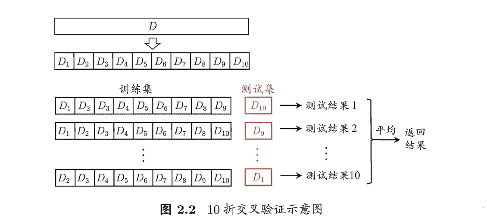

# Ch2. 模型评估与选择

## 2.1 经验误差和过拟合

错误率：分类错误的样本数占总样本数的比例
精度=1-错误率

误差：预测输出与样本的真实输出之间的差异
训练误差（经验误差）：学习器在训练集上的误差
泛化误差：学习器在新样本上的误差

过拟合：把训练样本自身的一些特点当做了所有潜在样本都会具有的一般性质，泛华能力下降
欠拟合：对训练样本的一般性质尚未学好

[^注]: 过拟合无法彻底避免，但可以缓解来减小其风险

## 2.2 评估方法

### 留出法

Def：将数据集D划分为两个互斥的集合，其中一个集合作为训练集S，另一个作为测试集T

数据集采样过程——分层采样

常见做法是吧2/3~4/5的样本用于训练，剩余样本用于测试

### 交叉验证法

1. 先将数据集 D划分为k个大小相似的互斥子集每个子集 Di，都尽可能保持数据分布的一致性，即从 D 中 通过分层采样得到
2. 然后，每次用k-1 个子集 的并集作 为训练集，余下的那个子集作为测试集;这样就可获得 k组训练/测试集，从而可进行 k 次训练和测试
3. 最终返回的是这 k 个测试结果的均值

[^注]: k 折交叉验证通常要随机使用不同的划分重复 p 次，最终的评估结果是这 p次k折交叉验证结果的均值

**留一法(Leave-One-Out，简称 LOO)**：数据集 D 中包含m个样本，若令 k=m ， 则得到了交叉验证法的一个特例

### 自助法

——数据集较小，难以有效划分训练集/测试集的时候很有用

1. 给定包含 m个样本的数据集 D，我们对它进行采样产生数据集 D': 每次随机从 D 中挑选一个样本，将其拷贝放入 D' ，然后再将该样本放回初始数据集 D 中，使得该样本在 下次采样时仍有可能被采到;

2. 这个过程重复执行m次后，我们就得到了包含 m个样本的数据集 D‘

   [^注]: 当m足够大时，约有1/3的样本数据没有被选入D’

3. 将D’用作训练集，D\D‘用作测试集

## 2.3 性能度量

给定样例集 D = {(X1 , Y1) , (X2 , Y2)， . . . , (Xm, Ym)} ， 其中Yi是示例 Xi 的真实标记。要评估学习器f的性能，就要把学习器预测结果 f(x)与真实标记 y进行比较.

**错误率**

对于样例集D
$$
E(f;D)=\frac{1}{m}\sum_{i=1}^{m}\mathbb{I}(f(x_i)\neq y_i)
$$
对于数据分布D
$$
E(f;D)=\int_{x\sim D}\mathbb{I}(f(x)\neq y)p(x)dx
$$
**精度**

对于样例集D
$$
acc(f;D)=\frac{1}{m}\sum_{i=1}^{m}\mathbb{I}(f(x_i)= y_i)=1-E(f;D)
$$
对于数据分布D
$$
acc(f;D)=\int_{x\sim D}\mathbb{I}(f(x)= y)p(x)dx=1-E(f;D)
$$
**查准率P**

