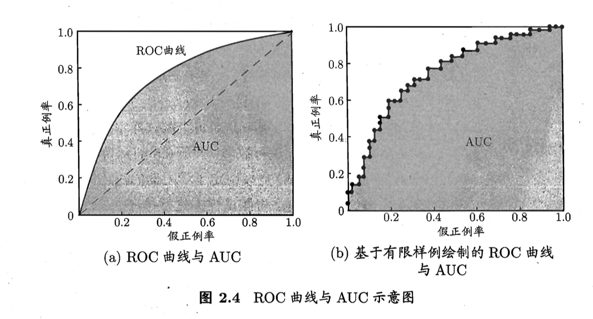

# Ch2. 模型评估与选择

## 2.1 经验误差和过拟合

错误率：分类错误的样本数占总样本数的比例
精度=1-错误率

误差：预测输出与样本的真实输出之间的差异
训练误差（经验误差）：学习器在训练集上的误差
泛化误差：学习器在新样本上的误差

过拟合：把训练样本自身的一些特点当做了所有潜在样本都会具有的一般性质，泛华能力下降
欠拟合：对训练样本的一般性质尚未学好

[^注]: 过拟合无法彻底避免，但可以缓解来减小其风险

## 2.2 评估方法

### 留出法

Def：将数据集D划分为两个互斥的集合，其中一个集合作为训练集S，另一个作为测试集T

数据集采样过程——分层采样

常见做法是吧2/3~4/5的样本用于训练，剩余样本用于测试

### 交叉验证法

1. 先将数据集 D划分为k个大小相似的互斥子集每个子集 Di，都尽可能保持数据分布的一致性，即从 D 中 通过分层采样得到
2. 然后，每次用k-1 个子集 的并集作 为训练集，余下的那个子集作为测试集;这样就可获得 k组训练/测试集，从而可进行 k 次训练和测试
3. 最终返回的是这 k 个测试结果的均值

[^注]: k 折交叉验证通常要随机使用不同的划分重复 p 次，最终的评估结果是这 p次k折交叉验证结果的均值

**留一法(Leave-One-Out，简称 LOO)**：数据集 D 中包含m个样本，若令 k=m ， 则得到了交叉验证法的一个特例

### 自助法

——数据集较小，难以有效划分训练集/测试集的时候很有用

1. 给定包含 m个样本的数据集 D，我们对它进行采样产生数据集 D': 每次随机从 D 中挑选一个样本，将其拷贝放入 D' ，然后再将该样本放回初始数据集 D 中，使得该样本在 下次采样时仍有可能被采到;

2. 这个过程重复执行m次后，我们就得到了包含 m个样本的数据集 D‘

   [^注]: 当m足够大时，约有1/3的样本数据没有被选入D’

3. 将D’用作训练集，D\D‘用作测试集

## 2.3 性能度量

给定样例集 D = {(X1 , Y1) , (X2 , Y2)， . . . , (Xm, Ym)} ， 其中Yi是示例 Xi 的真实标记。要评估学习器f的性能，就要把学习器预测结果 f(x)与真实标记 y进行比较.

### 错误率 & 精度

**错误率**

对于样例集D
$$
E(f;D)=\frac{1}{m}\sum_{i=1}^{m}\mathbb{I}(f(x_i)\neq y_i)
$$
对于数据分布D
$$
E(f;D)=\int_{x\sim D}\mathbb{I}(f(x)\neq y)p(x)dx
$$
**精度**

对于样例集D

$$
acc(f;D)=\frac{1}{m}\sum_{i=1}^{m}\mathbb{I}(f(x_i)= y_i)=1-E(f;D)
$$
对于数据分布D
$$
acc(f;D)=\int_{x\sim D}\mathbb{I}(f(x)= y)p(x)dx=1-E(f;D)
$$

### 查准率 & 查全率

**查准率P与查全率R**
$$
P=\frac{TP}{TP+FP}\\
R=\frac{TP}{TP+FN}
$$
其中TP（真正例）、FP（假正例）、FN（假反例）、TN（真反例）=>TP+FP+FN+TN=样本总数

| 预测类别\真实类别 | Postive      | Negative     |
| ----------------- | ------------ | ------------ |
| **Positive**      | TP（真正例） | FN（假反例） |
| **Negative**      | FP（假正例） | TN（真反例） |

1. 根据学习器的预测结果对样例进行排序，排在前面的是学习器认为"最可能 "是正例的样本，排在最后的则是学习器认为"最 不可能"是正例的样本

2. 按此顺序逐个把样本作为正例进行预测 ，则每次可以计算出当前的查全率、查准率

3. 得出P-R曲线

   [^平衡点BEP]: P=R

**F1度量**（基于查准率和查全率的调和平均）：
$$
F1=\frac{2\times P\times R}{P+R}=\frac{2\times TP}{样例总数+TP-TN}\\
F1的一般形式——F_\beta=\frac{(1+\beta^2)\times P\times R}{(\beta^2\times P)+R}
$$
ß=1时退化为F1；ß>1时查全率影响更大；ß<1时查准率影响更大

*在有多个二分类混淆矩阵时：*

- 先在各混淆矩阵上分别计算出查准率和查全率，再计算平均值可以得到：
  - 宏查准率macro-P
  - 宏查全率macro-R
  - 宏F1macro-F1
- 先将各混淆矩阵的对应元素进行平均，得到TP、FP、TN、FN的平均，基于这些平均值可以算出：
  - 微查准率micro-P
  - 微查全率micro-R
  - 微F1micro-F1

### ROC & AUC

**ROC**（受试者工作特征曲线）

根据学习器的预测结果对样例进行排序，按此顺序逐个把样本作为正例进行预测，每次计算出两个重要量的值，分别以它们为横、纵坐标作图'就得到了 "ROC 曲线“

ROC 曲线的纵轴是"真正例率" (True Positive Rate，简称 TPR) ，横轴是"假正例率" (False Positive Rate，简称 FPR) 

$$
TPR=\frac{TP}{TP+FN}\\
FPR=\frac{FP}{TN+FP}
$$
=>好的模型——TPR高，FPR低

**AUC**：Area under the ROC，ROC曲线下的面积，AUC越大，模型越好
	AUC考虑的是样本预测的排序质量，因此它与排序**损失loss**有紧密联系
$$
给定 m^+个正例和 m^-个反例,令 D^+ 和 D^-分别表示正、反例集合， 则排序的损失loss定义为：\\
l_{rank}=\frac{1}{m^+m^-}\sum_{x^+\in D^+}\sum_{x^-\in D^-}\{\mathbb{I}(f(x^+)<f(x^-))+\frac{1}{2}\mathbb{I}(f(x^+)=f(x^-))\}\\
AUC=1-l_{rank}
$$

### 代价敏感错误率 & 代价曲线

**非均等代价**：为权衡不同类型错误所造成的不同损失设置的

**代价矩阵（cost matrix）**：cost_ij表示将第i类样本预测为第j类样本的代价，cost_ii=0

[^损失程度]: 与|cost_ij - cost_ji|成正比

Eg. 二分类代价矩阵——

**代价敏感错误率**：

**代价曲线**

1. 参数：p=m+/m
2. 目的：对于一个模型，根据p的不同，找到使得代价总期望最小的模型的阈值
3. 横轴（正概率代价）：
   纵轴（归一化代价）：

## 2.4 比较检验

问题：

1. 测试集的性能与真正的泛化性能未必相同
2. 测试集不同反映出来的性能不同
3. 算法本身具有一定的随机性，同一测试集多次运行可能结果不同

**假设检验**

前提条件：某学习器的泛化错误率为∈，测试错误率为∈^

恰将 ∈^ * m 个 样本误分类的概率如下式所示

给定测试错误率，P在∈=∈^时最大 =>符合二项分布
